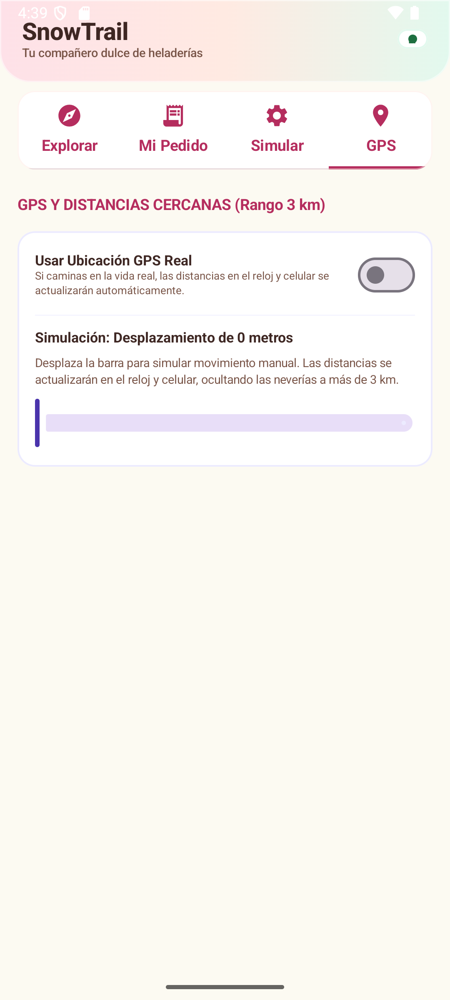
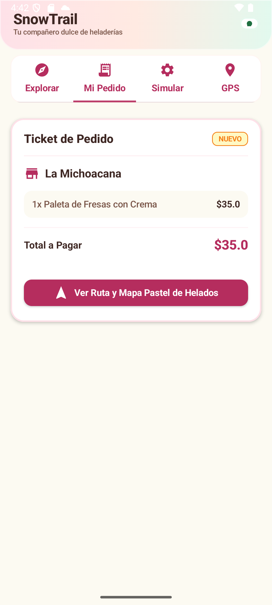
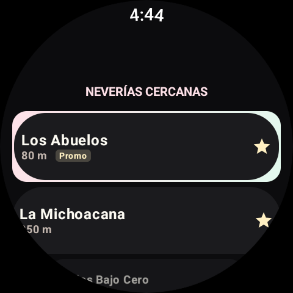
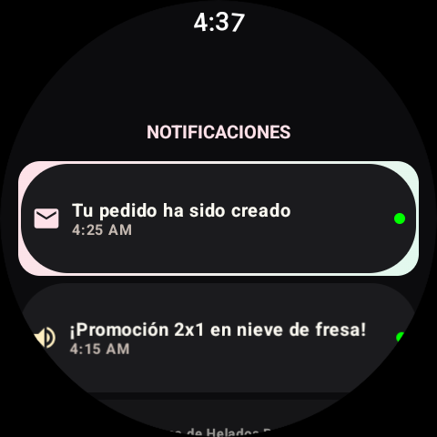
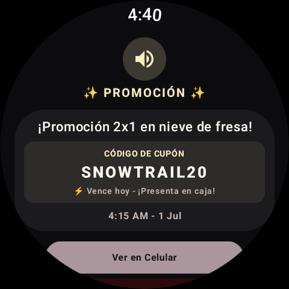
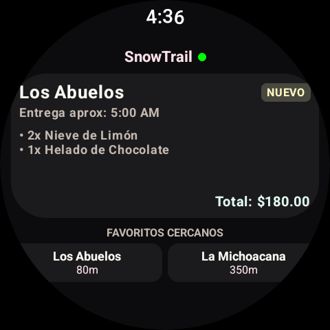

# SnowTrail 🍦✨
### Localizador de Neverías y Sincronización en Tiempo Real (Android & Wear OS)

---

## 👥 Integrantes del Proyecto
* **Paola Jaqueline López Mata**
* **Gerardo Manzano Villafaña**
* **Jennifer Ailin Medina Hernández**

**Grupo:** *[GDS6092]*

---

## 🎯 Objetivo del Proyecto
Desarrollar una aplicación móvil integrada con un dispositivo wearable (Wear OS) con una **estética visual premium inspirada en tonos pastel de helados**. La plataforma permite buscar, ordenar y seguir pedidos en neverías cercanas en tiempo real mediante sincronización GPS, persistencia local SQLite y alertas personalizadas de proximidad y promociones en el reloj.

---

## ⚙️ Tecnologías Utilizadas
* **Lenguaje:** Kotlin
* **Diseño de Interfaz:** Jetpack Compose (Móvil) & Compose for Wear OS (Reloj)
* **Persistencia Local:** `SQLiteOpenHelper` (Base de datos nativa SQL para evitar conflictos de anotadores en compilación)
* **Capa de Comunicación:** Google Play Services Wearable (`DataClient` y pings de latido rápido)
* **Animaciones y Efectos:** `Modifier.basicMarquee()` de Compose (efecto texto corrido en el reloj), transiciones y badges dinámicos.

---

## 🚀 Funcionalidades Principales

### 📱 Dispositivo Móvil (Celular)
1. **Pestaña GPS de Simulación:** Permite desplazar coordenadas mediante un deslizador para simular el movimiento real del usuario en el mapa, actualizando dinámicamente las neverías cercanas en un radio de 3 km.
2. **Pestaña de Neverías:** Listado interactivo de establecimientos con opciones para marcar favoritos en tiempo real y visualizar promociones especiales.
3. **Pestaña de Pedidos:** Flujo de compra completo, carrito interactivo y actualización de estados del pedido (Nuevo, Aceptado, Pospuesto, Entregado).
4. **Diseño Visual Pastel:** Interfaz estilizada en tonalidades suaves de vainilla, menta, durazno y fresa con textos legibles en marrón cacao.

### ⌚ Reloj Inteligente (Wear OS)
1. **Bandeja de Notificaciones con Marquesina:** Alertas con texto corrido continuo (`basicMarquee()`) para que los mensajes largos no se corten en la pantalla circular del reloj.
2. **Detalle a Pantalla Completa Instantáneo:** Al tocar una alerta, la pantalla cambia al instante mostrando el desglose completo del estatus, proximidad o promoción sin depender de interfaces deslizables laterales.
3. **Cupones de Promoción Enriquecidos:** Si la notificación es una oferta, el reloj genera de manera interactiva un cupón visual con diseño de línea discontinua y un código de descuento único (ej: `FRESA25`, `MINT30`) listo para mostrar en caja.
4. **Listado de Neverías Cercanas y Pedidos:** Visualización rápida con ordenamiento dinámico según la cercanía simulada en el celular.
5. **Navegación por Botones Físicos:** Soporte para botones laterales físicos (Stem Keys) para subir/bajar enfoque y confirmar/descartar alertas.

---

## 📸 Capturas de Pantalla

| Celular - GPS y Neverías | Celular - Detalle de Compra | Reloj - Tiendas Cercanas |
| :---: | :---: | :---: |
|  |  |  |
| **Reloj - Bandeja de Alertas (1)** | **Reloj - Bandeja de Alertas (2)** | **Reloj - Cupón de Descuento** |
|  |  |  | 

---

## 🛠️ Instrucciones para Ejecutar el Proyecto

1. **Clonar el Repositorio:**
   ```bash
   git clone https://github.com/PaolaLpez/SnowTrail.git
   ```
2. **Abrir en Android Studio:**
   - Abre la carpeta `SnowTrail` en Android Studio (versión Jellyfish o superior recomendada).
   - Deja que Gradle descargue las dependencias y sincronice el proyecto.
3. **Instalación en Dispositivos/Emuladores:**
   - Ejecuta el módulo `:app` en tu dispositivo físico Android o emulador de teléfono.
   - Ejecuta el módulo `:wear` en tu emulador de reloj inteligente Wear OS (asegúrate de que ambos estén emparejados en el mismo puente de comunicación).
4. **Simular Movimiento:**
   - Ve a la pestaña **GPS** en el celular.
   - Desplaza el control de la ubicación para ver cómo cambian y se sincronizan las neverías en tiempo real en la pantalla del reloj.
