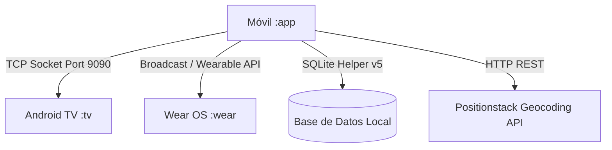

# 📱 Módulo Móvil (Smartphone) - SnowTrail (`:app`)

---

## 📌 1. Resumen de Arquitectura y Propósito
El módulo `:app` es el núcleo central del ecosistema **SnowTrail**. Proporciona una experiencia de usuario moderna construida con **Jetpack Compose** (Material 3) orientada a dos roles de usuario: **Cliente** y **Administrador**. Además, actúa como el emisor y sincronizador de eventos de red hacia **Android TV** (mediante sockets TCP) y **Wear OS** (a través de servicios de sincronización y difusiones locales).



---

## 📦 2. Archivos de Construcción y Dependencias

---

### 📄 `gradle/libs.versions.toml` (Version Catalog)
* **Ubicación:** `gradle/libs.versions.toml`
* **Propósito:** Catálogo centralizado que unifica versiones, dependencias y plugins entre `:app`, `:wear` y `:tv`.
* **Contenido y Código:**
```toml
[versions]
agp = "9.2.1"
playServicesWearable = "20.0.1"
kotlin = "2.2.10"
composeBom = "2024.09.00"
composeMaterial3 = "1.5.6"
composeFoundation = "1.5.6"
composeUiTooling = "1.5.6"
wearToolingPreview = "1.0.0"
activityCompose = "1.13.0"
coreSplashscreen = "1.2.0"

[libraries]
play-services-wearable = { group = "com.google.android.gms", name = "play-services-wearable", version.ref = "playServicesWearable" }
compose-bom = { group = "androidx.compose", name = "compose-bom", version.ref = "composeBom" }
ui = { group = "androidx.compose.ui", name = "ui" }
ui-graphics = { group = "androidx.compose.ui", name = "ui-graphics" }
ui-tooling = { group = "androidx.compose.ui", name = "ui-tooling" }
ui-tooling-preview = { group = "androidx.compose.ui", name = "ui-tooling-preview" }
activity-compose = { group = "androidx.activity", name = "activity-compose", version.ref = "activityCompose" }
core-splashscreen = { group = "androidx.core", name = "core-splashscreen", version.ref = "coreSplashscreen" }

[plugins]
android-application = { id = "com.android.application", version.ref = "agp" }
kotlin-compose = { id = "org.jetbrains.kotlin.plugin.compose", version.ref = "kotlin" }
```

---

### 📄 `app/build.gradle.kts` (Build Script del Módulo Móvil)
* **Ubicación:** `app/build.gradle.kts`
* **Propósito:** Configura el SDK de compilación (Android 36), Java 17, soporte de Jetpack Compose y las librerías de interfaz, red y base de datos.
* **Contenido y Código:**
```kotlin
plugins {
    alias(libs.plugins.android.application)
    alias(libs.plugins.kotlin.compose)
}

android {
    namespace = "mx.utng.snowtrail"
    compileSdk = 36

    defaultConfig {
        applicationId = "mx.utng.snowtrail"
        minSdk = 26
        targetSdk = 36
        versionCode = 1
        versionName = "1.0"
    }

    buildFeatures {
        compose = true
    }

    compileOptions {
        sourceCompatibility = JavaVersion.VERSION_17
        targetCompatibility = JavaVersion.VERSION_17
    }
}

dependencies {
    implementation(project(":shared"))
    implementation(libs.play.services.wearable)
    implementation("org.jetbrains.kotlinx:kotlinx-coroutines-play-services:1.7.3")
    implementation("com.google.firebase:firebase-firestore-ktx:24.10.1")
    implementation("androidx.room:room-runtime:2.6.1")
    implementation("androidx.room:room-ktx:2.6.1")
    implementation("androidx.lifecycle:lifecycle-service:2.7.0")
    implementation("androidx.lifecycle:lifecycle-runtime-compose:2.7.0")
    implementation(platform(libs.compose.bom))
    implementation(libs.activity.compose)
    implementation("androidx.compose.ui:ui")
    implementation("androidx.compose.ui:ui-graphics")
    implementation("androidx.compose.ui:ui-tooling-preview")
    implementation("androidx.compose.foundation:foundation")
    implementation("androidx.compose.material3:material3:1.2.0")
    implementation("androidx.compose.material:material-icons-extended")
    implementation("androidx.core:core-ktx:1.12.0")
    implementation("androidx.appcompat:appcompat:1.6.1")
    implementation(libs.core.splashscreen)
}
```

---

## 📂 3. Desglose Exhaustivo de Archivos del Código Fuente

---

### 📄 `app/src/main/AndroidManifest.xml` (Manifiesto de la Aplicación)
* **Ubicación:** `app/src/main/AndroidManifest.xml`
* **Propósito:** Declara los permisos del sistema, actividades y servicios en segundo plano.
* **Contenido y Código:**
```xml
<?xml version="1.0" encoding="utf-8"?>
<manifest xmlns:android="http://schemas.android.com/apk/res/android"
    xmlns:tools="http://schemas.android.com/tools">

    <!-- Permisos de red e Internet para Positionstack y Sockets TCP -->
    <uses-permission android:name="android.permission.INTERNET" />
    <uses-permission android:name="android.permission.ACCESS_NETWORK_STATE" />
    
    <!-- Permisos de geolocalización para simulación y GPS real -->
    <uses-permission android:name="android.permission.ACCESS_FINE_LOCATION" />
    <uses-permission android:name="android.permission.ACCESS_COARSE_LOCATION" />

    <application
        android:allowBackup="true"
        android:dataExtractionRules="@xml/data_extraction_rules"
        android:fullBackupContent="@xml/backup_rules"
        android:icon="@mipmap/ic_launcher"
        android:label="@string/app_name"
        android:roundIcon="@mipmap/ic_launcher_round"
        android:supportsRtl="true"
        android:theme="@style/Theme.SnowTrail"
        tools:targetApi="31">
        
        <activity
            android:name=".MainActivity"
            android:exported="true"
            android:label="@string/app_name"
            android:theme="@style/Theme.SnowTrail">
            <intent-filter>
                <action android:name="android.intent.action.MAIN" />
                <category android:name="android.intent.category.LAUNCHER" />
            </intent-filter>
        </activity>
        
        <service
            android:name=".service.WearSyncService"
            android:exported="false" />
    </application>
</manifest>
```

---

### 📄 `app/src/main/java/mx/utng/snowtrail/MainActivity.kt` (`main` - Actividad Principal y Vistas)
* **Ubicación:** `app/src/main/java/mx/utng/snowtrail/MainActivity.kt`
* **Propósito:** Punto de entrada visual que orquesta:
  1. **Autenticación:** Formulario de Login para Cliente y Administrador.
  2. **Vistas del Cliente:** Catálogo de neverías, `ShopDetailScreen` (detalle y carrito), `RouteNavigationScreen` (seguimiento en vivo), y mapa de Dolores Hidalgo.
  3. **Vistas del Administrador:**
     * `AdminDashboardTab`: CRUD de heladerías y promociones.
     * `AdminAddTab`: Selector de 3 opciones (Nueva Nevería, Nueva Promoción, Nuevo Pedido con selector de cantidades y carrito local).
     * `AdminOrdersHistoryTab`: Historial independiente agrupado dinámicamente por correo (`groupBy { it.userEmail }`) con badges de color y botón de vaciado de historial (`clearOrdersHistory()`).
     * `AdminProfileTab`: Simulación de GPS y cierre de sesión.
  4. **Transmisión de Sockets TCP (`sendToTv`):** Envío de comandos `SELECT_SHOP:<id>`, `ADD_ORDER:<datos>` y `ADD_PROMO:<datos>` hacia el puerto `9090` de la TV.
  5. **Geocodificación con API Positionstack + Leaflet:** Consulta HTTP asíncrona acotada a Dolores Hidalgo e inyección de mapa interactivo en `WebView`.

* **Fragmentos Clave de Código:**
```kotlin
// Transmisión de Sockets TCP hacia Android TV (Puerto 9090)
fun sendToTv(message: String) {
    CoroutineScope(Dispatchers.IO).launch {
        try {
            val socket = Socket()
            socket.connect(InetSocketAddress("127.0.0.1", 9090), 1000)
            val writer = PrintWriter(BufferedWriter(OutputStreamWriter(socket.getOutputStream())), true)
            writer.println(message)
            writer.flush()
            socket.close()
        } catch (e: Exception) {
            e.printStackTrace()
        }
    }
}

// Pantalla de Historial de Pedidos Agrupados por Correo
@Composable
fun AdminOrdersHistoryTab(
    repository: SnowTrailRepository,
    reloadFromDb: () -> Unit
) {
    var allOrders by remember { mutableStateOf(emptyList<MockOrder>()) }
    fun refreshOrders() { allOrders = repository.getAllOrders() }
    LaunchedEffect(Unit) { refreshOrders() }

    Column(modifier = Modifier.fillMaxSize().padding(16.dp).verticalScroll(rememberScrollState())) {
        val grouped = allOrders.groupBy { it.userEmail }
        grouped.forEach { (email, ordersGroup) ->
            Text("👤 Usuario: $email", fontWeight = FontWeight.Bold, color = Color(0xFFEF9A9A))
            ordersGroup.forEach { o ->
                Card(modifier = Modifier.fillMaxWidth().padding(vertical = 4.dp)) {
                    Column(modifier = Modifier.padding(12.dp)) {
                        Text("Pedido: #${o.id} - ${o.estado}", fontWeight = FontWeight.Bold)
                        Text("🏪 Nevería: ${o.neveriaNombre}")
                        Text("🛍️ Items: " + o.productos.joinToString(", ") { "${it.cantidad}x ${it.nombre}" })
                        Text("💵 Total: $${o.total}", color = Color(0xFFB52D5E), fontWeight = FontWeight.Bold)
                    }
                }
            }
        }
    }
}
```

> [!NOTE]
> Para conocer cómo el servidor de Android TV procesa las tramas de socket recibidas (`SELECT_SHOP`, `ADD_ORDER`, `ADD_PROMO`), consultar la documentación en [README de Android TV](../tv/README.md).

---

### 📄 `app/src/main/java/mx/utng/snowtrail/database/DatabaseHelper.kt` (Esquema SQLite v5)
* **Ubicación:** `app/src/main/java/mx/utng/snowtrail/database/DatabaseHelper.kt`
* **Propósito:** Administrador de base de datos local SQLite (`DATABASE_VERSION = 5`). Define las tablas `users`, `shops`, `promotions`, `orders` (con la columna `user_email`) y `order_products`.
* **Contenido y Código:**
```kotlin
package mx.utng.snowtrail.database

import android.content.Context
import android.database.sqlite.SQLiteDatabase
import android.database.sqlite.SQLiteOpenHelper

class DatabaseHelper(context: Context) : SQLiteOpenHelper(context, DATABASE_NAME, null, DATABASE_VERSION) {
    companion object {
        const val DATABASE_NAME = "snowtrail.db"
        const val DATABASE_VERSION = 5

        const val TABLE_USERS = "users"
        const val USER_ID = "id"
        const val USER_EMAIL = "email"
        const val USER_PASSWORD = "password"
        const val USER_ROLE = "role"

        const val TABLE_SHOPS = "shops"
        const val SHOP_ID = "id"
        const val SHOP_NAME = "name"
        const val SHOP_DISTANCE = "distance"
        const val SHOP_IS_FAVORITE = "is_favorite"
        const val SHOP_SCHEDULE = "schedule"
        const val SHOP_CONTACT = "contact"
        const val SHOP_ADDRESS = "address"

        const val TABLE_PROMOTIONS = "promotions"
        const val PROMO_ID = "id"
        const val PROMO_NAME = "name"
        const val PROMO_START = "start_date"
        const val PROMO_END = "end_date"
        const val PROMO_NOTE = "note"

        const val TABLE_ORDERS = "orders"
        const val ORDER_ID = "id"
        const val ORDER_SHOP_ID = "shop_id"
        const val ORDER_SHOP_NAME = "shop_name"
        const val ORDER_STATUS = "status"
        const val ORDER_ESTIMATED_TIME = "estimated_time"
        const val ORDER_TIMESTAMP = "timestamp"
        const val ORDER_TOTAL = "total"
        const val ORDER_USER_EMAIL = "user_email"

        const val TABLE_ORDER_PRODUCTS = "order_products"
        const val OP_ID = "id"
        const val OP_ORDER_ID = "order_id"
        const val OP_NAME = "name"
        const val OP_QUANTITY = "quantity"
        const val OP_UNIT_PRICE = "unit_price"
    }

    override fun onCreate(db: SQLiteDatabase) {
        db.execSQL("CREATE TABLE $TABLE_USERS ($USER_ID INTEGER PRIMARY KEY AUTOINCREMENT, $USER_EMAIL TEXT UNIQUE, $USER_PASSWORD TEXT, $USER_ROLE TEXT)")
        db.execSQL("CREATE TABLE $TABLE_SHOPS ($SHOP_ID TEXT PRIMARY KEY, $SHOP_NAME TEXT, $SHOP_DISTANCE REAL, $SHOP_IS_FAVORITE INTEGER, $SHOP_SCHEDULE TEXT, $SHOP_CONTACT TEXT, $SHOP_ADDRESS TEXT)")
        db.execSQL("CREATE TABLE $TABLE_PROMOTIONS ($PROMO_ID TEXT PRIMARY KEY, $PROMO_NAME TEXT, $PROMO_START TEXT, $PROMO_END TEXT, $PROMO_NOTE TEXT)")
        db.execSQL("CREATE TABLE $TABLE_ORDERS ($ORDER_ID TEXT PRIMARY KEY, $ORDER_SHOP_ID TEXT, $ORDER_SHOP_NAME TEXT, $ORDER_STATUS TEXT, $ORDER_ESTIMATED_TIME INTEGER, $ORDER_TIMESTAMP INTEGER, $ORDER_TOTAL REAL, $ORDER_USER_EMAIL TEXT DEFAULT 'Cliente@gmail.com')")
        db.execSQL("CREATE TABLE $TABLE_ORDER_PRODUCTS ($OP_ID INTEGER PRIMARY KEY AUTOINCREMENT, $OP_ORDER_ID TEXT, $OP_NAME TEXT, $OP_QUANTITY INTEGER, $OP_UNIT_PRICE REAL)")
    }

    override fun onUpgrade(db: SQLiteDatabase, oldVersion: Int, newVersion: Int) {
        db.execSQL("DROP TABLE IF EXISTS $TABLE_USERS")
        db.execSQL("DROP TABLE IF EXISTS $TABLE_SHOPS")
        db.execSQL("DROP TABLE IF EXISTS $TABLE_PROMOTIONS")
        db.execSQL("DROP TABLE IF EXISTS $TABLE_ORDERS")
        db.execSQL("DROP TABLE IF EXISTS $TABLE_ORDER_PRODUCTS")
        onCreate(db)
    }
}
```

---

### 📄 `app/src/main/java/mx/utng/snowtrail/database/SnowTrailRepository.kt` (Capa de Repositorio)
* **Ubicación:** `app/src/main/java/mx/utng/snowtrail/database/SnowTrailRepository.kt`
* **Propósito:** Abstracción segura de acceso a datos. Maneja inserciones transaccionales, consultas de pedidos e inicialización de 50 promociones de prueba.
* **Contenido y Código:**
```kotlin
package mx.utng.snowtrail.database

import android.content.ContentValues
import android.content.Context
import android.database.Cursor
import android.database.sqlite.SQLiteDatabase
import mx.utng.snowtrail.service.*

class SnowTrailRepository(context: Context) {
    private val dbHelper = DatabaseHelper(context)

    fun saveOrder(order: MockOrder) {
        val db = dbHelper.writableDatabase
        db.beginTransaction()
        try {
            val values = ContentValues().apply {
                put(DatabaseHelper.ORDER_ID, order.id)
                put(DatabaseHelper.ORDER_SHOP_ID, order.neveriaId)
                put(DatabaseHelper.ORDER_SHOP_NAME, order.neveriaNombre)
                put(DatabaseHelper.ORDER_STATUS, order.estado)
                put(DatabaseHelper.ORDER_ESTIMATED_TIME, order.tiempoEstimadoMinutos)
                put(DatabaseHelper.ORDER_TIMESTAMP, order.fechaHoraMillis)
                put(DatabaseHelper.ORDER_TOTAL, order.total)
                put(DatabaseHelper.ORDER_USER_EMAIL, order.userEmail)
            }
            db.insertWithOnConflict(DatabaseHelper.TABLE_ORDERS, null, values, SQLiteDatabase.CONFLICT_REPLACE)
            
            db.delete(DatabaseHelper.TABLE_ORDER_PRODUCTS, "${DatabaseHelper.OP_ORDER_ID} = ?", arrayOf(order.id))
            order.productos.forEach { prod ->
                val pValues = ContentValues().apply {
                    put(DatabaseHelper.OP_ORDER_ID, order.id)
                    put(DatabaseHelper.OP_NAME, prod.nombre)
                    put(DatabaseHelper.OP_QUANTITY, prod.cantidad)
                    put(DatabaseHelper.OP_UNIT_PRICE, prod.precioUnitario)
                }
                db.insert(DatabaseHelper.TABLE_ORDER_PRODUCTS, null, pValues)
            }
            db.setTransactionSuccessful()
        } finally {
            db.endTransaction()
        }
    }

    fun getAllOrders(): List<MockOrder> {
        val ordersList = mutableListOf<MockOrder>()
        val db = dbHelper.readableDatabase
        val cursor: Cursor = db.rawQuery("SELECT * FROM ${DatabaseHelper.TABLE_ORDERS} ORDER BY ${DatabaseHelper.ORDER_TIMESTAMP} DESC", null)
        if (cursor.moveToFirst()) {
            do {
                val id = cursor.getString(cursor.getColumnIndexOrThrow(DatabaseHelper.ORDER_ID))
                val shopId = cursor.getString(cursor.getColumnIndexOrThrow(DatabaseHelper.ORDER_SHOP_ID))
                val shopName = cursor.getString(cursor.getColumnIndexOrThrow(DatabaseHelper.ORDER_SHOP_NAME))
                val status = cursor.getString(cursor.getColumnIndexOrThrow(DatabaseHelper.ORDER_STATUS))
                val estimated = cursor.getInt(cursor.getColumnIndexOrThrow(DatabaseHelper.ORDER_ESTIMATED_TIME))
                val timestamp = cursor.getLong(cursor.getColumnIndexOrThrow(DatabaseHelper.ORDER_TIMESTAMP))
                val total = cursor.getDouble(cursor.getColumnIndexOrThrow(DatabaseHelper.ORDER_TOTAL))
                val email = cursor.getString(cursor.getColumnIndexOrThrow(DatabaseHelper.ORDER_USER_EMAIL))

                val prodList = mutableListOf<MockProductLine>()
                val pCursor = db.rawQuery("SELECT * FROM ${DatabaseHelper.TABLE_ORDER_PRODUCTS} WHERE ${DatabaseHelper.OP_ORDER_ID} = ?", arrayOf(id))
                if (pCursor.moveToFirst()) {
                    do {
                        val pName = pCursor.getString(pCursor.getColumnIndexOrThrow(DatabaseHelper.OP_NAME))
                        val pQty = pCursor.getInt(pCursor.getColumnIndexOrThrow(DatabaseHelper.OP_QUANTITY))
                        val pPrice = pCursor.getDouble(pCursor.getColumnIndexOrThrow(DatabaseHelper.OP_UNIT_PRICE))
                        prodList.add(MockProductLine(pName, pQty, pPrice))
                    } while (pCursor.moveToNext())
                }
                pCursor.close()
                ordersList.add(MockOrder(id, shopId, shopName, status, estimated, timestamp, total, prodList, email))
            } while (cursor.moveToNext())
        }
        cursor.close()
        return ordersList
    }

    fun clearOrdersHistory() {
        val db = dbHelper.writableDatabase
        db.beginTransaction()
        try {
            db.delete(DatabaseHelper.TABLE_ORDERS, null, null)
            db.delete(DatabaseHelper.TABLE_ORDER_PRODUCTS, null, null)
            db.setTransactionSuccessful()
        } finally {
            db.endTransaction()
        }
    }
}
```

---

### 📄 `app/src/main/java/mx/utng/snowtrail/service/WearSyncService.kt` (Modelos y Servicio Wear)
* **Ubicación:** `app/src/main/java/mx/utng/snowtrail/service/WearSyncService.kt`
* **Propósito:** Define los modelos de datos compartidos (`MockOrder`, `MockNotification`, `MockShop`, `MockPromotion`, `MockProductLine`) y el servicio de difusión para sincronización con Wear OS.
* **Contenido y Código:**
```kotlin
package mx.utng.snowtrail.service

import android.app.Service
import android.content.Intent
import android.os.IBinder

data class MockProductLine(
    val nombre: String,
    val cantidad: Int,
    val precioUnitario: Double
)

data class MockOrder(
    val id: String,
    val neveriaId: String,
    val neveriaNombre: String,
    val estado: String,
    val tiempoEstimadoMinutos: Int,
    val fechaHoraMillis: Long,
    val total: Double,
    val productos: List<MockProductLine>,
    val userEmail: String = "Cliente@gmail.com"
)

data class MockNotification(
    val id: String,
    val titulo: String,
    val mensaje: String,
    val timestamp: Long,
    val tipo: String,
    val neveriaId: String? = null
)

data class MockShop(
    val id: String,
    val nombre: String,
    val distancia: Double,
    val esFavorita: Boolean = false,
    val tienePromocion: Boolean = false,
    val horario: String = "10:00 AM - 9:00 PM",
    val contacto: String = "418-123-4567",
    val direccion: String = "Centro Histórico, Dolores Hidalgo"
)

data class MockPromotion(
    val id: String,
    val nombre: String,
    val fechaInicio: String,
    val fechaFin: String,
    val nota: String
)

class WearSyncService : Service() {
    override fun onBind(intent: Intent?): IBinder? = null
}
```

> [!TIP]
> Para conocer el manejo de la bandeja de notificaciones con efecto marquesina y cupones de descuento en el reloj, consultar el [README de Wear OS](../wear/README.md).
