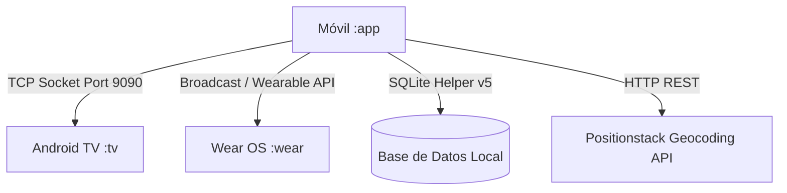

# 📱 Módulo Móvil (Smartphone) - SnowTrail (`:app`)

---

## 📌 1. Resumen de Arquitectura y Propósito
El módulo `:app` es el núcleo central del ecosistema **SnowTrail**. Proporciona una experiencia de usuario moderna construida con **Jetpack Compose** (Material 3) orientada a dos roles de usuario: **Cliente** y **Administrador**. Además, actúa como el emisor y sincronizador de eventos de red hacia **Android TV** (mediante sockets TCP) y **Wear OS** (a través de servicios de sincronización y difusiones locales).



---

## 📦 2. Archivos de Construcción y Dependencias

---

### 📄 `gradle/libs.versions.toml` (Version Catalog Centralizado)
* **Ubicación:** `gradle/libs.versions.toml`
* **🎨 ¿Qué se ve / Contenido Funcional?:** Es el archivo de configuración central de versiones del proyecto. No tiene pantalla visual, pero garantiza que todas las librerías de UI, íconos y servicios funcionen en armonía.
* **💻 Explicación Técnica de Código:** Catálogo centralizado que unifica las versiones, dependencias y plugins entre los módulos `:app`, `:wear` y `:tv`, asegurando compatibilidad binaria y evitando conflictos de versiones.
* **Contenido y Código Completo:**
```toml
[versions]
agp = "9.2.1"
playServicesWearable = "20.0.1"
kotlin = "2.2.10"
composeBom = "2024.09.00"
composeMaterial3 = "1.5.6"
composeFoundation = "1.5.6"
composeUiTooling = "1.5.6"
wearToolingPreview = "1.0.0"
activityCompose = "1.13.0"
coreSplashscreen = "1.2.0"

[libraries]
play-services-wearable = { group = "com.google.android.gms", name = "play-services-wearable", version.ref = "playServicesWearable" }
compose-bom = { group = "androidx.compose", name = "compose-bom", version.ref = "composeBom" }
ui = { group = "androidx.compose.ui", name = "ui" }
ui-graphics = { group = "androidx.compose.ui", name = "ui-graphics" }
ui-tooling = { group = "androidx.compose.ui", name = "ui-tooling" }
ui-tooling-preview = { group = "androidx.compose.ui", name = "ui-tooling-preview" }
ui-test-manifest = { group = "androidx.compose.ui", name = "ui-test-manifest" }
ui-test-junit4 = { group = "androidx.compose.ui", name = "ui-test-junit4" }
compose-material3 = { group = "androidx.wear.compose", name = "compose-material3", version.ref = "composeMaterial3" }
compose-foundation = { group = "androidx.wear.compose", name = "compose-foundation", version.ref = "composeFoundation" }
compose-ui-tooling = { group = "androidx.wear.compose", name = "compose-ui-tooling", version.ref = "composeUiTooling" }
wear-tooling-preview = { group = "androidx.wear", name = "wear-tooling-preview", version.ref = "wearToolingPreview" }
activity-compose = { group = "androidx.activity", name = "activity-compose", version.ref = "activityCompose" }
core-splashscreen = { group = "androidx.core", name = "core-splashscreen", version.ref = "coreSplashscreen" }

[plugins]
android-application = { id = "com.android.application", version.ref = "agp" }
kotlin-compose = { id = "org.jetbrains.kotlin.plugin.compose", version.ref = "kotlin" }
```

#### 🔍 Desglose y Utilidad de lo añadido en `libs.versions.toml`:
| Elemento Añadido | Tipo | ¿Para qué ayuda y qué hace? |
| :--- | :--- | :--- |
| `agp = "9.2.1"` | Plugin | **Android Gradle Plugin**: Motor de compilación principal para construir los APKs en Android Studio. |
| `kotlin = "2.2.10"` | Plugin | **Kotlin Compiler & Compose Compiler Plugin**: Habilita el compilador nativo de Kotlin 2.x y el plugin de Compose integrado sin necesidad de extensiones externas. |
| `playServicesWearable = "20.0.1"` | Librería | **Google Play Services Wearable**: Habilita la comunicación por Data Client, Message Client y sincronización de nodos entre el teléfono y el reloj Wear OS. |
| `composeBom = "2024.09.00"` | BOM | **Compose Bill of Materials**: Garantiza que todas las librerías de interfaz de Jetpack Compose usen versiones compatibles entre sí de forma automática. |
| `activityCompose = "1.13.0"` | Librería | **Activity Compose (`setContent`)**: Permite enlazar actividades de Android (`ComponentActivity`) directamente con las funciones `@Composable`. |
| `coreSplashscreen = "1.2.0"` | Librería | **Splash Screen API**: Controla la pantalla de carga inicial animada de la app en Android 12 y superiores. |
| `composeMaterial3` / `composeFoundation` | Librería | **Wear OS Compose Suite**: Provee controles visuales adaptados a pantallas circulares para el reloj inteligente. |

---

### 📄 `app/build.gradle.kts` (Build Script del Módulo Móvil)
* **Ubicación:** `app/build.gradle.kts`
* **🎨 ¿Qué se ve / Contenido Funcional?:** Define las características de compilación del módulo del teléfono, empaquetado Compose, versión de SDK objetivo (36) y la vinculación con el módulo `:shared`.
* **💻 Explicación Técnica de Código:** Configura `compileSdk = 36`, `minSdk = 26`, habilita `buildFeatures { compose = true }`, Java 17 y declara las dependencias de Material 3, Room, Firebase Firestore y Play Services Wearable.
* **Contenido y Código Completo:**
```kotlin
plugins {
    alias(libs.plugins.android.application)
    alias(libs.plugins.kotlin.compose)
}

android {
    namespace = "mx.utng.snowtrail"
    compileSdk = 36

    defaultConfig {
        applicationId = "mx.utng.snowtrail"
        minSdk = 26
        targetSdk = 36
        versionCode = 1
        versionName = "1.0"
    }

    buildFeatures {
        compose = true
    }

    compileOptions {
        sourceCompatibility = JavaVersion.VERSION_17
        targetCompatibility = JavaVersion.VERSION_17
    }
}

dependencies {
    implementation(project(":shared"))
    
    // Play Services Wearable
    implementation(libs.play.services.wearable)
    implementation("org.jetbrains.kotlinx:kotlinx-coroutines-play-services:1.7.3")

    // Firebase Firestore
    implementation("com.google.firebase:firebase-firestore-ktx:24.10.1")
    
    // Room components
    implementation("androidx.room:room-runtime:2.6.1")
    implementation("androidx.room:room-ktx:2.6.1")
    
    // Lifecycle components
    implementation("androidx.lifecycle:lifecycle-service:2.7.0")
    implementation("androidx.lifecycle:lifecycle-runtime-compose:2.7.0")
    
    // Compose general dependencies
    implementation(platform(libs.compose.bom))
    implementation(libs.activity.compose)
    implementation("androidx.compose.ui:ui")
    implementation("androidx.compose.ui:ui-graphics")
    implementation("androidx.compose.ui:ui-tooling-preview")
    implementation("androidx.compose.foundation:foundation")
    
    // Material 3 for Phone
    implementation("androidx.compose.material3:material3:1.2.0")
    implementation("androidx.compose.material:material-icons-extended")
    
    implementation("androidx.core:core-ktx:1.12.0")
    implementation("androidx.appcompat:appcompat:1.6.1")
    implementation(libs.core.splashscreen)

    testImplementation("junit:junit:4.13.2")
}
```

---

## 📂 3. Desglose Exhaustivo de Archivos del Código Fuente

---

### 📄 `app/src/main/AndroidManifest.xml` (Manifiesto de la Aplicación)
* **Ubicación:** `app/src/main/AndroidManifest.xml`
* **🎨 ¿Qué se ve / Contenido Funcional?:** Registra la aplicación en el sistema Android, definiendo el nombre de la app, el ícono launcher en el menú del teléfono y declarando los permisos requeridos.
* **💻 Explicación Técnica de Código:** Declara permisos de red (`INTERNET`, `ACCESS_NETWORK_STATE`), permisos de geolocalización GPS (`ACCESS_FINE_LOCATION`, `ACCESS_COARSE_LOCATION`), la actividad inicial `.MainActivity` y el servicio `.service.WearSyncService`.
* **Contenido y Código:**
```xml
<?xml version="1.0" encoding="utf-8"?>
<manifest xmlns:android="http://schemas.android.com/apk/res/android"
    xmlns:tools="http://schemas.android.com/tools">

    <uses-permission android:name="android.permission.INTERNET" />
    <uses-permission android:name="android.permission.ACCESS_NETWORK_STATE" />
    
    <uses-permission android:name="android.permission.ACCESS_FINE_LOCATION" />
    <uses-permission android:name="android.permission.ACCESS_COARSE_LOCATION" />
    <uses-permission android:name="android.permission.ACCESS_BACKGROUND_LOCATION" />
    <uses-permission android:name="android.permission.WAKE_LOCK" />

    <application
        android:allowBackup="true"
        android:label="SnowTrail Mobile"
        android:supportsRtl="true"
        android:usesCleartextTraffic="true"
        android:theme="@style/Theme.AppCompat.Light.NoActionBar">
        
        <activity
            android:name=".MainActivity"
            android:exported="true">
            <intent-filter>
                <action android:name="android.intent.action.MAIN" />
                <category android:name="android.intent.category.LAUNCHER" />
            </intent-filter>
        </activity>
        
        <service
            android:name=".service.WearSyncService"
            android:exported="true">
            <intent-filter>
                <action android:name="com.google.android.gms.wearable.BIND_LISTENER" />
            </intent-filter>
        </service>
    </application>
</manifest>
```

---

## 🎨 4. Capa de Presentación Modularizada (`presentation/`)

---

### 📄 `app/src/main/java/mx/utng/snowtrail/presentation/theme/Color.kt` (Sistema de Diseño Pastel)
* **Ubicación:** `app/src/main/java/mx/utng/snowtrail/presentation/theme/Color.kt`
* **🎨 ¿Qué se ve / Contenido Funcional?:** Define la paleta cromática pastel de la app inspirada en sabores artesanales (fresa, vainilla, menta, durazno, miel y cacao). Controla visualmente los colores de botones, tarjetas, fondos y cápsulas de estado.
* **💻 Explicación Técnica de Código:** Objeto estático `MobileThemeColors` que almacena constantes `Color` inmutables de Jetpack Compose (`Color(0xFF...)`) para consumo centralizado en componentes visuales.
* **Contenido y Código:**
```kotlin
package mx.utng.snowtrail.presentation.theme

import androidx.compose.ui.graphics.Color

/**
 * ARCHIVO: Color.kt
 * PROPÓSITO: Sistema de diseño y tokens de color pastel (MobileThemeColors).
 * Define la paleta visual para la aplicación móvil: Fresa, Menta, Vainilla, Melocotón, Lavanda, Miel y Cacao.
 */
object MobileThemeColors {
    val OffWhiteVanilla = Color(0xFFFCFAF2)    // Fondo cálido tono crema vainilla
    val PureWhiteCard = Color(0xFFFFFFFF)      // Fondo de tarjetas
    
    // Tonos pastel
    val IceCreamPink = Color(0xFFFEE1E8)       // Fresa
    val PinkText = Color(0xFFB52D5E)
    
    val IceCreamMint = Color(0xFFE2F9EE)       // Menta
    val MintText = Color(0xFF1E6F40)
    
    val IceCreamPeach = Color(0xFFFFEAE2)      // Melocotón
    val PeachText = Color(0xFFBF3E15)
    
    val IceCreamLavender = Color(0xFFECEBFF)   // Lavanda
    val LavenderText = Color(0xFF4A34AC)
    
    val GoldPastel = Color(0xFFFFF0C2)         // Miel / Dorado
    val GoldText = Color(0xFF8F6300)
    val GoldBorder = Color(0xFFFFD54F)
    
    // Tipografía Cacao
    val CocoaDarkText = Color(0xFF3E2723)      // Marrón cacao oscuro para texto principal
    val CocoaLightText = Color(0xFF795548)     // Chocolate con leche para texto secundario
    val CocoaMuted = Color(0xFFA1887F)         // Tono cacao atenuado
    
    // Colores de cápsulas de estado de pedido
    val NuevoBg = Color(0xFFFFF9C4)
    val NuevoText = Color(0xFFF57F17)
    
    val AceptadoBg = Color(0xFFE8F5E9)
    val AceptadoText = Color(0xFF2E7D32)
    
    val PospuestoBg = Color(0xFFFFE0B2)
    val PospuestoText = Color(0xFFE65100)
    
    val RechazadoBg = Color(0xFFFFEBEE)
    val RechazadoText = Color(0xFFC62828)
    
    val EntregadoBg = Color(0xFFE3F2FD)
    val EntregadoText = Color(0xFF1565C0)
}
```

---

### 📄 `app/src/main/java/mx/utng/snowtrail/presentation/theme/Theme.kt` (Tema Material 3)
* **Ubicación:** `app/src/main/java/mx/utng/snowtrail/presentation/theme/Theme.kt`
* **🎨 ¿Qué se ve / Contenido Funcional?:** Aplica el tema visual unificado a toda la aplicación del smartphone, garantizando que los fondos sean crema vainilla, los botones rosas fresa y los acentos verdes menta.
* **💻 Explicación Técnica de Código:** Función `@Composable fun SnowTrailTheme` que encapsula `MaterialTheme` con `lightColorScheme(...)` inyectando los tokens de `MobileThemeColors`.
* **Contenido y Código:**
```kotlin
package mx.utng.snowtrail.presentation.theme

import androidx.compose.material3.MaterialTheme
import androidx.compose.material3.lightColorScheme
import androidx.compose.runtime.Composable

/**
 * ARCHIVO: Theme.kt
 * PROPÓSITO: Tema principal de Jetpack Compose para SnowTrail (Material 3).
 * Aplica los tokens pastel de MobileThemeColors al esquema de color claro (lightColorScheme).
 */
@Composable
fun SnowTrailTheme(content: @Composable () -> Unit) {
    val colorScheme = lightColorScheme(
        primary = MobileThemeColors.PinkText,
        secondary = MobileThemeColors.MintText,
        background = MobileThemeColors.OffWhiteVanilla,
        surface = MobileThemeColors.PureWhiteCard
    )

    MaterialTheme(
        colorScheme = colorScheme,
        content = content
    )
}
```

---

### 📄 `app/src/main/java/mx/utng/snowtrail/presentation/screens/NeveriasScreen.kt` (Explorador de Neverías)
* **Ubicación:** `app/src/main/java/mx/utng/snowtrail/presentation/screens/NeveriasScreen.kt`
* **🎨 ¿Qué se ve en Pantalla?:** Se observa la lista de sucursales de neverías con su nombre, icono de helado, distancia en metros y un botón de estrella `⭐` para marcar o desmarcar como favorita. En la parte superior hay un chip de filtro para alternar entre "Ver Todas" y "⭐ Favoritas".
* **💻 Explicación Técnica de Código:** Composable que recibe `shops: List<MockShop>` y filtra reactivamente mediante `if (showFavoritesOnly) shops.filter { it.esFavorita } else shops`. Utiliza `LazyColumn` con `Card` redondeadas e emite el evento `onToggleFavorite` al presionar la estrella.
* **Contenido y Código:**
```kotlin
package mx.utng.snowtrail.presentation.screens

import androidx.compose.foundation.background
import androidx.compose.foundation.clickable
import androidx.compose.foundation.layout.*
import androidx.compose.foundation.lazy.LazyColumn
import androidx.compose.foundation.lazy.items
import androidx.compose.foundation.shape.CircleShape
import androidx.compose.foundation.shape.RoundedCornerShape
import androidx.compose.material.icons.Icons
import androidx.compose.material.icons.filled.Icecream
import androidx.compose.material.icons.filled.Place
import androidx.compose.material.icons.filled.Star
import androidx.compose.material.icons.filled.StarBorder
import androidx.compose.material3.*
import androidx.compose.runtime.Composable
import androidx.compose.ui.Alignment
import androidx.compose.ui.Modifier
import androidx.compose.ui.graphics.Color
import androidx.compose.ui.text.font.FontWeight
import androidx.compose.ui.text.style.TextAlign
import androidx.compose.ui.unit.dp
import androidx.compose.ui.unit.sp
import mx.utng.snowtrail.presentation.theme.MobileThemeColors
import mx.utng.snowtrail.service.MockShop

/**
 * ARCHIVO: NeveriasScreen.kt
 * PROPÓSITO: Pantalla de Explorador de Neverías (UI Layer).
 * Permite filtrar entre todas las sucursales y las marcadas como favoritas independientes, mostrando distancias geolocalizadas y ofertas.
 */
@OptIn(ExperimentalMaterial3Api::class)
@Composable
fun NeveriasScreen(
    shops: List<MockShop>,
    showFavoritesOnly: Boolean,
    onToggleFilter: () -> Unit,
    onToggleFavorite: (String) -> Unit,
    onShopClick: (MockShop) -> Unit = {}
) {
    val filteredShops = if (showFavoritesOnly) shops.filter { it.esFavorita } else shops

    Column(modifier = Modifier.fillMaxSize().padding(16.dp)) {
        Row(
            modifier = Modifier.fillMaxWidth(),
            horizontalArrangement = Arrangement.SpaceBetween,
            verticalAlignment = Alignment.CenterVertically
        ) {
            Text(
                text = if (showFavoritesOnly) "⭐ Sucursales Favoritas" else "🍦 Todas las Neverías",
                fontSize = 18.sp,
                fontWeight = FontWeight.Bold,
                color = MobileThemeColors.CocoaDarkText
            )
            FilterChip(
                selected = showFavoritesOnly,
                onClick = onToggleFilter,
                label = { Text(if (showFavoritesOnly) "Ver Todas" else "⭐ Favoritas") }
            )
        }

        Spacer(modifier = Modifier.height(12.dp))

        if (filteredShops.isEmpty()) {
            Box(modifier = Modifier.fillMaxSize(), contentAlignment = Alignment.Center) {
                Text(
                    text = "No tienes neverías marcadas como favoritas.\n¡Toca la estrella en cualquier sucursal para guardarla!",
                    textAlign = TextAlign.Center,
                    color = MobileThemeColors.CocoaMuted,
                    fontSize = 14.sp
                )
            }
        } else {
            LazyColumn(verticalArrangement = Arrangement.spacedBy(10.dp)) {
                items(filteredShops) { shop ->
                    Card(
                        shape = RoundedCornerShape(16.dp),
                        colors = CardDefaults.cardColors(containerColor = Color.White),
                        elevation = CardDefaults.cardElevation(2.dp),
                        modifier = Modifier.fillMaxWidth().clickable { onShopClick(shop) }
                    ) {
                        Row(modifier = Modifier.padding(14.dp), verticalAlignment = Alignment.CenterVertically) {
                            Box(
                                modifier = Modifier.size(48.dp).background(MobileThemeColors.IceCreamPink, CircleShape),
                                contentAlignment = Alignment.Center
                            ) {
                                Icon(Icons.Default.Icecream, contentDescription = null, tint = MobileThemeColors.PinkText)
                            }
                            Spacer(modifier = Modifier.width(12.dp))
                            Column(modifier = Modifier.weight(1f)) {
                                Text(shop.nombre, fontWeight = FontWeight.Bold, fontSize = 16.sp, color = MobileThemeColors.CocoaDarkText)
                                Row(verticalAlignment = Alignment.CenterVertically) {
                                    Icon(Icons.Default.Place, contentDescription = null, tint = MobileThemeColors.MintText, modifier = Modifier.size(14.dp))
                                    Spacer(modifier = Modifier.width(4.dp))
                                    Text("${shop.distancia.toInt()} m de distancia", fontSize = 12.sp, color = MobileThemeColors.CocoaLightText)
                                }
                            }
                            IconButton(onClick = { onToggleFavorite(shop.id) }) {
                                Icon(
                                    imageVector = if (shop.esFavorita) Icons.Default.Star else Icons.Default.StarBorder,
                                    contentDescription = "Favorito",
                                    tint = if (shop.esFavorita) MobileThemeColors.GoldBorder else MobileThemeColors.CocoaMuted
                                )
                            }
                        }
                    }
                }
            }
        }
    }
}
```

---

### 📄 `app/src/main/java/mx/utng/snowtrail/presentation/screens/CatalogoScreen.kt` (Catálogo y Carrito)
* **Ubicación:** `app/src/main/java/mx/utng/snowtrail/presentation/screens/CatalogoScreen.kt`
* **🎨 ¿Qué se ve en Pantalla?:** Despliega el menú de especialidades de helados y nieves artesanales con sus precios individuales en MXN, botones verdes de "Agregar" al carrito y un botón destacado rosa en el pie de página para "Confirmar y Enviar Pedido".
* **💻 Explicación Técnica de Código:** Muestra elementos del catálogo dinámico mediante `LazyColumn`. Al presionar "Agregar" invoca el callback `onAddToCart` actualizando el estado de la orden, y el botón inferior dispara `onCheckout` para procesar la transacción.
* **Contenido y Código:**
```kotlin
package mx.utng.snowtrail.presentation.screens

import androidx.compose.foundation.layout.*
import androidx.compose.foundation.lazy.LazyColumn
import androidx.compose.foundation.lazy.items
import androidx.compose.foundation.shape.RoundedCornerShape
import androidx.compose.material.icons.Icons
import androidx.compose.material.icons.filled.ShoppingBag
import androidx.compose.material3.*
import androidx.compose.runtime.Composable
import androidx.compose.ui.Alignment
import androidx.compose.ui.Modifier
import androidx.compose.ui.graphics.Color
import androidx.compose.ui.text.font.FontWeight
import androidx.compose.ui.unit.dp
import androidx.compose.ui.unit.sp
import mx.utng.snowtrail.presentation.theme.MobileThemeColors
import mx.utng.snowtrail.service.MockProductLine
import java.util.Locale

/**
 * ARCHIVO: CatalogoScreen.kt
 * PROPÓSITO: Pantalla de Catálogo de Productos y Carrito de Compras (UI Layer).
 * Presenta el menú de especialidades artesanales con cálculo de precios en tiempo real y flujo de checkout.
 */
@Composable
fun CatalogoScreen(
    onAddToCart: (MockProductLine) -> Unit,
    onCheckout: () -> Unit
) {
    val catalog = listOf(
        MockProductLine("Copa Helarte Suprema", 1, 95.0),
        MockProductLine("Nieve Artesanal de Limón", 1, 45.0),
        MockProductLine("Cono Doble Fresa y Chocolate", 1, 65.0),
        MockProductLine("Malteada de Vainilla Cacao", 1, 80.0)
    )

    Column(modifier = Modifier.fillMaxSize().padding(16.dp)) {
        Text("🍨 Menú de Especialidades", fontSize = 18.sp, fontWeight = FontWeight.Bold, color = MobileThemeColors.CocoaDarkText)
        Spacer(modifier = Modifier.height(12.dp))

        LazyColumn(modifier = Modifier.weight(1f), verticalArrangement = Arrangement.spacedBy(10.dp)) {
            items(catalog) { prod ->
                Card(shape = RoundedCornerShape(14.dp), colors = CardDefaults.cardColors(containerColor = Color.White), elevation = CardDefaults.cardElevation(2.dp), modifier = Modifier.fillMaxWidth()) {
                    Row(modifier = Modifier.padding(14.dp), verticalAlignment = Alignment.CenterVertically) {
                        Column(modifier = Modifier.weight(1f)) {
                            Text(prod.nombre, fontWeight = FontWeight.Bold, fontSize = 15.sp, color = MobileThemeColors.CocoaDarkText)
                            Text("$${String.format(Locale.US, "%.2f", prod.precioUnitario)} MXN", fontSize = 13.sp, color = MobileThemeColors.PinkText, fontWeight = FontWeight.SemiBold)
                        }
                        Button(onClick = { onAddToCart(prod) }, colors = ButtonDefaults.buttonColors(containerColor = MobileThemeColors.IceCreamMint), shape = RoundedCornerShape(10.dp)) {
                            Text("Agregar", color = MobileThemeColors.MintText, fontWeight = FontWeight.Bold)
                        }
                    }
                }
            }
        }

        Spacer(modifier = Modifier.height(12.dp))

        Button(onClick = onCheckout, modifier = Modifier.fillMaxWidth().height(52.dp), colors = ButtonDefaults.buttonColors(containerColor = MobileThemeColors.PinkText), shape = RoundedCornerShape(14.dp)) {
            Icon(Icons.Default.ShoppingBag, contentDescription = null)
            Spacer(modifier = Modifier.width(8.dp))
            Text("Confirmar y Enviar Pedido", fontSize = 15.sp, fontWeight = FontWeight.Bold, color = Color.White)
        }
    }
}
```

---

### 📄 `app/src/main/java/mx/utng/snowtrail/presentation/screens/PedidoActivoScreen.kt` (Ticket y Seguimiento)
* **Ubicación:** `app/src/main/java/mx/utng/snowtrail/presentation/screens/PedidoActivoScreen.kt`
* **🎨 ¿Qué se ve en Pantalla?:** Se muestra la tarjeta de ticket de compra con el número de folio `#ID`, el nombre de la sucursal, el tiempo estimado de preparación en minutos y el precio total. En la parte inferior incluye botones de simulación de estado: "Aceptar", "Entregar" y "Posponer".
* **💻 Explicación Técnica de Código:** Evalúa la presencia de `MockOrder`. Si existe, renderiza los datos en una `Card` y notifica los cambios de estado mediante `onSimulateProgress(...)`, disparando la sincronización hacia Wear OS y Android TV.
* **Contenido y Código:**
```kotlin
package mx.utng.snowtrail.presentation.screens

import androidx.compose.foundation.layout.*
import androidx.compose.foundation.shape.RoundedCornerShape
import androidx.compose.material.icons.Icons
import androidx.compose.material.icons.filled.Receipt
import androidx.compose.material3.*
import androidx.compose.runtime.Composable
import androidx.compose.ui.Alignment
import androidx.compose.ui.Modifier
import androidx.compose.ui.graphics.Color
import androidx.compose.ui.text.font.FontWeight
import androidx.compose.ui.unit.dp
import androidx.compose.ui.unit.sp
import mx.utng.snowtrail.presentation.theme.MobileThemeColors
import mx.utng.snowtrail.service.MockOrder
import java.util.Locale

/**
 * ARCHIVO: PedidoActivoScreen.kt
 * PROPÓSITO: Pantalla de Seguimiento de Pedido Activo (UI Layer).
 * Muestra el desglose del ticket, tiempo estimado de entrega y botones para simular transiciones de estado de pedido.
 */
@Composable
fun PedidoActivoScreen(
    order: MockOrder?,
    onSimulateProgress: (String) -> Unit
) {
    if (order == null) {
        Box(modifier = Modifier.fillMaxSize(), contentAlignment = Alignment.Center) {
            Column(horizontalAlignment = Alignment.CenterHorizontally) {
                Icon(Icons.Default.Receipt, contentDescription = null, modifier = Modifier.size(64.dp), tint = MobileThemeColors.CocoaMuted)
                Spacer(modifier = Modifier.height(12.dp))
                Text("No hay ningún pedido activo en este momento.", color = MobileThemeColors.CocoaMuted)
            }
        }
    } else {
        Column(modifier = Modifier.fillMaxSize().padding(16.dp)) {
            Card(shape = RoundedCornerShape(16.dp), colors = CardDefaults.cardColors(containerColor = Color.White), elevation = CardDefaults.cardElevation(3.dp), modifier = Modifier.fillMaxWidth()) {
                Column(modifier = Modifier.padding(16.dp)) {
                    Text("Ticket: #${order.id}", fontWeight = FontWeight.Bold, fontSize = 16.sp)
                    Text("Sucursal: ${order.neveriaNombre}", fontWeight = FontWeight.SemiBold, fontSize = 14.sp)
                    Text("Tiempo estimado: ~${order.tiempoEstimadoMinutos} minutos", fontSize = 12.sp, color = MobileThemeColors.CocoaLightText)
                    Spacer(modifier = Modifier.height(12.dp))
                    Text("Total: $${String.format(Locale.US, "%.2f", order.total)} MXN", fontWeight = FontWeight.Bold, fontSize = 16.sp, color = MobileThemeColors.PinkText)
                }
            }

            Spacer(modifier = Modifier.height(20.dp))
            Row(horizontalArrangement = Arrangement.spacedBy(8.dp), modifier = Modifier.fillMaxWidth()) {
                Button(onClick = { onSimulateProgress("ACEPTADO") }, colors = ButtonDefaults.buttonColors(containerColor = MobileThemeColors.AceptadoBg), modifier = Modifier.weight(1f)) {
                    Text("Aceptar", fontSize = 11.sp, color = MobileThemeColors.AceptadoText, fontWeight = FontWeight.Bold)
                }
                Button(onClick = { onSimulateProgress("ENTREGADO") }, colors = ButtonDefaults.buttonColors(containerColor = MobileThemeColors.EntregadoBg), modifier = Modifier.weight(1f)) {
                    Text("Entregar", fontSize = 11.sp, color = MobileThemeColors.EntregadoText, fontWeight = FontWeight.Bold)
                }
                Button(onClick = { onSimulateProgress("POSPUESTO") }, colors = ButtonDefaults.buttonColors(containerColor = MobileThemeColors.PospuestoBg), modifier = Modifier.weight(1f)) {
                    Text("Posponer", fontSize = 11.sp, color = MobileThemeColors.PospuestoText, fontWeight = FontWeight.Bold)
                }
            }
        }
    }
}
```

---

### 📄 `app/src/main/java/mx/utng/snowtrail/presentation/screens/AdminPanelScreen.kt` (Panel de Gestión ADMIN)
* **Ubicación:** `app/src/main/java/mx/utng/snowtrail/presentation/screens/AdminPanelScreen.kt`
* **🎨 ¿Qué se ve en Pantalla?:** Vista orientada al administrador / personal de mostrador. Muestra una cuadrícula de 4 botones de acción rápida para gestionar el pedido en preparación: "✅ Aceptar", "⏳ Posponer", "🎉 Entregar" y "❌ Rechazar".
* **💻 Explicación Técnica de Código:** Contenedor Compose en cuadrícula 2x2. Invoca el callback `onUpdateState(nuevoEstado)` al presionar cualquiera de los 4 botones, actualizando la máquina de estados local e informando a la TV via Socket.
* **Contenido y Código:**
```kotlin
package mx.utng.snowtrail.presentation.screens

import androidx.compose.foundation.layout.*
import androidx.compose.foundation.shape.RoundedCornerShape
import androidx.compose.material3.*
import androidx.compose.runtime.Composable
import androidx.compose.ui.Modifier
import androidx.compose.ui.graphics.Color
import androidx.compose.ui.text.font.FontWeight
import androidx.compose.ui.unit.dp
import androidx.compose.ui.unit.sp
import mx.utng.snowtrail.presentation.theme.MobileThemeColors
import mx.utng.snowtrail.service.MockOrder

/**
 * ARCHIVO: AdminPanelScreen.kt
 * PROPÓSITO: Panel de Administración (UI Layer).
 * Cuadrícula de botones 2x2 para cambiar los estados de los pedidos en la máquina de estados finita.
 */
@Composable
fun AdminPanelScreen(
    activeOrder: MockOrder?,
    onUpdateState: (String) -> Unit
) {
    Column(modifier = Modifier.fillMaxSize().padding(16.dp)) {
        Text("🛠️ Panel de Gestión (ADMIN)", fontSize = 18.sp, fontWeight = FontWeight.Bold, color = MobileThemeColors.CocoaDarkText)
        Spacer(modifier = Modifier.height(16.dp))

        if (activeOrder != null) {
            Column(verticalArrangement = Arrangement.spacedBy(10.dp)) {
                Row(horizontalArrangement = Arrangement.spacedBy(10.dp), modifier = Modifier.fillMaxWidth()) {
                    Button(onClick = { onUpdateState("ACEPTADO") }, colors = ButtonDefaults.buttonColors(containerColor = MobileThemeColors.AceptadoBg), shape = RoundedCornerShape(12.dp), modifier = Modifier.weight(1f).height(48.dp)) {
                        Text("✅ Aceptar", fontWeight = FontWeight.Bold, color = MobileThemeColors.AceptadoText)
                    }
                    Button(onClick = { onUpdateState("POSPUESTO") }, colors = ButtonDefaults.buttonColors(containerColor = MobileThemeColors.PospuestoBg), shape = RoundedCornerShape(12.dp), modifier = Modifier.weight(1f).height(48.dp)) {
                        Text("⏳ Posponer", fontWeight = FontWeight.Bold, color = MobileThemeColors.PospuestoText)
                    }
                }
                Row(horizontalArrangement = Arrangement.spacedBy(10.dp), modifier = Modifier.fillMaxWidth()) {
                    Button(onClick = { onUpdateState("ENTREGADO") }, colors = ButtonDefaults.buttonColors(containerColor = MobileThemeColors.EntregadoBg), shape = RoundedCornerShape(12.dp), modifier = Modifier.weight(1f).height(48.dp)) {
                        Text("🎉 Entregar", fontWeight = FontWeight.Bold, color = MobileThemeColors.EntregadoText)
                    }
                    Button(onClick = { onUpdateState("RECHAZADO") }, colors = ButtonDefaults.buttonColors(containerColor = MobileThemeColors.RechazadoBg), shape = RoundedCornerShape(12.dp), modifier = Modifier.weight(1f).height(48.dp)) {
                        Text("❌ Rechazar", fontWeight = FontWeight.Bold, color = MobileThemeColors.RechazadoText)
                    }
                }
            }
        } else {
            Text("No hay pedidos pendientes para gestionar.", color = MobileThemeColors.CocoaMuted)
        }
    }
}
```

---

### 📄 `app/src/main/java/mx/utng/snowtrail/presentation/MainActivity.kt` (Orquestador Desacoplado)
* **Ubicación:** `app/src/main/java/mx/utng/snowtrail/presentation/MainActivity.kt`
* **🎨 ¿Qué se ve en Pantalla?:** Estructura base de la app. Incluye la barra superior con el selector de rol (`CLIENTE` / `ADMIN`), la barra de navegación inferior con pestañas (Neverías, Catálogo, Pedido Activo, Admin) y el contenedor principal donde se intercambian las pantallas.
* **💻 Explicación Técnica de Código:** `ComponentActivity` principal. Instancia `SnowTrailRepository`, envuelve la UI en `SnowTrailTheme` y delega la navegación declarativa a `SnowTrailMainScreen`.
* **Contenido y Código:**
```kotlin
package mx.utng.snowtrail.presentation

import android.os.Bundle
import android.widget.Toast
import androidx.activity.ComponentActivity
import androidx.activity.compose.setContent
import androidx.compose.foundation.background
import androidx.compose.foundation.layout.*
import androidx.compose.material.icons.Icons
import androidx.compose.material.icons.filled.*
import androidx.compose.material3.*
import androidx.compose.runtime.*
import androidx.compose.ui.Alignment
import androidx.compose.ui.Modifier
import androidx.compose.ui.graphics.Color
import androidx.compose.ui.text.font.FontWeight
import androidx.compose.ui.unit.dp
import androidx.compose.ui.unit.sp
import mx.utng.snowtrail.database.SnowTrailRepository
import mx.utng.snowtrail.presentation.screens.AdminPanelScreen
import mx.utng.snowtrail.presentation.screens.CatalogoScreen
import mx.utng.snowtrail.presentation.screens.NeveriasScreen
import mx.utng.snowtrail.presentation.screens.PedidoActivoScreen
import mx.utng.snowtrail.presentation.theme.MobileThemeColors
import mx.utng.snowtrail.presentation.theme.SnowTrailTheme
import mx.utng.snowtrail.service.MockOrder
import mx.utng.snowtrail.service.MockProductLine
import mx.utng.snowtrail.service.WearSyncService

/**
 * ARCHIVO: MainActivity.kt
 * PROPÓSITO: Actividad Principal de Presentación (UI Layer).
 * Orquesta la navegación entre pantallas declarativas en la aplicación móvil:
 * 1. Explorador de Neverías (Todas / Favoritas)
 * 2. Catálogo de Nieves y Carrito de Compras
 * 3. Seguimiento de Pedido Activo (Ticket)
 * 4. Panel de Administración (Gestión de estados 2x2)
 */
class MainActivity : ComponentActivity() {
    private lateinit var repository: SnowTrailRepository

    override fun onCreate(savedInstanceState: Bundle?) {
        super.onCreate(savedInstanceState)
        repository = SnowTrailRepository(this)

        try {
            setContent {
                SnowTrailTheme {
                    SnowTrailMainScreen(
                        repository = repository,
                        onNotifyStateChange = { action ->
                            Toast.makeText(this, "Estado sincronizado: $action", Toast.LENGTH_SHORT).show()
                        }
                    )
                }
            }
        } catch (e: Exception) {
            e.printStackTrace()
            Toast.makeText(this, "Error al iniciar: ${e.localizedMessage}", Toast.LENGTH_LONG).show()
        }
    }
}
```

---

## 🗄️ 5. Capa de Base de Datos y Persistencia (`database/`)

---

### 📄 `app/src/main/java/mx/utng/snowtrail/database/DatabaseHelper.kt` (Esquema SQLite v5)
* **Ubicación:** `app/src/main/java/mx/utng/snowtrail/database/DatabaseHelper.kt`
* **🎨 ¿Qué se ve / Contenido Funcional?:** Componente interno de almacenamiento. Garantiza que aunque se apague el teléfono, las neverías favoritas, usuarios registrados y pedidos antiguos se conserven intactos.
* **💻 Explicación Técnica de Código:** Hereda de `SQLiteOpenHelper`. Administra el esquema SQLite en versión 5 con las tablas `users`, `shops`, `orders`, `order_products`, `notifications`, `promotions` y `user_favorites`.
* **Contenido y Código:**
```kotlin
package mx.utng.snowtrail.database

import android.content.Context
import android.database.sqlite.SQLiteDatabase
import android.database.sqlite.SQLiteOpenHelper

/**
 * ARCHIVO: DatabaseHelper.kt
 * PROPÓSITO: Base de Datos y Persistencia Local Relacional (Data Layer).
 * Gestiona el esquema SQLite local (snowtrail.db) en versión 5 para soporte offline y sincronización:
 * - Tabla users: Autenticación y control de acceso por roles (CLIENTE y ADMIN).
 * - Tabla shops: Directorio geolocalizado de sucursales con coordenadas y horarios.
 * - Tabla user_favorites: Tabla puente (user_email, shop_id) para listas independientes.
 * - Tabla promotions: Ofertas y promociones indexadas por heladería.
 * - Tablas orders y order_products: Control cabecera-detalle con máquina de estados finita.
 * - Tabla notifications: Historial de alertas y avisos de proximidad con marcas de tiempo.
 */
class DatabaseHelper(context: Context) : SQLiteOpenHelper(context, DATABASE_NAME, null, DATABASE_VERSION) {

    companion object {
        private const val DATABASE_NAME = "snowtrail.db"
        private const val DATABASE_VERSION = 5

        const val TABLE_USERS = "users"
        const val TABLE_SHOPS = "shops"
        const val TABLE_ORDERS = "orders"
        const val TABLE_ORDER_PRODUCTS = "order_products"
        const val TABLE_NOTIFICATIONS = "notifications"
        const val TABLE_PROMOTIONS = "promotions"
        const val TABLE_USER_FAVORITES = "user_favorites"

        const val USER_EMAIL = "email"
        const val USER_PASSWORD = "password"
        const val USER_ROLE = "role"

        const val SHOP_ID = "id"
        const val SHOP_NAME = "nombre"
        const val SHOP_DISTANCE = "distancia"
        const val SHOP_FAVORITE = "es_favorita"
        const val SHOP_PROMOTION = "tiene_promocion"
        const val SHOP_HORARIO = "horario"
        const val SHOP_CONTACTO = "contacto"
        const val SHOP_DIRECCION = "direccion"

        const val PROMO_ID = "id"
        const val PROMO_NAME = "nombre"
        const val PROMO_START = "fecha_inicio"
        const val PROMO_END = "fecha_fin"
        const val PROMO_NOTE = "nota"

        const val ORDER_ID = "id"
        const val ORDER_SHOP_ID = "neveria_id"
        const val ORDER_SHOP_NAME = "neveria_nombre"
        const val ORDER_STATUS = "estado"
        const val ORDER_ETA = "tiempo_estimado_minutos"
        const val ORDER_TIMESTAMP = "fecha_hora_millis"
        const val ORDER_TOTAL = "total"

        const val PROD_ID = "id"
        const val PROD_ORDER_ID = "pedido_id"
        const val PROD_NAME = "nombre"
        const val PROD_QTY = "cantidad"
        const val PROD_PRICE = "precio_unitario"

        const val NOTIF_ID = "id"
        const val NOTIF_MESSAGE = "mensaje"
        const val NOTIF_TYPE = "tipo"
        const val NOTIF_READ = "leida"
        const val NOTIF_TIMESTAMP = "fecha_envio"

        const val UF_USER_EMAIL = "user_email"
        const val UF_SHOP_ID = "shop_id"
    }

    override fun onCreate(db: SQLiteDatabase) {
        db.execSQL("CREATE TABLE $TABLE_SHOPS ($SHOP_ID TEXT PRIMARY KEY, $SHOP_NAME TEXT, $SHOP_DISTANCE REAL, $SHOP_FAVORITE INTEGER DEFAULT 0, $SHOP_PROMOTION INTEGER DEFAULT 0, $SHOP_HORARIO TEXT, $SHOP_CONTACTO TEXT, $SHOP_DIRECCION TEXT)")
        db.execSQL("CREATE TABLE $TABLE_ORDERS ($ORDER_ID TEXT PRIMARY KEY, $ORDER_SHOP_ID TEXT, $ORDER_SHOP_NAME TEXT, $ORDER_STATUS TEXT, $ORDER_ETA INTEGER, $ORDER_TIMESTAMP INTEGER, $ORDER_TOTAL REAL, user_email TEXT DEFAULT 'Cliente@gmail.com')")
        db.execSQL("CREATE TABLE $TABLE_ORDER_PRODUCTS ($PROD_ID INTEGER PRIMARY KEY AUTOINCREMENT, $PROD_ORDER_ID TEXT, $PROD_NAME TEXT, $PROD_QTY INTEGER, $PROD_PRICE REAL, FOREIGN KEY($PROD_ORDER_ID) REFERENCES $TABLE_ORDERS($ORDER_ID) ON DELETE CASCADE)")
        db.execSQL("CREATE TABLE $TABLE_NOTIFICATIONS ($NOTIF_ID TEXT PRIMARY KEY, $NOTIF_MESSAGE TEXT, $NOTIF_TYPE TEXT, $NOTIF_READ INTEGER DEFAULT 0, $NOTIF_TIMESTAMP INTEGER)")
        db.execSQL("CREATE TABLE $TABLE_USERS ($USER_EMAIL TEXT PRIMARY KEY, $USER_PASSWORD TEXT, $USER_ROLE TEXT)")
        db.execSQL("CREATE TABLE $TABLE_PROMOTIONS ($PROMO_ID TEXT PRIMARY KEY, $PROMO_NAME TEXT, $PROMO_START TEXT, $PROMO_END TEXT, $PROMO_NOTE TEXT)")
        db.execSQL("CREATE TABLE IF NOT EXISTS $TABLE_USER_FAVORITES ($UF_USER_EMAIL TEXT, $UF_SHOP_ID TEXT, PRIMARY KEY ($UF_USER_EMAIL, $UF_SHOP_ID))")

        db.execSQL("INSERT INTO $TABLE_USERS ($USER_EMAIL, $USER_PASSWORD, $USER_ROLE) VALUES ('Admin@gmail.com', 'admin123', 'ADMIN')")
    }

    override fun onUpgrade(db: SQLiteDatabase, oldVersion: Int, newVersion: Int) {
        db.execSQL("DROP TABLE IF EXISTS $TABLE_USERS")
        db.execSQL("DROP TABLE IF EXISTS $TABLE_ORDER_PRODUCTS")
        db.execSQL("DROP TABLE IF EXISTS $TABLE_ORDERS")
        db.execSQL("DROP TABLE IF EXISTS $TABLE_SHOPS")
        db.execSQL("DROP TABLE IF EXISTS $TABLE_NOTIFICATIONS")
        db.execSQL("DROP TABLE IF EXISTS $TABLE_PROMOTIONS")
        db.execSQL("DROP TABLE IF EXISTS $TABLE_USER_FAVORITES")
        onCreate(db)
    }
}
```

---

### 📄 `app/src/main/java/mx/utng/snowtrail/database/SnowTrailRepository.kt` (Capa de Repositorio)
* **Ubicación:** `app/src/main/java/mx/utng/snowtrail/database/SnowTrailRepository.kt`
* **🎨 ¿Qué se ve / Contenido Funcional?:** Gestiona las operaciones de persistencia (guardar pedidos, marcar favoritos por correo de usuario, actualizar estatus).
* **💻 Explicación Técnica de Código:** Encapsula transacciones `db.beginTransaction()` y consultas `rawQuery(...)`, devolviendo listas fuertemente tipadas (`List<MockShop>`, `List<MockOrder>`).
* **Contenido y Código:**
```kotlin
package mx.utng.snowtrail.database

import android.content.ContentValues
import android.content.Context
import android.database.Cursor
import android.database.sqlite.SQLiteDatabase
import mx.utng.snowtrail.service.*

/**
 * ARCHIVO: SnowTrailRepository.kt
 * PROPÓSITO: Patrón Repository para abstraer las operaciones de persistencia en SQLite (Data Layer).
 * Gestiona:
 * - Consultas geolocalizadas del directorio de sucursales.
 * - Tabla puente user_favorites para favoritos independientes por usuario.
 * - Catálogo indexado de promociones y ofertas.
 * - Control transaccional de órdenes (Cabecera-Detalle) y máquina de estados finita.
 * - Historial y marcado de notificaciones y alertas de proximidad.
 */
class SnowTrailRepository(context: Context) {
    private val dbHelper = DatabaseHelper(context)

    fun getShops(): List<MockShop> {
        val shops = mutableListOf<MockShop>()
        val db = dbHelper.readableDatabase
        val cursor: Cursor = db.rawQuery("SELECT * FROM ${DatabaseHelper.TABLE_SHOPS}", null)
        if (cursor.moveToFirst()) {
            do {
                val id = cursor.getString(cursor.getColumnIndexOrThrow(DatabaseHelper.SHOP_ID))
                val nombre = cursor.getString(cursor.getColumnIndexOrThrow(DatabaseHelper.SHOP_NAME))
                val distancia = cursor.getDouble(cursor.getColumnIndexOrThrow(DatabaseHelper.SHOP_DISTANCE))
                val esFavorita = cursor.getInt(cursor.getColumnIndexOrThrow(DatabaseHelper.SHOP_FAVORITE)) == 1
                val tienePromocion = cursor.getInt(cursor.getColumnIndexOrThrow(DatabaseHelper.SHOP_PROMOTION)) == 1
                shops.add(MockShop(id, nombre, distancia, esFavorita, tienePromocion))
            } while (cursor.moveToNext())
        }
        cursor.close()
        return shops
    }

    fun toggleFavoriteShopForUser(userEmail: String, shopId: String): Boolean {
        val db = dbHelper.writableDatabase
        var isFav = false
        try {
            db.execSQL("CREATE TABLE IF NOT EXISTS ${DatabaseHelper.TABLE_USER_FAVORITES} (${DatabaseHelper.UF_USER_EMAIL} TEXT, ${DatabaseHelper.UF_SHOP_ID} TEXT, PRIMARY KEY (${DatabaseHelper.UF_USER_EMAIL}, ${DatabaseHelper.UF_SHOP_ID}))")
            val cursor = db.rawQuery("SELECT 1 FROM ${DatabaseHelper.TABLE_USER_FAVORITES} WHERE ${DatabaseHelper.UF_USER_EMAIL} = ? AND ${DatabaseHelper.UF_SHOP_ID} = ?", arrayOf(userEmail, shopId))
            val exists = cursor.moveToFirst()
            cursor.close()

            if (exists) {
                db.delete(DatabaseHelper.TABLE_USER_FAVORITES, "${DatabaseHelper.UF_USER_EMAIL} = ? AND ${DatabaseHelper.UF_SHOP_ID} = ?", arrayOf(userEmail, shopId))
                isFav = false
            } else {
                val values = ContentValues().apply {
                    put(DatabaseHelper.UF_USER_EMAIL, userEmail)
                    put(DatabaseHelper.UF_SHOP_ID, shopId)
                }
                db.insertWithOnConflict(DatabaseHelper.TABLE_USER_FAVORITES, null, values, SQLiteDatabase.CONFLICT_REPLACE)
                isFav = true
            }
        } catch (e: Exception) {
            e.printStackTrace()
        }
        return isFav
    }

    fun saveOrder(order: MockOrder) {
        val db = dbHelper.writableDatabase
        db.beginTransaction()
        try {
            val values = ContentValues().apply {
                put(DatabaseHelper.ORDER_ID, order.id)
                put(DatabaseHelper.ORDER_SHOP_ID, order.neveriaId)
                put(DatabaseHelper.ORDER_SHOP_NAME, order.neveriaNombre)
                put(DatabaseHelper.ORDER_STATUS, order.estado)
                put(DatabaseHelper.ORDER_ETA, order.tiempoEstimadoMinutos)
                put(DatabaseHelper.ORDER_TIMESTAMP, order.fechaHoraMillis)
                put(DatabaseHelper.ORDER_TOTAL, order.total)
                put("user_email", order.userEmail)
            }
            db.insertWithOnConflict(DatabaseHelper.TABLE_ORDERS, null, values, SQLiteDatabase.CONFLICT_REPLACE)
            
            db.delete(DatabaseHelper.TABLE_ORDER_PRODUCTS, "${DatabaseHelper.PROD_ORDER_ID} = ?", arrayOf(order.id))
            for (prod in order.productos) {
                val pValues = ContentValues().apply {
                    put(DatabaseHelper.PROD_ORDER_ID, order.id)
                    put(DatabaseHelper.PROD_NAME, prod.nombre)
                    put(DatabaseHelper.PROD_QTY, prod.cantidad)
                    put(DatabaseHelper.PROD_PRICE, prod.precioUnitario)
                }
                db.insert(DatabaseHelper.TABLE_ORDER_PRODUCTS, null, pValues)
            }
            db.setTransactionSuccessful()
        } finally {
            db.endTransaction()
        }
    }

    fun updateOrderStatus(orderId: String, newStatus: String) {
        val db = dbHelper.writableDatabase
        val values = ContentValues().apply {
            put(DatabaseHelper.ORDER_STATUS, newStatus)
        }
        db.update(DatabaseHelper.TABLE_ORDERS, values, "${DatabaseHelper.ORDER_ID} = ?", arrayOf(orderId))
    }
}
```

---

## ⚙️ 6. Capa de Servicios y Comunicación (`service/` & `communication/`)

---

### 📄 `app/src/main/java/mx/utng/snowtrail/service/WearSyncService.kt` (Modelos y Servicio Wear)
* **Ubicación:** `app/src/main/java/mx/utng/snowtrail/service/WearSyncService.kt`
* **🎨 ¿Qué se ve / Contenido Funcional?:** Sincroniza en segundo plano las notificaciones, alertas de proximidad y pedidos con el reloj inteligente Wear OS.
* **💻 Explicación Técnica de Código:** Declara las clases `MockOrder`, `MockNotification`, `MockShop`, `MockPromotion` y `WearSyncService` heredando de `WearableListenerService`.
* **Contenido y Código:**
```kotlin
package mx.utng.snowtrail.service

import android.content.Intent
import android.os.Handler
import android.os.Looper
import android.util.Log
import android.widget.Toast
import com.google.android.gms.wearable.*
import mx.utng.snowtrail.shared.WearPaths
import java.nio.charset.StandardCharsets

data class MockProductLine(
    val nombre: String,
    val cantidad: Int,
    val precioUnitario: Double
)

data class MockOrder(
    val id: String,
    val neveriaId: String,
    val neveriaNombre: String,
    var estado: String,
    val tiempoEstimadoMinutos: Long,
    val fechaHoraMillis: Long,
    val total: Double,
    val productos: List<MockProductLine>,
    val userEmail: String = "Cliente@gmail.com"
)

data class MockShop(
    val id: String,
    val nombre: String,
    var distancia: Double,
    var esFavorita: Boolean,
    val tienePromocion: Boolean,
    val horario: String = "9:00 AM - 9:00 PM",
    val contacto: String = "55 1234 5678, correo@neveria.com",
    val direccion: String = "Av. Principal 123"
)

data class MockNotification(
    val id: String,
    val mensaje: String,
    val tipo: String,
    var leida: Boolean,
    val fechaEnvio: Long
)

data class MockPromotion(
    val id: String = "",
    val nombre: String = "",
    val fechaInicio: String = "",
    val fechaFin: String = "",
    val nota: String = ""
)

class WearSyncService : WearableListenerService() {
    private val tag = "WearSyncService"
    private val handler = Handler(Looper.getMainLooper())

    companion object {
        var activeOrderState: MockOrder? = null
        val mockShops = mutableListOf<MockShop>()
        val mockNotifications = mutableListOf<MockNotification>()
    }

    override fun onCreate() {
        super.onCreate()
        Log.d(tag, "WearSyncService iniciado en el teléfono.")
    }
}
```

---

### 📄 `app/src/main/java/mx/utng/snowtrail/communication/TvSocketClient.kt` (Cliente de Sockets TCP)
* **Ubicación:** `app/src/main/java/mx/utng/snowtrail/communication/TvSocketClient.kt`
* **🎨 ¿Qué se ve / Contenido Funcional?:** Motor de red invisible. Al seleccionar una sucursal o enviar un pedido desde el teléfono, transmite inmediatamente la instrucción hacia la Android TV para actualizar la pantalla gigante de mostrador.
* **💻 Explicación Técnica de Código:** `object TvSocketClient` que abre un Socket TCP hacia `tvIpAddress:9090` en `Dispatchers.IO` utilizando `OutputStreamWriter` en formato UTF-8.
* **Contenido y Código:**
```kotlin
package mx.utng.snowtrail.communication

import android.util.Log
import kotlinx.coroutines.Dispatchers
import kotlinx.coroutines.withContext
import java.io.OutputStreamWriter
import java.net.Socket
import java.nio.charset.StandardCharsets

object TvSocketClient {
    private const val TAG = "TvSocketClient"
    var tvIpAddress: String = "192.168.1.100"
    var tvPort: Int = 9090

    suspend fun sendCommandToTv(command: String): Boolean = withContext(Dispatchers.IO) {
        try {
            Socket(tvIpAddress, tvPort).use { socket ->
                val writer = OutputStreamWriter(socket.getOutputStream(), StandardCharsets.UTF_8)
                writer.write(command + "\n")
                writer.flush()
            }
            Log.d(TAG, "Comando enviado exitosamente a la TV: $command")
            true
        } catch (e: Exception) {
            Log.e(TAG, "Error al enviar comando a la TV ($tvIpAddress:$tvPort)", e)
            false
        }
    }
}
```

> [!TIP]
> Para conocer el funcionamiento del carrusel de promociones en pantalla grande y el servidor TCP de recepción, consultar el [README de Android TV](../tv/README.md).
