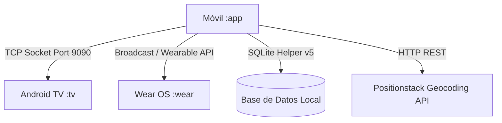

# 📱 Módulo Móvil (Smartphone) - SnowTrail (`:app`)

---

## 📌 Resumen de Arquitectura y Propósito
El módulo `:app` es el núcleo central del ecosistema **SnowTrail**. Proporciona una experiencia de usuario moderna basada en **Jetpack Compose** orientada a dos roles principales: **Cliente** y **Administrador**. Además, actúa como el emisor y sincronizador de eventos de red hacia **Android TV** (mediante sockets TCP) y **Wear OS** (a través de servicios de sincronización y difusiones locales).



---

## 📂 Desglose Técnico Archivo por Archivo

---

### 1. `MainActivity.kt`
* **Ubicación:** `app/src/main/java/mx/utng/snowtrail/MainActivity.kt`
* **Propósito:** Actividad principal (`ComponentActivity`) que gestiona el ciclo de vida, la máquina de estados de Compose, la navegación entre pantallas y roles (Login, Cliente, Administrador), el consumo de la API de geolocalización y la transmisión por sockets TCP.

#### 🔧 Componentes y Funcionalidades Clave:
* **Autenticación y Roles:** Manejo de sesiones para `Admin@gmail.com` y `Cliente@gmail.com`.
* **Transmisor TCP (`sendToTv`):** Envía tramas serializadas hacia la IP de la TV en el puerto `9090` en hilos en segundo plano (`Dispatchers.IO`).
* **Integración de Mapas Positionstack + Leaflet:** Inyección dinámica de HTML/JavaScript en un componente `AndroidView(WebView)` renderizando la cartografía de *Dolores Hidalgo, Gto, México* con marcadores interactivos `🍦`.
* **Apartados de Administrador:**
  * `AdminDashboardTab`: CRUD completo de establecimientos y promociones.
  * `AdminAddTab`: Formulario con selector de tres vías (Nueva Nevería, Nueva Promoción, Nuevo Pedido con carrito multi-producto y cantidades).
  * `AdminOrdersHistoryTab`: Pantalla independiente con historial agrupado dinámicamente por correo electrónico de usuario (`groupBy { it.userEmail }`).
  * `AdminProfileTab`: Controles de simulación de GPS y cierre de sesión.

#### 💻 Fragmento Técnico de Código:
```kotlin
// Transmisión de Sockets TCP hacia Android TV
fun sendToTv(message: String) {
    CoroutineScope(Dispatchers.IO).launch {
        try {
            val socket = Socket()
            // Se conecta a localhost (con adb forward) o a la IP de la TV en el puerto 9090
            socket.connect(InetSocketAddress("127.0.0.1", 9090), 1000)
            val writer = PrintWriter(BufferedWriter(OutputStreamWriter(socket.getOutputStream())), true)
            writer.println(message)
            writer.flush()
            socket.close()
        } catch (e: Exception) {
            e.printStackTrace()
        }
    }
}
```

> [!NOTE]
> Para comprender cómo el servidor de Android TV procesa las tramas de socket recibidas (`SELECT_SHOP`, `ADD_ORDER`, `ADD_PROMO`), consultar la documentación en [README de Android TV](../tv/README.md).

---

### 2. `DatabaseHelper.kt`
* **Ubicación:** `app/src/main/java/mx/utng/snowtrail/database/DatabaseHelper.kt`
* **Propósito:** Gestor de persistencia SQLite local mediante `SQLiteOpenHelper`. Define el esquema relacional para usuarios, heladerías, promociones y pedidos en la versión **`5`**.

#### 📋 Esquema Relacional:
| Tabla | Columnas Clave | Descripción |
| :--- | :--- | :--- |
| `users` | `id`, `email`, `password`, `role` | Credenciales y roles de autenticación |
| `shops` | `id`, `name`, `distance`, `is_favorite`, `schedule`, `contact`, `address` | Directorio de neverías |
| `promotions` | `id`, `name`, `start_date`, `end_date`, `note` | Catálogo de ofertas vigentes |
| `orders` | `id`, `shop_id`, `shop_name`, `status`, `estimated_time`, `timestamp`, `total`, `user_email` | Cabecera de pedidos con vínculo de usuario |
| `order_products` | `order_id`, `product_name`, `quantity`, `unit_price` | Detalle de líneas de producto por pedido |

#### 💻 Fragmento Técnico de Código:
```kotlin
override fun onCreate(db: SQLiteDatabase) {
    // Tabla de órdenes con soporte para agrupación de usuarios
    db.execSQL("""
        CREATE TABLE $TABLE_ORDERS (
            $ORDER_ID TEXT PRIMARY KEY,
            $ORDER_SHOP_ID TEXT,
            $ORDER_SHOP_NAME TEXT,
            $ORDER_STATUS TEXT,
            $ORDER_ESTIMATED_TIME INTEGER,
            $ORDER_TIMESTAMP INTEGER,
            $ORDER_TOTAL REAL,
            $ORDER_USER_EMAIL TEXT DEFAULT 'Cliente@gmail.com'
        )
    """.trimIndent())
}
```

---

### 3. `SnowTrailRepository.kt`
* **Ubicación:** `app/src/main/java/mx/utng/snowtrail/database/SnowTrailRepository.kt`
* **Propósito:** Capa de abstracción de datos (Repository Pattern). Expone métodos transaccionales y seguros para consultar y persistir entidades sin exponer directamente el `dbHelper`.

#### 🔧 Métodos Principales:
* `saveOrder(order: MockOrder)`: Inserta cabecera y detalle de productos en una transacción atómica.
* `getAllOrders(): List<MockOrder>`: Recupera todas las compras del sistema asociadas a su usuario.
* `clearOrdersHistory()`: Borra de forma segura las tablas `orders` y `order_products`.
* `getShops()`, `saveShop()`, `deleteShop()`: Operaciones CRUD de heladerías.
* `getPromotions()`, `savePromotion()`, `deletePromotion()`: Operaciones CRUD de promociones.

---

### 4. `WearSyncService.kt`
* **Ubicación:** `app/src/main/java/mx/utng/snowtrail/service/WearSyncService.kt`
* **Propósito:** Servicio y receptor de eventos de sincronización con Wear OS. Declara las clases de modelo compartidas (`MockOrder`, `MockNotification`, `MockShop`, `MockPromotion`).

#### 💻 Fragmento Técnico de Código:
```kotlin
data class MockOrder(
    val id: String,
    val neveriaId: String,
    val neveriaNombre: String,
    val estado: String,
    val tiempoEstimadoMinutos: Int,
    val fechaHoraMillis: Long,
    val total: Double,
    val productos: List<MockProductLine>,
    val userEmail: String = "Cliente@gmail.com"
)
```

> [!TIP]
> Para conocer el manejo de la bandeja de notificaciones con efecto marquesina y cupones de descuento en el reloj, consultar el [README de Wear OS](../wear/README.md).

---

### 5. `AndroidManifest.xml`
* **Ubicación:** `app/src/main/AndroidManifest.xml`
* **Propósito:** Declara los permisos requeridos para la conectividad de red, consumo de la API de Positionstack y servicios en segundo plano:
  * `android.permission.INTERNET`
  * `android.permission.ACCESS_NETWORK_STATE`
  * `android.permission.ACCESS_FINE_LOCATION`
  * `android.permission.ACCESS_COARSE_LOCATION`
