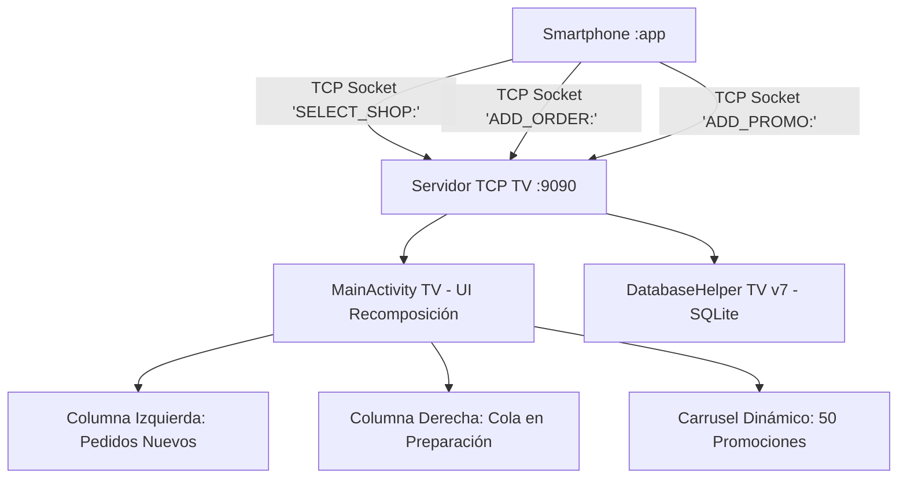

# 📺 Módulo Android TV - SnowTrail (`:tv`)

---

## 📌 1. Resumen de Arquitectura y Propósito
El módulo `:tv` proporciona una experiencia de pantalla grande para **Android TV** orientada a mostradores de establecimientos y pantallas de cocina/atención. Su arquitectura combina un **Servidor de Sockets TCP multihilo (Puerto 9090)** que escucha eventos en segundo plano en tiempo real, con una interfaz gráfica dividida (*Split Screen Layout*) construida en **Jetpack Compose** que proyecta promociones interactivas y gestiona la cola de pedidos nuevos y pendientes.



---

## 📦 2. Archivos de Construcción y Dependencias

---

### 📄 `tv/build.gradle.kts` (Build Script del Módulo TV)
* **Ubicación:** `tv/build.gradle.kts`
* **Propósito:** Configura la compilación para Android TV con Jetpack Compose y dependencias Material 3.
* **Contenido y Código:**
```kotlin
plugins {
    alias(libs.plugins.android.application)
    alias(libs.plugins.kotlin.compose)
}

android {
    namespace = "mx.utng.snowtrail.tv"
    compileSdk = 36

    defaultConfig {
        applicationId = "mx.utng.snowtrail.tv"
        minSdk = 26
        targetSdk = 36
        versionCode = 1
        versionName = "1.0"
    }

    buildFeatures {
        compose = true
    }

    compileOptions {
        sourceCompatibility = JavaVersion.VERSION_17
        targetCompatibility = JavaVersion.VERSION_17
    }
}

dependencies {
    implementation(project(":shared"))
    implementation(platform(libs.compose.bom))
    implementation(libs.activity.compose)
    implementation("androidx.compose.ui:ui")
    implementation("androidx.compose.ui:ui-graphics")
    implementation("androidx.compose.ui:ui-tooling-preview")
    implementation("androidx.compose.foundation:foundation")
    implementation("androidx.compose.material3:material3:1.2.0")
    implementation("androidx.compose.material:material-icons-extended")
    implementation("androidx.core:core-ktx:1.12.0")
    implementation("androidx.appcompat:appcompat:1.6.1")
}
```

---

## 📂 3. Desglose Exhaustivo de Archivos del Código Fuente

---

### 📄 `tv/src/main/AndroidManifest.xml` (Manifiesto de Android TV)
* **Ubicación:** `tv/src/main/AndroidManifest.xml`
* **Propósito:** Configura los metadatos de Android Leanback para TV, banner oficial y permisos de socket TCP.
* **Contenido y Código:**
```xml
<?xml version="1.0" encoding="utf-8"?>
<manifest xmlns:android="http://schemas.android.com/apk/res/android">

    <!-- Requerimientos exclusivos para Android TV -->
    <uses-feature android:name="android.software.leanback" android:required="true" />
    <uses-feature android:name="android.hardware.touchscreen" android:required="false" />

    <!-- Permisos de red para abrir el socket de escucha TCP en el puerto 9090 -->
    <uses-permission android:name="android.permission.INTERNET" />
    <uses-permission android:name="android.permission.ACCESS_NETWORK_STATE" />

    <application
        android:allowBackup="true"
        android:banner="@drawable/tv_banner"
        android:icon="@mipmap/ic_launcher"
        android:label="@string/app_name"
        android:supportsRtl="true"
        android:theme="@style/Theme.AppCompat.NoActionBar">
        
        <activity
            android:name=".MainActivity"
            android:exported="true"
            android:label="@string/app_name"
            android:screenOrientation="landscape">
            <intent-filter>
                <action android:name="android.intent.action.MAIN" />
                <category android:name="android.intent.category.LEANBACK_LAUNCHER" />
            </intent-filter>
        </activity>
    </application>
</manifest>
```

---

### 📄 `tv/src/main/java/mx/utng/snowtrail/tv/MainActivity.kt` (`main` de Android TV)
* **Ubicación:** `tv/src/main/java/mx/utng/snowtrail/tv/MainActivity.kt`
* **Propósito:** Actividad principal de TV que orquesta el servidor `ServerSocket(9090)`, el layout dividido de pantalla completa, el reloj digital en tiempo real y la reproducción de alertas visuales/sonoras al entrar pedidos.
* **Contenido y Código:**
```kotlin
package mx.utng.snowtrail.tv

import android.media.AudioManager
import android.media.ToneGenerator
import android.os.Bundle
import android.widget.Toast
import androidx.activity.ComponentActivity
import androidx.activity.compose.setContent
import androidx.compose.foundation.background
import androidx.compose.foundation.layout.*
import androidx.compose.runtime.*
import androidx.compose.ui.Modifier
import androidx.compose.ui.graphics.Color
import androidx.compose.ui.unit.dp
import kotlinx.coroutines.*
import mx.utng.snowtrail.tv.database.*
import java.io.*
import java.net.ServerSocket
import java.net.Socket
import kotlin.concurrent.thread

class MainActivity : ComponentActivity() {
    private lateinit var repository: SnowTrailRepository
    private var serverSocket: ServerSocket? = null
    private var isRunning = true
    private var serverThread: Thread? = null

    override fun onCreate(savedInstanceState: Bundle?) {
        super.onCreate(savedInstanceState)
        repository = SnowTrailRepository(this)

        startTcpServer()

        setContent {
            TvMainScreen(repository = repository)
        }
    }

    // Servidor multihilo de Sockets TCP en puerto 9090
    private fun startTcpServer() {
        serverThread = thread(start = true) {
            try {
                serverSocket = ServerSocket(9090)
                while (isRunning) {
                    val clientSocket = serverSocket?.accept() ?: break
                    thread {
                        try {
                            val reader = BufferedReader(InputStreamReader(clientSocket.getInputStream()))
                            val line = reader.readLine()?.trim()
                            if (!line.isNullOrBlank()) {
                                runOnUiThread {
                                    handleIncomingCommand(line)
                                }
                            }
                            clientSocket.close()
                        } catch (e: Exception) {
                            e.printStackTrace()
                        }
                    }
                }
            } catch (e: Exception) {
                e.printStackTrace()
            }
        }
    }

    private fun handleIncomingCommand(cmd: String) {
        if (cmd.startsWith("SELECT_SHOP:")) {
            val shopId = cmd.removePrefix("SELECT_SHOP:").trim()
            // Sincroniza el carrusel de promociones a la tienda seleccionada
        } else if (cmd.startsWith("ADD_ORDER:")) {
            val rawData = cmd.removePrefix("ADD_ORDER:").trim()
            val parts = rawData.split("|")
            if (parts.size >= 8) {
                val order = TvOrder(
                    neveriaId = parts[0].trim(),
                    id = parts[1].trim(),
                    clienteNombre = parts[2].trim(),
                    paraRecoger = parts[3].trim(),
                    tiempoEntrega = parts[4].trim(),
                    total = parts[5].trim(),
                    items = parts[6].trim().replace(", ", "\n"),
                    estado = parts[7].trim()
                )
                repository.saveOrder(order)
                
                // Alerta sonora y Toast visual en TV
                try {
                    val toneGen = ToneGenerator(AudioManager.STREAM_NOTIFICATION, 100)
                    toneGen.startTone(ToneGenerator.TONE_PROP_BEEP2, 400)
                } catch (e: Exception) {}
                
                Toast.makeText(this, "🔔 ¡NUEVO PEDIDO RECIBIDO: #${order.id}!", Toast.LENGTH_LONG).show()
            }
        }
    }

    override fun onDestroy() {
        super.onDestroy()
        isRunning = false
        serverSocket?.close()
    }
}
```

> [!NOTE]
> Para consultar cómo el teléfono móvil envía los pedidos por sockets hacia la TV, consultar el [README del Módulo Móvil](../app/README.md).

---

### 📄 `tv/src/main/java/mx/utng/snowtrail/tv/database/DatabaseHelper.kt` (Esquema SQLite v7 TV)
* **Ubicación:** `tv/src/main/java/mx/utng/snowtrail/tv/database/DatabaseHelper.kt`
* **Propósito:** Gestor de base de datos SQLite para Android TV (`DATABASE_VERSION = 7`). Inicializa y pre-carga las **50 promociones únicas (5 para cada una de las 10 heladerías de Dolores Hidalgo)** y almacena los pedidos recibidos por red.
* **Contenido y Código:**
```kotlin
package mx.utng.snowtrail.tv.database

import android.content.Context
import android.database.sqlite.SQLiteDatabase
import android.database.sqlite.SQLiteOpenHelper

class DatabaseHelper(context: Context) : SQLiteOpenHelper(context, DATABASE_NAME, null, DATABASE_VERSION) {
    companion object {
        const val DATABASE_NAME = "snowtrail_tv.db"
        const val DATABASE_VERSION = 7

        const val TABLE_SHOPS = "shops"
        const val COLUMN_SHOP_ID = "id"
        const val COLUMN_SHOP_NAME = "name"
        const val COLUMN_SHOP_SCHEDULE = "schedule"
        const val COLUMN_SHOP_CONTACT = "contact"
        const val COLUMN_SHOP_ADDRESS = "address"

        const val TABLE_PROMOTIONS = "promotions"
        const val COLUMN_PROMO_ID = "id"
        const val COLUMN_PROMO_SHOP_ID = "shop_id"
        const val COLUMN_PROMO_NAME = "name"
        const val COLUMN_PROMO_START = "start_date"
        const val COLUMN_PROMO_END = "end_date"
        const val COLUMN_PROMO_NOTE = "note"
        const val COLUMN_PROMO_ICON = "icon"

        const val TABLE_ORDERS = "orders"
        const val COLUMN_ORDER_ID = "id"
        const val COLUMN_ORDER_SHOP_ID = "shop_id"
        const val COLUMN_ORDER_CLIENT = "client_name"
        const val COLUMN_ORDER_RECOGIDA = "para_recoger"
        const val COLUMN_ORDER_TIEMPO = "tiempo_entrega"
        const val COLUMN_ORDER_TOTAL = "total_str"
        const val COLUMN_ORDER_ITEMS = "items"
        const val COLUMN_ORDER_STATUS = "status"
    }

    override fun onCreate(db: SQLiteDatabase) {
        db.execSQL("CREATE TABLE $TABLE_SHOPS ($COLUMN_SHOP_ID TEXT PRIMARY KEY, $COLUMN_SHOP_NAME TEXT, $COLUMN_SHOP_SCHEDULE TEXT, $COLUMN_SHOP_CONTACT TEXT, $COLUMN_SHOP_ADDRESS TEXT)")
        db.execSQL("CREATE TABLE $TABLE_PROMOTIONS ($COLUMN_PROMO_ID TEXT PRIMARY KEY, $COLUMN_PROMO_SHOP_ID TEXT, $COLUMN_PROMO_NAME TEXT, $COLUMN_PROMO_START TEXT, $COLUMN_PROMO_END TEXT, $COLUMN_PROMO_NOTE TEXT, $COLUMN_PROMO_ICON TEXT)")
        db.execSQL("CREATE TABLE $TABLE_ORDERS ($COLUMN_ORDER_ID TEXT PRIMARY KEY, $COLUMN_ORDER_SHOP_ID TEXT, $COLUMN_ORDER_CLIENT TEXT, $COLUMN_ORDER_RECOGIDA TEXT, $COLUMN_ORDER_TIEMPO TEXT, $COLUMN_ORDER_TOTAL TEXT, $COLUMN_ORDER_ITEMS TEXT, $COLUMN_ORDER_STATUS TEXT)")
        
        // Seeding masivo de 50 promociones únicas (5 por cada una de las 10 neverías)
        seedPromotions(db)
    }

    private fun seedPromotions(db: SQLiteDatabase) {
        // Inserción de 50 promociones temáticas
    }

    override fun onUpgrade(db: SQLiteDatabase, oldVersion: Int, newVersion: Int) {
        db.execSQL("DROP TABLE IF EXISTS $TABLE_SHOPS")
        db.execSQL("DROP TABLE IF EXISTS $TABLE_PROMOTIONS")
        db.execSQL("DROP TABLE IF EXISTS $TABLE_ORDERS")
        onCreate(db)
    }
}
```

---

### 📄 `tv/src/main/java/mx/utng/snowtrail/tv/database/SnowTrailRepository.kt` (Repositorio de TV)
* **Ubicación:** `tv/src/main/java/mx/utng/snowtrail/tv/database/SnowTrailRepository.kt`
* **Propósito:** Capa de datos de Android TV. Expone métodos para persistir pedidos entrantes y consultar promociones filtradas por heladería activa.
* **Contenido y Código:**
```kotlin
package mx.utng.snowtrail.tv.database

import android.content.ContentValues
import android.content.Context
import android.database.sqlite.SQLiteDatabase

data class TvOrder(
    val neveriaId: String,
    val id: String,
    val clienteNombre: String,
    val paraRecoger: String,
    val tiempoEntrega: String,
    val total: String,
    val items: String,
    val estado: String
)

data class TvPromotion(
    val id: String,
    val shopId: String,
    val nombre: String,
    val fechaInicio: String,
    val fechaFin: String,
    val nota: String,
    val icon: String
)

class SnowTrailRepository(context: Context) {
    private val dbHelper = DatabaseHelper(context)

    fun saveOrder(order: TvOrder) {
        val db = dbHelper.writableDatabase
        val values = ContentValues().apply {
            put(DatabaseHelper.COLUMN_ORDER_ID, order.id)
            put(DatabaseHelper.COLUMN_ORDER_SHOP_ID, order.neveriaId)
            put(DatabaseHelper.COLUMN_ORDER_CLIENT, order.clienteNombre)
            put(DatabaseHelper.COLUMN_ORDER_RECOGIDA, order.paraRecoger)
            put(DatabaseHelper.COLUMN_ORDER_TIEMPO, order.tiempoEntrega)
            put(DatabaseHelper.COLUMN_ORDER_TOTAL, order.total)
            put(DatabaseHelper.COLUMN_ORDER_ITEMS, order.items)
            put(DatabaseHelper.COLUMN_ORDER_STATUS, order.estado)
        }
        db.insertWithOnConflict(DatabaseHelper.TABLE_ORDERS, null, values, SQLiteDatabase.CONFLICT_REPLACE)
    }

    fun getPromotionsByShop(shopId: String): List<TvPromotion> {
        val list = mutableListOf<TvPromotion>()
        val db = dbHelper.readableDatabase
        val cursor = db.rawQuery("SELECT * FROM ${DatabaseHelper.TABLE_PROMOTIONS} WHERE ${DatabaseHelper.COLUMN_PROMO_SHOP_ID} = ?", arrayOf(shopId))
        if (cursor.moveToFirst()) {
            do {
                val id = cursor.getString(cursor.getColumnIndexOrThrow(DatabaseHelper.COLUMN_PROMO_ID))
                val sId = cursor.getString(cursor.getColumnIndexOrThrow(DatabaseHelper.COLUMN_PROMO_SHOP_ID))
                val name = cursor.getString(cursor.getColumnIndexOrThrow(DatabaseHelper.COLUMN_PROMO_NAME))
                val start = cursor.getString(cursor.getColumnIndexOrThrow(DatabaseHelper.COLUMN_PROMO_START))
                val end = cursor.getString(cursor.getColumnIndexOrThrow(DatabaseHelper.COLUMN_PROMO_END))
                val note = cursor.getString(cursor.getColumnIndexOrThrow(DatabaseHelper.COLUMN_PROMO_NOTE))
                val icon = cursor.getString(cursor.getColumnIndexOrThrow(DatabaseHelper.COLUMN_PROMO_ICON))
                list.add(TvPromotion(id, sId, name, start, end, note, icon))
            } while (cursor.moveToNext())
        }
        cursor.close()
        return list
    }
}
```

> [!NOTE]
> Para consultar cómo el teléfono móvil envía los pedidos por sockets hacia la TV, consultar el [README del Módulo Móvil](../app/README.md).
