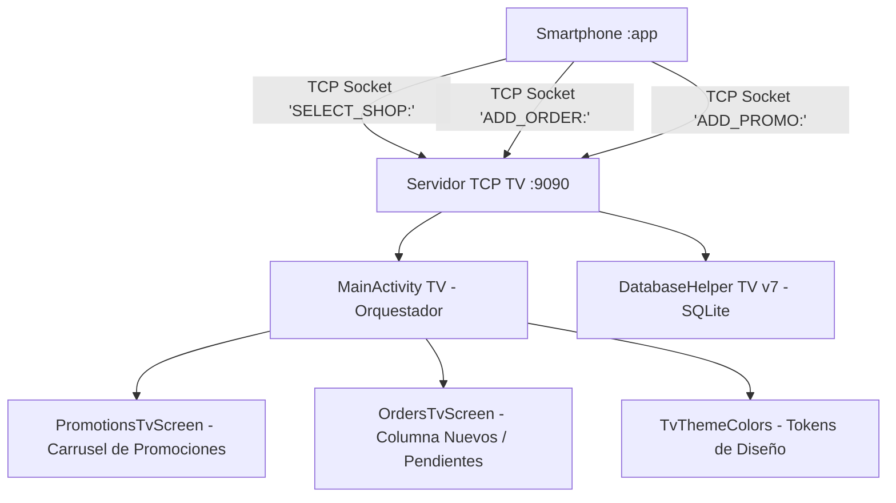

# 📺 Módulo Android TV - SnowTrail (`:tv`)

---

## 📌 1. Resumen de Arquitectura y Propósito
El módulo `:tv` proporciona una experiencia de pantalla grande para **Android TV** orientada a mostradores de establecimientos y pantallas de cocina/atención. Su arquitectura combina un **Servidor de Sockets TCP multihilo (Puerto 9090)** que escucha eventos en segundo plano en tiempo real, con una interfaz gráfica dividida (*Split Screen Layout*) construida en **Jetpack Compose** que proyecta promociones interactivas y gestiona la cola de pedidos nuevos y pendientes.



---

## 📦 2. Archivos de Construcción y Dependencias

---

### 📄 `gradle/libs.versions.toml` (Version Catalog Centralizado)
* **Ubicación:** `gradle/libs.versions.toml`
* **Propósito:** Catálogo centralizado que unifica las versiones, dependencias y plugins del módulo de Android TV con el resto de plataformas.
* **Contenido y Código Completo:**
```toml
[versions]
agp = "9.2.1"
playServicesWearable = "20.0.1"
kotlin = "2.2.10"
composeBom = "2024.09.00"
composeMaterial3 = "1.5.6"
composeFoundation = "1.5.6"
composeUiTooling = "1.5.6"
wearToolingPreview = "1.0.0"
activityCompose = "1.13.0"
coreSplashscreen = "1.2.0"

[libraries]
play-services-wearable = { group = "com.google.android.gms", name = "play-services-wearable", version.ref = "playServicesWearable" }
compose-bom = { group = "androidx.compose", name = "compose-bom", version.ref = "composeBom" }
ui = { group = "androidx.compose.ui", name = "ui" }
ui-graphics = { group = "androidx.compose.ui", name = "ui-graphics" }
ui-tooling = { group = "androidx.compose.ui", name = "ui-tooling" }
ui-tooling-preview = { group = "androidx.compose.ui", name = "ui-tooling-preview" }
ui-test-manifest = { group = "androidx.compose.ui", name = "ui-test-manifest" }
ui-test-junit4 = { group = "androidx.compose.ui", name = "ui-test-junit4" }
compose-material3 = { group = "androidx.wear.compose", name = "compose-material3", version.ref = "composeMaterial3" }
compose-foundation = { group = "androidx.wear.compose", name = "compose-foundation", version.ref = "composeFoundation" }
compose-ui-tooling = { group = "androidx.wear.compose", name = "compose-ui-tooling", version.ref = "composeUiTooling" }
wear-tooling-preview = { group = "androidx.wear", name = "wear-tooling-preview", version.ref = "wearToolingPreview" }
activity-compose = { group = "androidx.activity", name = "activity-compose", version.ref = "activityCompose" }
core-splashscreen = { group = "androidx.core", name = "core-splashscreen", version.ref = "coreSplashscreen" }

[plugins]
android-application = { id = "com.android.application", version.ref = "agp" }
kotlin-compose = { id = "org.jetbrains.kotlin.plugin.compose", version.ref = "kotlin" }
```

#### 🔍 Desglose y Utilidad para Android TV:
| Elemento Añadido | Tipo | ¿Para qué ayuda en Android TV? |
| :--- | :--- | :--- |
| `agp = "9.2.1"` | Plugin | **Android Gradle Plugin**: Compila el módulo `:tv` y genera el APK `tv-debug.apk`. |
| `kotlin-compose` | Plugin | **Compose Compiler Plugin**: Permite construir la interfaz de pantalla grande usando programación declarativa reactiva. |
| `composeBom = "2024.09.00"` | BOM | **Compose BOM**: Mantiene sincronizadas las librerías de UI, gráficos y animación de la televisión. |
| `activityCompose = "1.13.0"` | Librería | **Activity Compose**: Enlaza la actividad de TV (`ComponentActivity`) con la UI dividida de Compose. |

---

### 📄 `tv/build.gradle.kts` (Build Script del Módulo TV)
* **Ubicación:** `tv/build.gradle.kts`
* **Propósito:** Configura la compilación para Android TV con Jetpack Compose y dependencias Material 3.
* **Contenido y Código Completo:**
```kotlin
plugins {
    alias(libs.plugins.android.application)
    alias(libs.plugins.kotlin.compose)
}

android {
    namespace = "mx.utng.snowtrail.tv"
    compileSdk = 36

    defaultConfig {
        applicationId = "mx.utng.snowtrail.tv"
        minSdk = 26
        targetSdk = 36
        versionCode = 1
        versionName = "1.0"
    }

    buildFeatures {
        compose = true
    }

    compileOptions {
        sourceCompatibility = JavaVersion.VERSION_17
        targetCompatibility = JavaVersion.VERSION_17
    }
}

dependencies {
    implementation(project(":shared"))
    
    // Compose general dependencies
    implementation(platform(libs.compose.bom))
    implementation(libs.activity.compose)
    implementation("androidx.compose.ui:ui")
    implementation("androidx.compose.ui:ui-graphics")
    implementation("androidx.compose.ui:ui-tooling-preview")
    implementation("androidx.compose.foundation:foundation")
    
    // Material 3 for Compose
    implementation("androidx.compose.material3:material3:1.2.0")
    implementation("androidx.compose.material:material-icons-extended")
    
    implementation("androidx.core:core-ktx:1.12.0")
    implementation("androidx.appcompat:appcompat:1.6.1")
}
```

#### 🔍 Desglose y Utilidad de las Dependencias añadidas en `:tv`:
| Dependencia Añadida | Propósito Técnico | Beneficio en Android TV |
| :--- | :--- | :--- |
| `implementation(project(":shared"))` | Módulo compartido | Provee modelos unificados de datos (`TvOrder`, `TvPromotion`). |
| `platform(libs.compose.bom)` | Bill of Materials | Asegura que la renderización de fuentes grandes en 1080p / 4K sea nítida y fluida a 60 fps. |
| `compose.material3:1.2.0` | Sistema de Diseño M3 | Provee las tarjetas oscuras estilizadas, bordes degradados y tipografías para la pantalla de mostrador. |
| `material-icons-extended` | Íconos extendidos | Íconos de tienda, campanas de notificación, heladerías y relojes en la TV. |
| `core-ktx:1.12.0` | Extensiones de Kotlin | Simplifica el manejo de hilos en segundo plano para el **Servidor Socket TCP en el puerto 9090**. |
| `appcompat:1.6.1` | Compatibilidad Android | Brinda compatibilidad con Android TV OS y emuladores de Google TV. |

---

## 📂 3. Desglose Exhaustivo de Archivos del Código Fuente

---

### 📄 `tv/src/main/AndroidManifest.xml` (Manifiesto de Android TV)
* **Ubicación:** `tv/src/main/AndroidManifest.xml`
* **Propósito:** Configura los metadatos de Android Leanback para TV, banner oficial y permisos de socket TCP.
* **Contenido y Código:**
```xml
<?xml version="1.0" encoding="utf-8"?>
<manifest xmlns:android="http://schemas.android.com/apk/res/android">

    <!-- Requerimientos exclusivos para Android TV -->
    <uses-feature android:name="android.software.leanback" android:required="true" />
    <uses-feature android:name="android.hardware.touchscreen" android:required="false" />

    <!-- Permisos de red para abrir el socket de escucha TCP en el puerto 9090 -->
    <uses-permission android:name="android.permission.INTERNET" />
    <uses-permission android:name="android.permission.ACCESS_NETWORK_STATE" />

    <application
        android:allowBackup="true"
        android:banner="@drawable/tv_banner"
        android:icon="@mipmap/ic_launcher"
        android:label="@string/app_name"
        android:supportsRtl="true"
        android:theme="@style/Theme.AppCompat.NoActionBar">
        
        <activity
            android:name=".MainActivity"
            android:exported="true"
            android:label="@string/app_name"
            android:screenOrientation="landscape">
            <intent-filter>
                <action android:name="android.intent.action.MAIN" />
                <category android:name="android.intent.category.LEANBACK_LAUNCHER" />
            </intent-filter>
        </activity>
    </application>
</manifest>
```

---

## 🎨 4. Capa de Presentación Modularizada (`tv/screens/` y `tv/theme/`)

---

### 📄 `tv/src/main/java/mx/utng/snowtrail/tv/theme/TvThemeColors.kt` (Tokens de Color TV)
* **Ubicación:** `tv/src/main/java/mx/utng/snowtrail/tv/theme/TvThemeColors.kt`
* **Propósito:** Define los tokens de color pastel del sistema visual de Android TV para mantener coherencia visual con el módulo móvil.
* **Contenido y Código:**
```kotlin
package mx.utng.snowtrail.tv.theme

import androidx.compose.ui.graphics.Color

object TvThemeColors {
    val VanillaBackground = Color(0xFFFCFAF2)   // Fondo vainilla suave
    val MintGreen = Color(0xFFE2F9EE)            // Verde menta para paneles
    val PinkStrawberry = Color(0xFFFEE1E8)       // Rosa fresa para acentos
    val PinkBorder = Color(0xFFEF9A9A)           // Borde rosa pastel
    val CocoaDark = Color(0xFF3E2723)            // Texto marrón oscuro
    val CocoaMedium = Color(0xFF795548)          // Texto marrón medio
    val GoldText = Color(0xFF8F6300)             // Texto dorado
    val FresaPink = Color(0xFFB52D5E)            // Rosa intenso (totales)

    // Estados de pedidos
    val AceptadoGreen = Color(0xFF81C784)        // Verde para Aceptar
    val PospuestoYellow = Color(0xFFFFD54F)      // Amarillo para Posponer
    val RechazadoRed = Color(0xFFE57373)         // Rojo para Rechazar
    val EntregadoBlueBg = Color(0xFFE3F2FD)      // Azul claro para Entregado
    val EntregadoBlueText = Color(0xFF1565C0)    // Azul oscuro para Entregado
    val CocoaBrown = Color(0xFF5D4037)           // Marrón para texto sobre amarillo
}
```

---

### 📄 `tv/src/main/java/mx/utng/snowtrail/tv/screens/PromotionsTvScreen.kt` (Carrusel de Promociones)
* **Ubicación:** `tv/src/main/java/mx/utng/snowtrail/tv/screens/PromotionsTvScreen.kt`
* **Propósito:** Pantalla principal de TV que muestra un carrusel con auto-desplazamiento cada **4 segundos** de las promociones activas. Soporta navegación con control remoto mediante `FocusRequester`.
* **Contenido y Código:**
```kotlin
package mx.utng.snowtrail.tv.screens

import androidx.compose.foundation.BorderStroke
import androidx.compose.foundation.background
import androidx.compose.foundation.border
import androidx.compose.foundation.clickable
import androidx.compose.foundation.focusable
import androidx.compose.foundation.layout.*
import androidx.compose.foundation.shape.CircleShape
import androidx.compose.foundation.shape.RoundedCornerShape
import androidx.compose.material3.*
import androidx.compose.runtime.*
import androidx.compose.ui.Alignment
import androidx.compose.ui.Modifier
import androidx.compose.ui.draw.alpha
import androidx.compose.ui.focus.FocusRequester
import androidx.compose.ui.focus.focusRequester
import androidx.compose.ui.graphics.Brush
import androidx.compose.ui.graphics.Color
import androidx.compose.ui.platform.LocalContext
import androidx.compose.ui.text.font.FontWeight
import androidx.compose.ui.text.style.TextAlign
import androidx.compose.ui.text.style.TextOverflow
import androidx.compose.ui.unit.dp
import androidx.compose.ui.unit.sp
import kotlinx.coroutines.delay
import mx.utng.snowtrail.tv.database.SnowTrailRepository.TvPromotion
import mx.utng.snowtrail.tv.theme.TvThemeColors

@Composable
fun PromotionsTvScreen(
    promotions: List<TvPromotion>,
    selectedShopName: String,
    onNavigateToOrders: () -> Unit
) {
    var currentIndex by remember { mutableIntStateOf(0) }
    val focusRequester = remember { FocusRequester() }

    // Solicitar foco al iniciar para soportar control remoto de TV
    LaunchedEffect(Unit) {
        try {
            delay(100L)
            focusRequester.requestFocus()
        } catch (e: Exception) { e.printStackTrace() }
    }

    // Auto-scroll del carrusel de promociones cada 4 segundos
    LaunchedEffect(promotions) {
        if (promotions.isNotEmpty()) {
            while (true) {
                delay(4000L)
                currentIndex = (currentIndex + 1) % promotions.size
            }
        }
    }

    val context = LocalContext.current

    Box(
        modifier = Modifier
            .fillMaxSize()
            .background(Brush.verticalGradient(colors = listOf(TvThemeColors.MintGreen, TvThemeColors.VanillaBackground)))
            .padding(24.dp)
            .clickable { onNavigateToOrders() }
    ) {
        // Decoración de fondo semitransparente
        Text("🍓", fontSize = 48.sp, modifier = Modifier.align(Alignment.TopEnd).padding(end = 120.dp, top = 20.dp).alpha(0.18f))
        Text("🍦", fontSize = 48.sp, modifier = Modifier.align(Alignment.BottomStart).padding(start = 40.dp, bottom = 40.dp).alpha(0.18f))
        Text("🍨", fontSize = 48.sp, modifier = Modifier.align(Alignment.BottomEnd).padding(end = 40.dp, bottom = 40.dp).alpha(0.18f))

        Column(modifier = Modifier.fillMaxSize()) {
            // Header con nombre de heladería activa
            Row(modifier = Modifier.fillMaxWidth(), horizontalArrangement = Arrangement.SpaceBetween, verticalAlignment = Alignment.CenterVertically) {
                Row(verticalAlignment = Alignment.CenterVertically, horizontalArrangement = Arrangement.spacedBy(16.dp)) {
                    Box(modifier = Modifier.size(60.dp).background(Color.White, CircleShape).border(BorderStroke(1.5.dp, TvThemeColors.PinkBorder), CircleShape), contentAlignment = Alignment.Center) {
                        Text("🍦", fontSize = 32.sp)
                    }
                    Column {
                        Text("LA NIEVERÍA PASTEL", fontSize = 24.sp, fontWeight = FontWeight.ExtraBold, color = TvThemeColors.CocoaDark)
                        Text("Heladería Activa: $selectedShopName", fontSize = 18.sp, fontWeight = FontWeight.Bold, color = TvThemeColors.CocoaMedium)
                    }
                }
                Column(horizontalAlignment = Alignment.End) {
                    Text("🔔 NOTIFICACIONES", fontSize = 16.sp, fontWeight = FontWeight.Bold, color = TvThemeColors.CocoaMedium)
                    Text("SUCURSAL MATRIZ", fontSize = 14.sp, fontWeight = FontWeight.Bold, color = TvThemeColors.GoldText)
                }
            }

            Spacer(modifier = Modifier.height(30.dp))
            Text("OPCIÓN DE PROMOCIONES", fontSize = 28.sp, fontWeight = FontWeight.ExtraBold, color = TvThemeColors.CocoaDark, modifier = Modifier.align(Alignment.CenterHorizontally))
            Spacer(modifier = Modifier.height(24.dp))

            // Carrusel de tarjetas: izquierda (previa) - centro (activa) - derecha (siguiente)
            Row(modifier = Modifier.weight(1f).fillMaxWidth(), horizontalArrangement = Arrangement.Center, verticalAlignment = Alignment.CenterVertically) {
                if (promotions.isNotEmpty()) {
                    for (i in -1..1) {
                        val index = (currentIndex + i + promotions.size) % promotions.size
                        val promo = promotions[index]
                        val isCurrent = i == 0
                        Card(
                            colors = CardDefaults.cardColors(containerColor = if (isCurrent) Color.White else Color.White.copy(alpha = 0.6f)),
                            shape = RoundedCornerShape(24.dp),
                            border = BorderStroke(if (isCurrent) 3.dp else 1.dp, if (isCurrent) TvThemeColors.PinkBorder else Color.LightGray),
                            elevation = CardDefaults.cardElevation(defaultElevation = if (isCurrent) 12.dp else 4.dp),
                            modifier = Modifier.width(if (isCurrent) 340.dp else 260.dp).height(if (isCurrent) 280.dp else 220.dp).padding(horizontal = 12.dp)
                        ) {
                            Column(modifier = Modifier.fillMaxSize().padding(20.dp), horizontalAlignment = Alignment.CenterHorizontally, verticalArrangement = Arrangement.SpaceBetween) {
                                Box(modifier = Modifier.size(if (isCurrent) 90.dp else 65.dp).background(TvThemeColors.PinkStrawberry, CircleShape), contentAlignment = Alignment.Center) {
                                    Text(promo.imagen, fontSize = if (isCurrent) 45.sp else 32.sp)
                                }
                                Text(promo.nombre, fontSize = if (isCurrent) 20.sp else 16.sp, fontWeight = FontWeight.ExtraBold, color = TvThemeColors.CocoaDark, textAlign = TextAlign.Center, maxLines = 2, overflow = TextOverflow.Ellipsis)
                                Text(promo.nota, fontSize = if (isCurrent) 12.sp else 10.sp, color = TvThemeColors.CocoaMedium, textAlign = TextAlign.Center, maxLines = 2, overflow = TextOverflow.Ellipsis)
                            }
                        }
                    }
                } else {
                    Text("No hay promociones activas actualmente.", fontSize = 18.sp, color = Color.Gray)
                }
            }

            Spacer(modifier = Modifier.height(16.dp))
            Button(
                onClick = { android.widget.Toast.makeText(context, "Cargando Pedidos...", android.widget.Toast.LENGTH_SHORT).show(); onNavigateToOrders() },
                colors = ButtonDefaults.buttonColors(containerColor = TvThemeColors.PinkBorder),
                shape = RoundedCornerShape(20.dp),
                modifier = Modifier.align(Alignment.CenterHorizontally).width(220.dp).height(50.dp).focusRequester(focusRequester).focusable()
            ) {
                Text("🔄 ACTUALIZAR", fontSize = 16.sp, fontWeight = FontWeight.Bold, color = Color.White)
            }
        }
    }
}
```

---

### 📄 `tv/src/main/java/mx/utng/snowtrail/tv/screens/OrdersTvScreen.kt` (Gestión de Pedidos)
* **Ubicación:** `tv/src/main/java/mx/utng/snowtrail/tv/screens/OrdersTvScreen.kt`
* **Propósito:** Pantalla dividida en dos columnas que muestra en tiempo real los pedidos recibidos por TCP:
  - **Columna Izquierda:** Pedido `NUEVO` activo con botones (Aceptar / Posponer / Rechazar).
  - **Columna Derecha:** Lista scrollable de pedidos `PENDIENTE` con botón de marcar como `ENTREGADO`.
* **Contenido y Código:**
```kotlin
package mx.utng.snowtrail.tv.screens

import androidx.compose.foundation.BorderStroke
import androidx.compose.foundation.background
import androidx.compose.foundation.border
import androidx.compose.foundation.focusable
import androidx.compose.foundation.layout.*
import androidx.compose.foundation.lazy.LazyColumn
import androidx.compose.foundation.lazy.items
import androidx.compose.foundation.shape.CircleShape
import androidx.compose.foundation.shape.RoundedCornerShape
import androidx.compose.material3.*
import androidx.compose.runtime.*
import androidx.compose.ui.Alignment
import androidx.compose.ui.Modifier
import androidx.compose.ui.focus.FocusRequester
import androidx.compose.ui.focus.focusRequester
import androidx.compose.ui.graphics.Color
import androidx.compose.ui.platform.LocalContext
import androidx.compose.ui.text.font.FontWeight
import androidx.compose.ui.unit.dp
import androidx.compose.ui.unit.sp
import kotlinx.coroutines.delay
import mx.utng.snowtrail.tv.database.SnowTrailRepository.TvOrder
import mx.utng.snowtrail.tv.theme.TvThemeColors

@Composable
fun OrdersTvScreen(
    orders: List<TvOrder>,
    selectedShopName: String,
    onUpdateOrder: (String, String) -> Unit,
    onBack: () -> Unit
) {
    val newOrders = orders.filter { it.estado == "NUEVO" }
    val pendingOrders = orders.filter { it.estado == "PENDIENTE" }
    val focusRequester = remember { FocusRequester() }

    LaunchedEffect(Unit) {
        try { delay(100L); focusRequester.requestFocus() } catch (e: Exception) { e.printStackTrace() }
    }

    val context = LocalContext.current

    Box(modifier = Modifier.fillMaxSize().background(TvThemeColors.VanillaBackground).padding(24.dp)) {
        Column(modifier = Modifier.fillMaxSize()) {
            // Header
            Row(modifier = Modifier.fillMaxWidth(), horizontalArrangement = Arrangement.SpaceBetween, verticalAlignment = Alignment.CenterVertically) {
                Row(verticalAlignment = Alignment.CenterVertically, horizontalArrangement = Arrangement.spacedBy(16.dp)) {
                    Box(modifier = Modifier.size(50.dp).background(Color.White, CircleShape).border(BorderStroke(1.5.dp, TvThemeColors.PinkBorder), CircleShape), contentAlignment = Alignment.Center) {
                        Text("🍦", fontSize = 24.sp)
                    }
                    Column {
                        Text("LA NIEVERÍA PASTEL", fontSize = 20.sp, fontWeight = FontWeight.ExtraBold, color = TvThemeColors.CocoaDark)
                        Text("Heladería Activa: $selectedShopName", fontSize = 16.sp, fontWeight = FontWeight.Bold, color = TvThemeColors.CocoaMedium)
                    }
                }
                Text("PEDIDOS", fontSize = 28.sp, fontWeight = FontWeight.ExtraBold, color = TvThemeColors.CocoaDark)
            }

            Spacer(modifier = Modifier.height(20.dp))

            // Vista dividida
            Row(modifier = Modifier.weight(1f).fillMaxWidth(), horizontalArrangement = Arrangement.spacedBy(24.dp)) {
                // Columna Izquierda: Pedido NUEVO activo
                Column(modifier = Modifier.weight(1f).fillMaxHeight()) {
                    Text("Pedidos Nuevos", fontSize = 22.sp, fontWeight = FontWeight.ExtraBold, color = TvThemeColors.CocoaDark, modifier = Modifier.padding(bottom = 12.dp))
                    Box(modifier = Modifier.weight(1f).fillMaxWidth().background(TvThemeColors.MintGreen.copy(alpha = 0.5f), RoundedCornerShape(16.dp)).border(BorderStroke(1.5.dp, TvThemeColors.MintGreen), RoundedCornerShape(16.dp)).padding(16.dp)) {
                        if (newOrders.isNotEmpty()) {
                            val activeNew = newOrders.first()
                            Column(modifier = Modifier.fillMaxSize(), verticalArrangement = Arrangement.SpaceBetween) {
                                Column(verticalArrangement = Arrangement.spacedBy(10.dp)) {
                                    Text("Cliente: ${activeNew.cliente}", fontSize = 18.sp, fontWeight = FontWeight.Bold, color = TvThemeColors.CocoaDark)
                                    Text(activeNew.paraRecoger, fontSize = 16.sp, color = TvThemeColors.CocoaMedium)
                                    Text("Tiempo de entrega aprox: ${activeNew.tiempoEntrega}", fontSize = 16.sp, color = TvThemeColors.CocoaMedium)
                                    Text("Total: ${activeNew.total}", fontSize = 18.sp, fontWeight = FontWeight.Bold, color = TvThemeColors.FresaPink)
                                    Divider(color = Color.LightGray)
                                    Text("Items:", fontSize = 16.sp, fontWeight = FontWeight.Bold, color = TvThemeColors.CocoaDark)
                                    Text(activeNew.items.replace(", ", "\n"), fontSize = 16.sp, color = TvThemeColors.CocoaDark)
                                }
                                Row(modifier = Modifier.fillMaxWidth(), horizontalArrangement = Arrangement.spacedBy(12.dp)) {
                                    Button(onClick = { onUpdateOrder(activeNew.id, "PENDIENTE") }, colors = ButtonDefaults.buttonColors(containerColor = TvThemeColors.AceptadoGreen), shape = RoundedCornerShape(12.dp), modifier = Modifier.weight(1f)) {
                                        Text("✔ Aceptar", color = Color.White, fontWeight = FontWeight.Bold)
                                    }
                                    Button(onClick = { onUpdateOrder(activeNew.id, "PENDIENTE") }, colors = ButtonDefaults.buttonColors(containerColor = TvThemeColors.PospuestoYellow), shape = RoundedCornerShape(12.dp), modifier = Modifier.weight(1f)) {
                                        Text("🕒 Posponer", color = TvThemeColors.CocoaBrown, fontWeight = FontWeight.Bold)
                                    }
                                    Button(onClick = { onUpdateOrder(activeNew.id, "RECHAZADO") }, colors = ButtonDefaults.buttonColors(containerColor = TvThemeColors.RechazadoRed), shape = RoundedCornerShape(12.dp), modifier = Modifier.weight(1f)) {
                                        Text("❌ Rechazar", color = Color.White, fontWeight = FontWeight.Bold)
                                    }
                                }
                            }
                        } else {
                            Box(modifier = Modifier.fillMaxSize(), contentAlignment = Alignment.Center) { Text("No hay nuevos pedidos.", fontSize = 16.sp, color = Color.Gray) }
                        }
                    }
                }

                // Columna Derecha: Cola de pedidos PENDIENTES
                Column(modifier = Modifier.weight(1f).fillMaxHeight()) {
                    Text("Pendientes", fontSize = 22.sp, fontWeight = FontWeight.ExtraBold, color = TvThemeColors.CocoaDark, modifier = Modifier.padding(bottom = 12.dp))
                    LazyColumn(verticalArrangement = Arrangement.spacedBy(12.dp), modifier = Modifier.weight(1f).fillMaxWidth()) {
                        if (pendingOrders.isNotEmpty()) {
                            items(pendingOrders) { order ->
                                Card(colors = CardDefaults.cardColors(containerColor = Color.White), shape = RoundedCornerShape(16.dp), border = BorderStroke(1.dp, Color.LightGray), modifier = Modifier.fillMaxWidth()) {
                                    Column(modifier = Modifier.padding(16.dp)) {
                                        Row(modifier = Modifier.fillMaxWidth(), horizontalArrangement = Arrangement.SpaceBetween, verticalAlignment = Alignment.CenterVertically) {
                                            Column {
                                                Text("# Num. Pedido: ${order.id}", fontSize = 16.sp, fontWeight = FontWeight.Bold, color = TvThemeColors.CocoaDark)
                                                Text("Cliente: ${order.cliente}", fontSize = 14.sp, color = Color.Gray)
                                            }
                                            Button(onClick = { onUpdateOrder(order.id, "ENTREGADO") }, colors = ButtonDefaults.buttonColors(containerColor = TvThemeColors.EntregadoBlueBg), shape = RoundedCornerShape(10.dp), border = BorderStroke(1.dp, TvThemeColors.EntregadoBlueText), contentPadding = PaddingValues(horizontal = 12.dp, vertical = 6.dp), modifier = Modifier.height(36.dp)) {
                                                Text("✔ Entregado", color = TvThemeColors.EntregadoBlueText, fontSize = 12.sp, fontWeight = FontWeight.Bold)
                                            }
                                        }
                                        Spacer(modifier = Modifier.height(8.dp))
                                        Text("Items:\n${order.items.replace(", ", "\n")}", fontSize = 13.sp, color = Color.DarkGray)
                                    }
                                }
                            }
                        } else {
                            item { Box(modifier = Modifier.fillMaxWidth().height(150.dp), contentAlignment = Alignment.Center) { Text("No hay pedidos pendientes.", fontSize = 16.sp, color = Color.Gray) } }
                        }
                    }
                }
            }

            Spacer(modifier = Modifier.height(16.dp))
            Button(onClick = { android.widget.Toast.makeText(context, "Volviendo a Promociones...", android.widget.Toast.LENGTH_SHORT).show(); onBack() }, colors = ButtonDefaults.buttonColors(containerColor = Color(0xFFA7B8C4)), shape = RoundedCornerShape(20.dp), modifier = Modifier.width(180.dp).height(45.dp).focusRequester(focusRequester).focusable()) {
                Text("🔄 Actualizar", fontSize = 15.sp, fontWeight = FontWeight.Bold, color = Color.White)
            }
        }
    }
}
```

---

### 📄 `tv/src/main/java/mx/utng/snowtrail/tv/MainActivity.kt` (Orquestador Android TV)
* **Ubicación:** `tv/src/main/java/mx/utng/snowtrail/tv/MainActivity.kt`
* **Propósito:** Actividad principal limpia y desacoplada. Gestiona el servidor TCP, procesa comandos del móvil y delega la UI a las pantallas especializadas.
* **Contenido y Código:**
```kotlin
package mx.utng.snowtrail.tv

import android.os.Bundle
import androidx.activity.ComponentActivity
import androidx.activity.compose.setContent
import androidx.compose.material3.MaterialTheme
import androidx.compose.material3.Surface
import androidx.compose.runtime.*
import androidx.compose.ui.Modifier
import androidx.compose.ui.graphics.Color
import androidx.compose.foundation.layout.fillMaxSize
import kotlinx.coroutines.Dispatchers
import kotlinx.coroutines.launch
import kotlinx.coroutines.withContext
import mx.utng.snowtrail.tv.database.SnowTrailRepository
import mx.utng.snowtrail.tv.database.SnowTrailRepository.TvOrder
import mx.utng.snowtrail.tv.database.SnowTrailRepository.TvPromotion
import mx.utng.snowtrail.tv.screens.OrdersTvScreen
import mx.utng.snowtrail.tv.screens.PromotionsTvScreen

class MainActivity : ComponentActivity() {

    private lateinit var repository: SnowTrailRepository
    private var serverJob: kotlinx.coroutines.Job? = null
    private var onSocketMessageReceived: ((String) -> Unit)? = null

    private val shopNames = mapOf(
        "nev_los_abuelos" to "Los Abuelos",
        "nev_la_mich" to "La Michoacana",
        "nev_zero" to "Helados Bajo Cero",
        "nev_artis" to "Artesanales del Valle",
        "nev_far" to "Heladería Lejana",
        "nev_centenario" to "Nieves del Centenario",
        "nev_gelato" to "Gelato Italiano",
        "nev_antonio" to "Paletería San Antonio",
        "nev_copo" to "El Copo Dorado",
        "nev_flor" to "Flor de Dolores"
    )

    override fun onCreate(savedInstanceState: Bundle?) {
        super.onCreate(savedInstanceState)
        repository = SnowTrailRepository(applicationContext)

        // Servidor TCP en segundo plano (Puerto 9090)
        serverJob = kotlinx.coroutines.CoroutineScope(Dispatchers.IO).launch {
            var serverSocket: java.net.ServerSocket? = null
            try {
                serverSocket = java.net.ServerSocket(9090)
                while (true) {
                    val socket = serverSocket.accept()
                    val reader = java.io.BufferedReader(java.io.InputStreamReader(socket.getInputStream()))
                    val line = reader.readLine()
                    if (line != null) {
                        withContext(Dispatchers.Main) { onSocketMessageReceived?.invoke(line) }
                    }
                    reader.close()
                    socket.close()
                }
            } catch (e: Exception) {
                android.util.Log.e("TvSocketServer", "Error: ${e.message}", e)
            } finally {
                try { serverSocket?.close() } catch (ex: Exception) {}
            }
        }

        setContent {
            MaterialTheme {
                var currentScreen by remember { mutableStateOf("promotions") }
                var promotions by remember { mutableStateOf(emptyList<TvPromotion>()) }
                var orders by remember { mutableStateOf(emptyList<TvOrder>()) }
                var selectedShopId by remember { mutableStateOf<String?>("nev_los_abuelos") }

                // Procesar mensajes TCP del móvil
                DisposableEffect(Unit) {
                    onSocketMessageReceived = { msg ->
                        try {
                            when {
                                msg.startsWith("SELECT_SHOP:") -> {
                                    val shopId = msg.substringAfter("SELECT_SHOP:").trim()
                                    selectedShopId = if (shopId == "ALL") null else shopId
                                }
                                msg.startsWith("ADD_PROMO:") -> {
                                    val parts = msg.substringAfter("ADD_PROMO:").split("|")
                                    if (parts.size >= 7) {
                                        val newPromo = TvPromotion(parts[1].trim(), parts[2].trim(), parts[3].trim(), parts[4].trim(), parts[5].trim(), parts[6].trim(), parts[0].trim())
                                        repository.savePromotion(newPromo)
                                        promotions = repository.getPromotions()
                                        currentScreen = "promotions"
                                    }
                                }
                                msg.startsWith("ADD_ORDER:") -> {
                                    val parts = msg.substringAfter("ADD_ORDER:").split("|")
                                    if (parts.size >= 8) {
                                        val newOrder = TvOrder(parts[1].trim(), parts[2].trim(), parts[3].trim(), parts[4].trim(), parts[5].trim(), parts[6].trim(), parts[7].trim(), parts[0].trim())
                                        repository.saveOrder(newOrder)
                                        orders = repository.getOrders()
                                        currentScreen = "orders"
                                    }
                                }
                            }
                        } catch (e: Exception) { e.printStackTrace() }
                    }
                    onDispose { onSocketMessageReceived = null }
                }

                LaunchedEffect(currentScreen, selectedShopId) {
                    promotions = repository.getPromotions()
                    orders = repository.getOrders()
                }

                val filteredPromotions = promotions.filter { selectedShopId == null || it.neveriaId == selectedShopId }
                val filteredOrders = orders.filter { selectedShopId == null || it.neveriaId == selectedShopId }

                Surface(modifier = Modifier.fillMaxSize(), color = Color(0xFFFCFAF2)) {
                    if (currentScreen == "promotions") {
                        PromotionsTvScreen(
                            promotions = filteredPromotions,
                            selectedShopName = shopNames[selectedShopId] ?: "Todas",
                            onNavigateToOrders = { currentScreen = "orders" }
                        )
                    } else {
                        OrdersTvScreen(
                            orders = filteredOrders,
                            selectedShopName = shopNames[selectedShopId] ?: "Todas",
                            onUpdateOrder = { orderId, newStatus ->
                                repository.updateOrderStatus(orderId, newStatus)
                                orders = repository.getOrders()
                            },
                            onBack = { currentScreen = "promotions" }
                        )
                    }
                }
            }
        }
    }

    override fun onDestroy() {
        super.onDestroy()
        serverJob?.cancel()
    }
}
```

> [!NOTE]
> Para consultar cómo el teléfono móvil envía los pedidos por sockets hacia la TV, consultar el [README del Módulo Móvil](../app/README.md).

---

## 🗄️ 5. Capa de Base de Datos (`tv/database/`)

---

### 📄 `tv/src/main/java/mx/utng/snowtrail/tv/database/DatabaseHelper.kt` (Esquema SQLite v7 TV)
* **Ubicación:** `tv/src/main/java/mx/utng/snowtrail/tv/database/DatabaseHelper.kt`
* **Propósito:** Gestor de base de datos SQLite para Android TV (`DATABASE_VERSION = 7`). Inicializa y pre-carga las **50 promociones únicas (5 para cada una de las 10 heladerías de Dolores Hidalgo)** y almacena los pedidos recibidos por red.
* **Contenido y Código:**
```kotlin
package mx.utng.snowtrail.tv.database

import android.content.Context
import android.database.sqlite.SQLiteDatabase
import android.database.sqlite.SQLiteOpenHelper

class DatabaseHelper(context: Context) : SQLiteOpenHelper(context, DATABASE_NAME, null, DATABASE_VERSION) {
    companion object {
        const val DATABASE_NAME = "snowtrail_tv.db"
        const val DATABASE_VERSION = 7

        const val TABLE_PROMOTIONS = "promotions"
        const val PROMO_ID = "id"
        const val PROMO_NAME = "nombre"
        const val PROMO_START = "fecha_inicio"
        const val PROMO_END = "fecha_fin"
        const val PROMO_NOTE = "nota"
        const val PROMO_IMAGE = "imagen"
        const val PROMO_SHOP_ID = "neveria_id"

        const val TABLE_ORDERS = "orders"
        const val ORDER_ID = "id"
        const val ORDER_CLIENT = "cliente"
        const val ORDER_PICKUP = "para_recoger"
        const val ORDER_ETA = "tiempo_entrega"
        const val ORDER_TOTAL = "total"
        const val ORDER_ITEMS = "items"
        const val ORDER_STATUS = "estado"
        const val ORDER_SHOP_ID = "neveria_id"
    }

    override fun onCreate(db: SQLiteDatabase) {
        db.execSQL("CREATE TABLE $TABLE_PROMOTIONS ($PROMO_ID TEXT PRIMARY KEY, $PROMO_NAME TEXT, $PROMO_START TEXT, $PROMO_END TEXT, $PROMO_NOTE TEXT, $PROMO_IMAGE TEXT, $PROMO_SHOP_ID TEXT)")
        db.execSQL("CREATE TABLE $TABLE_ORDERS ($ORDER_ID TEXT PRIMARY KEY, $ORDER_CLIENT TEXT, $ORDER_PICKUP TEXT, $ORDER_ETA TEXT, $ORDER_TOTAL TEXT, $ORDER_ITEMS TEXT, $ORDER_STATUS TEXT, $ORDER_SHOP_ID TEXT)")
        seedPromotions(db)
    }

    // Seeding masivo de 50 promociones únicas (5 por cada una de las 10 neverías)
    private fun seedPromotions(db: SQLiteDatabase) { /* ... 50 inserciones ... */ }

    override fun onUpgrade(db: SQLiteDatabase, oldVersion: Int, newVersion: Int) {
        db.execSQL("DROP TABLE IF EXISTS $TABLE_PROMOTIONS")
        db.execSQL("DROP TABLE IF EXISTS $TABLE_ORDERS")
        onCreate(db)
    }
}
```

---

### 📄 `tv/src/main/java/mx/utng/snowtrail/tv/database/SnowTrailRepository.kt` (Repositorio de TV)
* **Ubicación:** `tv/src/main/java/mx/utng/snowtrail/tv/database/SnowTrailRepository.kt`
* **Propósito:** Capa de datos de Android TV. Define los modelos `TvPromotion` y `TvOrder`, y expone métodos para persistir, consultar y actualizar pedidos y promociones.
* **Contenido y Código:**
```kotlin
package mx.utng.snowtrail.tv.database

import android.content.ContentValues
import android.content.Context
import android.database.sqlite.SQLiteDatabase

class SnowTrailRepository(context: Context) {
    private val dbHelper = DatabaseHelper(context)

    data class TvPromotion(
        val id: String,
        val nombre: String,
        val fechaInicio: String,
        val fechaFin: String,
        val nota: String,
        val imagen: String,
        val neveriaId: String
    )

    data class TvOrder(
        val id: String,
        val cliente: String,
        val paraRecoger: String,
        val tiempoEntrega: String,
        val total: String,
        val items: String,
        val estado: String,
        val neveriaId: String
    )

    fun getPromotions(): List<TvPromotion> {
        val list = mutableListOf<TvPromotion>()
        val db = dbHelper.readableDatabase
        val cursor = db.rawQuery("SELECT * FROM ${DatabaseHelper.TABLE_PROMOTIONS}", null)
        if (cursor.moveToFirst()) {
            do {
                list.add(TvPromotion(
                    cursor.getString(cursor.getColumnIndexOrThrow(DatabaseHelper.PROMO_ID)),
                    cursor.getString(cursor.getColumnIndexOrThrow(DatabaseHelper.PROMO_NAME)),
                    cursor.getString(cursor.getColumnIndexOrThrow(DatabaseHelper.PROMO_START)),
                    cursor.getString(cursor.getColumnIndexOrThrow(DatabaseHelper.PROMO_END)),
                    cursor.getString(cursor.getColumnIndexOrThrow(DatabaseHelper.PROMO_NOTE)),
                    cursor.getString(cursor.getColumnIndexOrThrow(DatabaseHelper.PROMO_IMAGE)),
                    cursor.getString(cursor.getColumnIndexOrThrow(DatabaseHelper.PROMO_SHOP_ID)) ?: "nev_los_abuelos"
                ))
            } while (cursor.moveToNext())
        }
        cursor.close()
        return list
    }

    fun getOrders(): List<TvOrder> {
        val list = mutableListOf<TvOrder>()
        val db = dbHelper.readableDatabase
        val cursor = db.rawQuery("SELECT * FROM ${DatabaseHelper.TABLE_ORDERS}", null)
        if (cursor.moveToFirst()) {
            do {
                list.add(TvOrder(
                    cursor.getString(cursor.getColumnIndexOrThrow(DatabaseHelper.ORDER_ID)),
                    cursor.getString(cursor.getColumnIndexOrThrow(DatabaseHelper.ORDER_CLIENT)),
                    cursor.getString(cursor.getColumnIndexOrThrow(DatabaseHelper.ORDER_PICKUP)),
                    cursor.getString(cursor.getColumnIndexOrThrow(DatabaseHelper.ORDER_ETA)),
                    cursor.getString(cursor.getColumnIndexOrThrow(DatabaseHelper.ORDER_TOTAL)),
                    cursor.getString(cursor.getColumnIndexOrThrow(DatabaseHelper.ORDER_ITEMS)),
                    cursor.getString(cursor.getColumnIndexOrThrow(DatabaseHelper.ORDER_STATUS)),
                    cursor.getString(cursor.getColumnIndexOrThrow(DatabaseHelper.ORDER_SHOP_ID)) ?: "nev_los_abuelos"
                ))
            } while (cursor.moveToNext())
        }
        cursor.close()
        return list
    }

    fun updateOrderStatus(orderId: String, newStatus: String) {
        val db = dbHelper.writableDatabase
        val values = ContentValues().apply { put(DatabaseHelper.ORDER_STATUS, newStatus) }
        db.update(DatabaseHelper.TABLE_ORDERS, values, "${DatabaseHelper.ORDER_ID} = ?", arrayOf(orderId))
    }

    fun savePromotion(promo: TvPromotion) {
        val db = dbHelper.writableDatabase
        val values = ContentValues().apply {
            put(DatabaseHelper.PROMO_ID, promo.id)
            put(DatabaseHelper.PROMO_NAME, promo.nombre)
            put(DatabaseHelper.PROMO_START, promo.fechaInicio)
            put(DatabaseHelper.PROMO_END, promo.fechaFin)
            put(DatabaseHelper.PROMO_NOTE, promo.nota)
            put(DatabaseHelper.PROMO_IMAGE, promo.imagen)
            put(DatabaseHelper.PROMO_SHOP_ID, promo.neveriaId)
        }
        db.insertWithOnConflict(DatabaseHelper.TABLE_PROMOTIONS, null, values, SQLiteDatabase.CONFLICT_REPLACE)
    }

    fun saveOrder(order: TvOrder) {
        val db = dbHelper.writableDatabase
        val values = ContentValues().apply {
            put(DatabaseHelper.ORDER_ID, order.id)
            put(DatabaseHelper.ORDER_CLIENT, order.cliente)
            put(DatabaseHelper.ORDER_PICKUP, order.paraRecoger)
            put(DatabaseHelper.ORDER_ETA, order.tiempoEntrega)
            put(DatabaseHelper.ORDER_TOTAL, order.total)
            put(DatabaseHelper.ORDER_ITEMS, order.items)
            put(DatabaseHelper.ORDER_STATUS, order.estado)
            put(DatabaseHelper.ORDER_SHOP_ID, order.neveriaId)
        }
        db.insertWithOnConflict(DatabaseHelper.TABLE_ORDERS, null, values, SQLiteDatabase.CONFLICT_REPLACE)
    }
}
```

---

## 🔌 6. Configuración y Redirección del Puerto 9090 (ADB)

Para que los pedidos y promociones viajen en tiempo real desde el dispositivo/emulador móvil hacia la pantalla de Android TV a través del **Servidor Socket TCP en el puerto 9090**, se deben ejecutar los siguientes dos comandos de redirección con ADB:

### 💻 Comandos en PowerShell:
```powershell
# 1. Redirigir el puerto 9090 del servidor/host hacia el emulador de Android TV
& "$env:LOCALAPPDATA\Android\Sdk\platform-tools\adb.exe" -s emulator-5556 forward tcp:9090 tcp:9090

# 2. Habilitar el puente inverso en el emulador del Celular
& "$env:LOCALAPPDATA\Android\Sdk\platform-tools\adb.exe" -s emulator-5554 reverse tcp:9090 tcp:9090
```

### 🖥️ Comandos en Símbolo del Sistema (CMD):
```cmd
:: 1. Redirigir el puerto hacia Android TV
"%LOCALAPPDATA%\Android\Sdk\platform-tools\adb.exe" -s emulator-5556 forward tcp:9090 tcp:9090

:: 2. Habilitar el puente inverso hacia el Celular
"%LOCALAPPDATA%\Android\Sdk\platform-tools\adb.exe" -s emulator-5554 reverse tcp:9090 tcp:9090
```

> [!TIP]
> Para verificar los identificadores de tus emuladores activos (ej: `emulator-5554` para teléfono y `emulator-5556` para TV), ejecuta:
> `& "$env:LOCALAPPDATA\Android\Sdk\platform-tools\adb.exe" devices`

---

> [!NOTE]
> Para consultar cómo el teléfono móvil envía los pedidos por sockets hacia la TV, consultar el [README del Módulo Móvil](../app/README.md).
