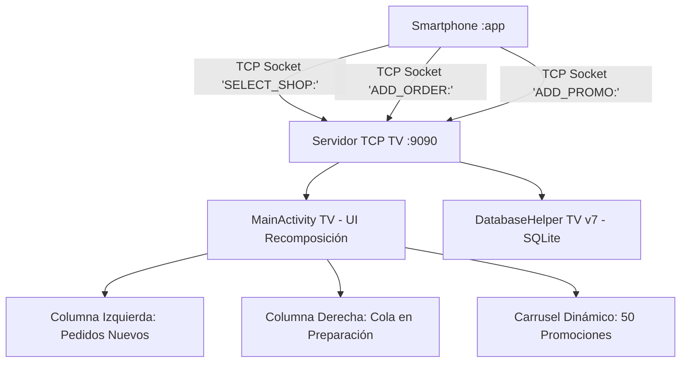

# 📺 Módulo Android TV - SnowTrail (`:tv`)

---

## 📌 Resumen de Arquitectura y Propósito
El módulo `:tv` proporciona una experiencia de pantalla grande para **Android TV** orientada a mostradores de establecimientos y pantallas de cocina/atención. Su arquitectura combina un **Servidor de Sockets TCP multihilo (Puerto 9090)** que escucha eventos en segundo plano en tiempo real, con una interfaz gráfica dividida (*Split Screen Layout*) construida en **Jetpack Compose** que proyecta promociones interactivas y gestiona la cola de pedidos nuevos y pendientes.



---

## 📂 Desglose Técnico Archivo por Archivo

---

### 1. `MainActivity.kt` (Android TV)
* **Ubicación:** `tv/src/main/java/mx/utng/snowtrail/tv/MainActivity.kt`
* **Propósito:** Actividad principal de TV que inicializa el `ServerSocket(9090)` en corrutinas de Kotlin (`Dispatchers.IO`), renderiza el reloj digital en vivo, proyecta el carrusel de promociones y muestra alertas sonoras y visuales inmediatas cuando entra un nuevo pedido.

#### 🔧 Componentes y Funcionalidades Clave:
* **Servidor TCP Multihilo (`startTcpServer`):** Escucha continua en el puerto `9090`. Procesa y limpia tramas mediante `.trim()` para evitar caracteres de retorno de carro (`\r` o `\n`).
  * `SELECT_SHOP:<shop_id>`: Cambia de inmediato las promociones proyectadas para mostrar las de la heladería seleccionada en el celular.
  * `ADD_ORDER:<datos>`: Inserta el pedido en la base de datos de la TV, actualiza la columna de *Pedidos Nuevos* en verde y dispara un `Toast` y sonido de alerta en pantalla.
  * `ADD_PROMO:<datos>`: Registra y muestra al instante una nueva promoción creada desde el celular.
* **Layout Dividido de Alta Definición:**
  * **Columna Izquierda:** Tarjetas destacadas con borde verde para pedidos en estado `NUEVO`.
  * **Columna Derecha:** Cola de pedidos `PENDIENTES` en preparación y carrusel rotativo de ofertas.
* **Reloj en Tiempo Real:** Corrutina en bucle que actualiza fecha y hora en formato `HH:mm:ss`.

#### 💻 Fragmento Técnico de Código:
```kotlin
// Servidor de Sockets TCP en segundo plano (Puerto 9090)
private fun startTcpServer() {
    serverThread = thread(start = true) {
        try {
            serverSocket = ServerSocket(9090)
            while (isRunning) {
                val clientSocket = serverSocket?.accept() ?: break
                thread {
                    try {
                        val reader = BufferedReader(InputStreamReader(clientSocket.getInputStream()))
                        val line = reader.readLine()?.trim()
                        if (!line.isNullOrBlank()) {
                            runOnUiThread {
                                handleIncomingCommand(line)
                            }
                        }
                        clientSocket.close()
                    } catch (e: Exception) {
                        e.printStackTrace()
                    }
                }
            }
        } catch (e: Exception) {
            e.printStackTrace()
        }
    }
}
```

> [!NOTE]
> Para conocer cómo el módulo móvil emite los comandos `ADD_ORDER` y `SELECT_SHOP` hacia la TV, consultar el [README del Módulo Móvil](../app/README.md).

---

### 2. `DatabaseHelper.kt` (Android TV)
* **Ubicación:** `tv/src/main/java/mx/utng/snowtrail/tv/database/DatabaseHelper.kt`
* **Propósito:** Gestor de persistencia SQLite local para la TV en la versión **`7`**. Inicializa y mantiene el catálogo pre-cargado de **50 promociones únicas (5 para cada una de las 10 heladerías de Dolores Hidalgo)** y el historial de pedidos de la TV.

#### 📋 Esquema Relacional de TV:
| Tabla | Columnas Clave | Descripción |
| :--- | :--- | :--- |
| `shops` | `id`, `name`, `schedule`, `contact`, `address` | Registro de sucursales en TV |
| `promotions` | `id`, `shop_id`, `name`, `start_date`, `end_date`, `note`, `icon` | 50 promociones tematizadas |
| `orders` | `id`, `shop_id`, `client_name`, `para_recoger`, `tiempo_entrega`, `total_str`, `items`, `status` | Cola de pedidos recibidos por socket |

---

### 3. `SnowTrailRepository.kt` (Android TV)
* **Ubicación:** `tv/src/main/java/mx/utng/snowtrail/tv/database/SnowTrailRepository.kt`
* **Propósito:** Repositorio que gestiona la consulta de promociones filtradas por establecimiento (`getPromotionsByShop`) y la inserción atómica de pedidos entrantes (`saveOrder`).

#### 💻 Fragmento Técnico de Código:
```kotlin
fun saveOrder(order: TvOrder) {
    val db = dbHelper.writableDatabase
    val values = ContentValues().apply {
        put(DatabaseHelper.COLUMN_ORDER_ID, order.id)
        put(DatabaseHelper.COLUMN_ORDER_SHOP_ID, order.neveriaId)
        put(DatabaseHelper.COLUMN_ORDER_CLIENT, order.clienteNombre)
        put(DatabaseHelper.COLUMN_ORDER_RECOGIDA, order.paraRecoger)
        put(DatabaseHelper.COLUMN_ORDER_TIEMPO, order.tiempoEntrega)
        put(DatabaseHelper.COLUMN_ORDER_TOTAL, order.total)
        put(DatabaseHelper.COLUMN_ORDER_ITEMS, order.items)
        put(DatabaseHelper.COLUMN_ORDER_STATUS, order.estado)
    }
    db.insertWithOnConflict(DatabaseHelper.TABLE_ORDERS, null, values, SQLiteDatabase.CONFLICT_REPLACE)
}
```

---

### 4. `AndroidManifest.xml` (Android TV)
* **Ubicación:** `tv/src/main/AndroidManifest.xml`
* **Propósito:** Configura las directivas de Android Leanback para TV:
  * `<uses-feature android:name="android.software.leanback" android:required="true" />`: Exclusividad de hardware TV.
  * `<uses-feature android:name="android.hardware.touchscreen" android:required="false" />`: Permite operar sin pantalla táctil mediante control remoto (D-Pad).
  * `android:banner="@drawable/tv_banner"`: Banner oficial para el launcher de Android TV.
  * `android.permission.INTERNET` y `android.permission.ACCESS_NETWORK_STATE`: Permite abrir el socket de escucha TCP en el puerto 9090.
