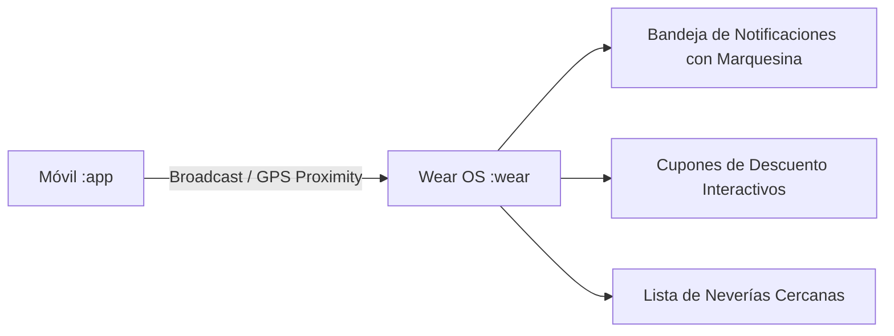

# ⌚ Módulo Wear OS (Smartwatch) - SnowTrail (`:wear`)

---

## 📌 Resumen de Arquitectura y Propósito
El módulo `:wear` está diseñado específicamente para dispositivos **Wear OS** con pantallas circulares o cuadradas. Proporciona una interfaz compacta y reactiva basada en **Compose for Wear OS**, enfocada en alertas de proximidad en tiempo real, seguimiento instantáneo del estado de pedidos y generación visual de cupones de descuento interactivos.



---

## 📂 Desglose Técnico Archivo por Archivo

---

### 1. `MainActivity.kt` (Wear OS Presentation)
* **Ubicación:** `wear/src/main/java/mx/utng/snowtrail/presentation/MainActivity.kt`
* **Propósito:** Actividad principal del reloj inteligente que implementa el ciclo de vida de Wear OS, soporte para modo ambiente (`AmbientMode`), navegación por botones físicos (*Stem Keys*) y renderizado de componentes adaptados a pantallas reducidas.

#### 🔧 Componentes y Funcionalidades Clave:
* **Efecto Marquesina (`basicMarquee`):** Permite el desplazamiento continuo de textos largos en títulos y alertas para que no se corten en la pantalla circular del reloj.
* **Modal de Cupones Enriquecidos:** Cuando una alerta corresponde a una promoción, renderiza un cupón con bordes punteados y código promocional (ej. `FRESA25`, `MINT30`) optimizado para mostrar en el mostrador de la heladería.
* **Manejo de Botones Físicos:** Captura eventos de teclas de hardware (`KEYCODE_STEM_1`, `KEYCODE_STEM_2`) para navegación y confirmación rápida de alertas sin tocar la pantalla.
* **Lista de Heladerías Cercanas:** Componente `ScalingLazyColumn` con escalado visual de elementos según la posición en la curvatura de la pantalla.

#### 💻 Fragmento Técnico de Código:
```kotlin
// Renderizado de Alerta con Texto en Marquesina Continua y Cupón
@Composable
fun WearNotificationItem(
    notification: MockNotification,
    onClick: () -> Unit
) {
    Card(
        onClick = onClick,
        modifier = Modifier
            .fillMaxWidth()
            .padding(vertical = 4.dp),
        colors = CardDefaults.cardColors(containerColor = Color(0xFF2C2C2C))
    ) {
        Column(modifier = Modifier.padding(8.dp)) {
            Text(
                text = notification.titulo,
                style = MaterialTheme.typography.title3,
                color = Color(0xFFEF9A9A),
                maxLines = 1,
                modifier = Modifier.basicMarquee() // Efecto de marquesina continua
            )
            Text(
                text = notification.mensaje,
                style = MaterialTheme.typography.body2,
                color = Color.White
            )
        }
    }
}
```

> [!NOTE]
> Para conocer cómo el módulo móvil emite los eventos de proximidad y cambios de coordenadas GPS hacia el reloj, consultar el [README del Módulo Móvil](../app/README.md).

---

### 2. `AndroidManifest.xml` (Wear OS)
* **Ubicación:** `wear/src/main/AndroidManifest.xml`
* **Propósito:** Configura los metadatos específicos del ecosistema Wearable:
  * `<uses-feature android:name="android.hardware.type.watch" />`: Declara la aplicación como exclusiva para relojes inteligentes.
  * `android.permission.WAKE_LOCK`: Permite activar la pantalla brevemente al recibir una alerta de proximidad.
  * `android.permission.VIBRATE`: Proporciona respuesta háptica al ingresar al radio de una heladería con promoción activa.

---

### 3. `build.gradle.kts` (Wear OS)
* **Ubicación:** `wear/build.gradle.kts`
* **Propósito:** Declara el conjunto de dependencias optimizadas para Wear OS:
  * `androidx.wear.compose:compose-material`: Componentes de diseño adaptados a Wear OS.
  * `androidx.wear.compose:compose-foundation`: Contenedores de desplazamiento y escalado circular.
  * `com.google.android.gms:play-services-wearable`: Capa de transporte y sincronización de datos con el teléfono.
