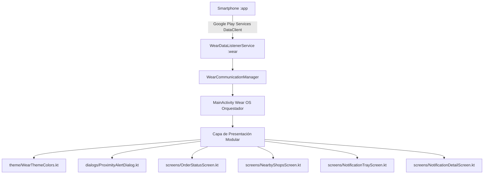

# ⌚ Módulo Wear OS (Smartwatch) - SnowTrail (`:wear`)

---

## 📌 1. Resumen de Arquitectura y Propósito
El módulo `:wear` está diseñado específicamente para dispositivos **Wear OS** con pantallas circulares o cuadradas. Su arquitectura modular en la capa de presentación se enfoca en proporcionar una interfaz ultraligera y reactiva con **Compose for Wear OS**, diseñada para recibir notificaciones de proximidad en tiempo real, mostrar cupones de descuento interactivos con códigos alfanuméricos, listar neverías cercanas con escalado dinámico (`ScalingLazyColumn`) y controlar pedidos mediante gestos y botones físicos (Stem Keys).



---

## 📦 2. Archivos de Construcción y Dependencias

---

### 📄 `gradle/libs.versions.toml` (Version Catalog Centralizado)
* **Ubicación:** `gradle/libs.versions.toml`
* **🎨 ¿Qué se ve / Contenido Funcional?:** Define las versiones de las librerías específicas de Wear OS (Wear Compose, Play Services Wearable) para garantizar compatibilidad con el smartwatch.
* **💻 Explicación Técnica de Código:** Version Catalog centralizado con las versiones de `playServicesWearable`, `composeMaterial3` (Wear) y `wearToolingPreview`.
* **Contenido y Código Completo:**
```toml
[versions]
agp = "9.2.1"
playServicesWearable = "20.0.1"
kotlin = "2.2.10"
composeBom = "2024.09.00"
composeMaterial3 = "1.5.6"
composeFoundation = "1.5.6"
composeUiTooling = "1.5.6"
wearToolingPreview = "1.0.0"
activityCompose = "1.13.0"
coreSplashscreen = "1.2.0"

[libraries]
play-services-wearable = { group = "com.google.android.gms", name = "play-services-wearable", version.ref = "playServicesWearable" }
compose-bom = { group = "androidx.compose", name = "compose-bom", version.ref = "composeBom" }
ui = { group = "androidx.compose.ui", name = "ui" }
ui-graphics = { group = "androidx.compose.ui", name = "ui-graphics" }
ui-tooling = { group = "androidx.compose.ui", name = "ui-tooling" }
ui-tooling-preview = { group = "androidx.compose.ui", name = "ui-tooling-preview" }
ui-test-manifest = { group = "androidx.compose.ui", name = "ui-test-manifest" }
ui-test-junit4 = { group = "androidx.compose.ui", name = "ui-test-junit4" }
compose-material3 = { group = "androidx.wear.compose", name = "compose-material3", version.ref = "composeMaterial3" }
compose-foundation = { group = "androidx.wear.compose", name = "compose-foundation", version.ref = "composeFoundation" }
compose-ui-tooling = { group = "androidx.wear.compose", name = "compose-ui-tooling", version.ref = "composeUiTooling" }
wear-tooling-preview = { group = "androidx.wear", name = "wear-tooling-preview", version.ref = "wearToolingPreview" }
activity-compose = { group = "androidx.activity", name = "activity-compose", version.ref = "activityCompose" }
core-splashscreen = { group = "androidx.core", name = "core-splashscreen", version.ref = "coreSplashscreen" }

[plugins]
android-application = { id = "com.android.application", version.ref = "agp" }
kotlin-compose = { id = "org.jetbrains.kotlin.plugin.compose", version.ref = "kotlin" }
```

#### 🔍 Desglose y Utilidad para Wear OS:
| Elemento Añadido | Tipo | ¿Para qué ayuda en el Smartwatch? |
| :--- | :--- | :--- |
| `playServicesWearable = "20.0.1"` | Librería | **Data Layer & Message Client**: Recibe en segundo plano las promociones y pedidos enviados desde el celular. |
| `composeMaterial3` / `composeFoundation` | Librería | **Wear Compose Suite**: Componentes circulares (`ScalingLazyColumn`, `Chip`, `Card`) optimizados para reloj. |
| `wearToolingPreview = "1.0.0"` | Tooling | **Previsualización de Wearables**: Renderiza previsualizaciones en Android Studio en formatos redondos y cuadrados. |
| `activityCompose = "1.13.0"` | Librería | **Activity Compose (`setContent`)**: Vincula el ciclo de vida del reloj con Compose UI. |

---

### 📄 `wear/build.gradle.kts` (Build Script del Módulo Smartwatch)
* **Ubicación:** `wear/build.gradle.kts`
* **🎨 ¿Qué se ve / Contenido Funcional?:** Configura la compilación optimizada para relojes inteligentes Wear OS 3.0+ (minSdk 30) y dependencias de sensores y botones.
* **💻 Explicación Técnica de Código:** `compileSdk = 36`, `minSdk = 30`, dependencias `androidx.wear.compose:compose-material`, `androidx.wear:wear` y soporte para Kotlin Coroutines.
* **Contenido y Código Completo:**
```kotlin
plugins {
    id("com.android.application")
    alias(libs.plugins.kotlin.compose)
}

android {
    namespace = "mx.utng.snowtrail"
    compileSdk = 36

    defaultConfig {
        applicationId = "mx.utng.snowtrail"
        minSdk = 30
        targetSdk = 36
        versionCode = 1
        versionName = "1.0"
    }

    buildFeatures {
        compose = true
    }

    compileOptions {
        sourceCompatibility = JavaVersion.VERSION_17
        targetCompatibility = JavaVersion.VERSION_17
    }
}

dependencies {
    implementation(project(":shared"))

    // Play Services Wearable
    implementation(libs.play.services.wearable)
    implementation("org.jetbrains.kotlinx:kotlinx-coroutines-play-services:1.7.3")

    // Wear OS Compose dependencies
    implementation("androidx.wear.compose:compose-material:1.3.0")
    implementation("androidx.wear.compose:compose-foundation:1.3.0")
    implementation("androidx.wear.compose:compose-navigation:1.3.0")

    // Compose general dependencies
    implementation("androidx.activity:activity-compose:1.8.2")
    implementation("androidx.compose.ui:ui:1.6.1")
    implementation("androidx.compose.ui:ui-tooling-preview:1.6.1")
    implementation("androidx.compose.foundation:foundation:1.6.1")
    implementation("androidx.compose.material:material-icons-extended:1.6.1")

    // Wear OS native UI components support
    implementation("androidx.wear:wear:1.3.0")

    // Testing
    testImplementation("junit:junit:4.13.2")
}
```

#### 🔍 Desglose y Utilidad de las Dependencias añadidas en `:wear`:
| Dependencia Añadida | Propósito Técnico | Beneficio en el Smartwatch |
| :--- | :--- | :--- |
| `implementation(project(":shared"))` | Módulo compartido | Provee los modelos de datos compartidos (`WearDataListenerService`, `WearShop`). |
| `libs.play.services.wearable` | Wearable Data Layer | Escucha mensajes `/snowtrail/proximity_alert`, `/snowtrail/sync_promotions` y `/snowtrail/order_status`. |
| `kotlinx-coroutines-play-services` | Asincronía Kotlin | Permite enviar respuestas al celular mediante corrutinas sin congelar la pantalla táctil del reloj. |
| `compose-foundation:1.6.1` | Modificadores avanzados | Habilita el modificador `Modifier.basicMarquee()` para que los textos largos se deslicen de forma continua. |
| `wear:1.3.0` | Soporte de Hardware | Soporta los botones físicos laterales del reloj (Stem Keys) y la corona giratoria (Rotary Input). |
| `material-icons-extended` | Íconos | Provee íconos compactos de helados, cupones, notificaciones y tiendas en el reloj. |

---

## 📂 3. Infraestructura y Orquestador

---

### 📄 `wear/src/main/AndroidManifest.xml` (Manifiesto de Wear OS)
* **Ubicación:** `wear/src/main/AndroidManifest.xml`
* **🎨 ¿Qué se ve / Contenido Funcional?:** Declara la aplicación para smartwatch autónomo, solicitando permisos de vibración háptica al recibir alertas.
* **💻 Explicación Técnica de Código:** `<uses-feature android:name="android.hardware.type.watch" />`, permisos `WAKE_LOCK`, `VIBRATE`, metadato `standalone = true` y declaración de `.service.WearDataListenerService`.
* **Contenido y Código Completo:**
```xml
<?xml version="1.0" encoding="utf-8"?>
<manifest xmlns:android="http://schemas.android.com/apk/res/android">

    <uses-feature android:name="android.hardware.type.watch" />

    <uses-permission android:name="android.permission.WAKE_LOCK" />
    <uses-permission android:name="android.permission.VIBRATE" />

    <application
        android:allowBackup="true"
        android:icon="@mipmap/ic_launcher"
        android:label="@string/app_name"
        android:supportsRtl="true"
        android:theme="@android:style/Theme.DeviceDefault">
        
        <meta-data
            android:name="com.google.android.wearable.standalone"
            android:value="true" />

        <activity
            android:name=".presentation.MainActivity"
            android:exported="true"
            android:label="@string/app_name"
            android:theme="@android:style/Theme.DeviceDefault">
            <intent-filter>
                <action android:name="android.intent.action.MAIN" />
                <category android:name="android.intent.category.LAUNCHER" />
            </intent-filter>
        </activity>

        <service
            android:name=".service.WearDataListenerService"
            android:exported="true">
            <intent-filter>
                <action android:name="com.google.android.gms.wearable.DATA_CHANGED" />
                <action android:name="com.google.android.gms.wearable.MESSAGE_RECEIVED" />
                <data android:scheme="wear" android:host="*" android:pathPrefix="/snowtrail" />
            </intent-filter>
        </service>
    </application>
</manifest>
```

---

### 📄 `wear/src/main/java/mx/utng/snowtrail/presentation/MainActivity.kt` (Orquestador Principal)
* **Ubicación:** `wear/src/main/java/mx/utng/snowtrail/presentation/MainActivity.kt`
* **🎨 ¿Qué se ve en Pantalla?:** Es el orquestador visual de las 3 pestañas deslizables (Notificaciones, Estatus de Pedido, Neverías Cercanas). Muestra la hora del reloj en el borde superior (`TimeText`), la banner roja de "Sin conexión" si se pierde la señal y captura los clics de los botones físicos laterales del reloj (Botón Superior e Inferior).
* **💻 Explicación Técnica de Código:** `ComponentActivity` principal. Configura `HorizontalPager`, instala `DataClient.OnDataChangedListener` para recibir sincros en tiempo real, inicia el bucle `startHeartbeatLoop()` y captura eventos de hardware en `onKeyDown(keyCode)` para teclas `KEYCODE_STEM_1` y `KEYCODE_STEM_2`.
* **Contenido y Código Completo:**
```kotlin
package mx.utng.snowtrail.presentation

import android.content.Context
import android.os.Build
import android.os.Bundle
import android.os.VibrationEffect
import android.os.Vibrator
import android.os.VibratorManager
import android.util.Log
import android.view.KeyEvent
import android.widget.Toast
import androidx.activity.ComponentActivity
import androidx.activity.compose.setContent
import androidx.compose.foundation.ExperimentalFoundationApi
import androidx.compose.foundation.background
import androidx.compose.foundation.layout.*
import androidx.compose.foundation.pager.HorizontalPager
import androidx.compose.foundation.pager.rememberPagerState
import androidx.compose.runtime.*
import androidx.compose.ui.Alignment
import androidx.compose.ui.Modifier
import androidx.compose.ui.graphics.Color
import androidx.compose.ui.text.font.FontWeight
import androidx.compose.ui.unit.dp
import androidx.compose.ui.unit.sp
import androidx.lifecycle.lifecycleScope
import androidx.wear.compose.material.*
import com.google.android.gms.wearable.*
import mx.utng.snowtrail.communication.WearCommunicationManager
import mx.utng.snowtrail.model.*
import mx.utng.snowtrail.presentation.dialogs.ProximityAlertDialog
import mx.utng.snowtrail.presentation.screens.NearbyShopsScreen
import mx.utng.snowtrail.presentation.screens.NotificationDetailScreen
import mx.utng.snowtrail.presentation.screens.NotificationTrayScreen
import mx.utng.snowtrail.presentation.screens.OrderStatusScreen
import mx.utng.snowtrail.service.WearStateHolder
import mx.utng.snowtrail.shared.WearPaths
import kotlinx.coroutines.delay
import kotlinx.coroutines.launch

/**
 * ARCHIVO: MainActivity.kt
 * PROPÓSITO: Actividad Principal y Orquestador de la UI para Wear OS (`:wear`).
 * Maneja el ciclo de vida, escuchadores de sincronización en segundo plano con DataClient,
 * gestos de navegación y eventos de botones físicos de hardware (STEM Keys) y motor háptico.
 */
class MainActivity : ComponentActivity() {

    private val tag = "WearMainActivity"
    private lateinit var commManager: WearCommunicationManager
    
    private var pagerCurrentPage = 1
    private var focusedShopIndex = 0
    private var focusedNotifIndex = 0
    
    private var activeDetailNotification by mutableStateOf<NotificacionResumen?>(null)
    private var isProximityAlertActive = false

    @OptIn(ExperimentalFoundationApi::class)
    override fun onCreate(savedInstanceState: Bundle?) {
        super.onCreate(savedInstanceState)
        
        commManager = WearCommunicationManager(this)
        startHeartbeatLoop()

        setContent {
            val isConnected by commManager.isConnected.collectAsState()
            val activeOrder by WearStateHolder.activeOrder.collectAsState()
            val nearbyShops by WearStateHolder.nearbyShops.collectAsState()
            val notifications by WearStateHolder.notifications.collectAsState()
            val proximityAlert by WearStateHolder.proximityAlert.collectAsState()
            val isLoading by WearStateHolder.isLoading.collectAsState()

            val pagerState = rememberPagerState(initialPage = 1) { 3 }
            val coroutineScope = rememberCoroutineScope()

            DisposableEffect(Unit) {
                val listener = DataClient.OnDataChangedListener { dataEvents ->
                    for (event in dataEvents) {
                        if (event.type == DataEvent.TYPE_CHANGED) {
                            val dataItem = event.dataItem
                            val uriPath = dataItem.uri.path ?: continue
                            val dataMap = DataMapItem.fromDataItem(dataItem).dataMap
                            
                            when (uriPath) {
                                WearPaths.PATH_NEVERIAS_CERCANAS -> {
                                    val shopMaps = dataMap.getDataMapArrayList("shops") ?: ArrayList()
                                    val shops = shopMaps.map { sMap ->
                                        NeveriaResumen(
                                            id = sMap.getString("id", ""),
                                            nombre = sMap.getString("nombre", ""),
                                            distancia = sMap.getDouble("distancia", 0.0),
                                            esFavorita = sMap.getBoolean("esFavorita", false),
                                            tienePromocion = sMap.getBoolean("tienePromocion", false)
                                        )
                                    }
                                    WearStateHolder.updateNearbyShops(shops)
                                }
                                WearPaths.PATH_PEDIDO_ACTIVO -> {
                                    val hasActiveOrder = dataMap.getBoolean("hasActiveOrder", false)
                                    if (!hasActiveOrder) {
                                        WearStateHolder.updateActiveOrder(null)
                                    } else {
                                        val id = dataMap.getString("id", "")
                                        val neveriaId = dataMap.getString("neveriaId", "")
                                        val neveriaNombre = dataMap.getString("neveriaNombre", "")
                                        val estado = dataMap.getString("estado", "NUEVO")
                                        val tiempoEstimado = dataMap.getLong("tiempoEstimadoMinutos", 0)
                                        val fechaHora = dataMap.getLong("fechaHoraMillis", 0)
                                        val total = dataMap.getDouble("total", 0.0)

                                        val productsList = dataMap.getDataMapArrayList("productos") ?: ArrayList()
                                        val products = productsList.map { pMap ->
                                            ProductoResumen(
                                                nombre = pMap.getString("nombre", ""),
                                                cantidad = pMap.getInt("cantidad", 0),
                                                precioUnitario = pMap.getDouble("precioUnitario", 0.0)
                                            )
                                        }

                                        val order = PedidoResumen(id, neveriaId, neveriaNombre, estado, tiempoEstimado, fechaHora, total, products)
                                        WearStateHolder.updateActiveOrder(order)
                                    }
                                }
                                WearPaths.PATH_NOTIFICACIONES -> {
                                    val notifMaps = dataMap.getDataMapArrayList("notifications") ?: ArrayList()
                                    val notifs = notifMaps.map { nMap ->
                                        NotificacionResumen(
                                            id = nMap.getString("id", ""),
                                            mensaje = nMap.getString("mensaje", ""),
                                            tipo = nMap.getString("tipo", "CAMBIO_ESTADO"),
                                            leida = nMap.getBoolean("leida", false),
                                            fechaEnvio = nMap.getLong("fechaEnvio", 0)
                                        )
                                    }
                                    WearStateHolder.updateNotifications(notifs)
                                }
                            }
                        }
                    }
                }
                
                val dataClient = Wearable.getDataClient(this@MainActivity)
                dataClient.addListener(listener)
                onDispose {
                    dataClient.removeListener(listener)
                }
            }
            
            LaunchedEffect(pagerState.currentPage) {
                pagerCurrentPage = pagerState.currentPage
            }

            LaunchedEffect(proximityAlert) {
                if (proximityAlert != null) {
                    isProximityAlertActive = true
                    triggerHapticFeedback()
                } else {
                    isProximityAlertActive = false
                }
            }

            LaunchedEffect(nearbyShops) {
                if (focusedShopIndex >= nearbyShops.size && nearbyShops.isNotEmpty()) {
                    focusedShopIndex = nearbyShops.size - 1
                }
            }
            LaunchedEffect(notifications) {
                if (focusedNotifIndex >= notifications.size && notifications.isNotEmpty()) {
                    focusedNotifIndex = notifications.size - 1
                }
            }

            Scaffold(
                modifier = Modifier.fillMaxSize(),
                timeText = { TimeText() }
            ) {
                Box(
                    modifier = Modifier.fillMaxSize(),
                    contentAlignment = Alignment.Center
                ) {
                    val activeNotif = activeDetailNotification
                    if (activeNotif != null) {
                        NotificationDetailScreen(
                            notification = activeNotif,
                            onBack = { activeDetailNotification = null },
                            onConfirm = {
                                commManager.sendMessage(
                                    WearPaths.MSG_ABRIR_NOTIFICACION, activeNotif.id,
                                    onSuccess = {
                                        activeDetailNotification = null
                                        Toast.makeText(this@MainActivity, "Abriendo en celular...", Toast.LENGTH_SHORT).show()
                                    }
                                )
                            },
                            onDismiss = {
                                commManager.sendMessage(
                                    WearPaths.MSG_DESCARTAR_NOTIFICACION, activeNotif.id,
                                    onSuccess = {
                                        activeDetailNotification = null
                                    }
                                )
                            }
                        )
                    } else {
                        HorizontalPager(
                            state = pagerState,
                            modifier = Modifier.fillMaxSize()
                        ) { page ->
                            when (page) {
                                0 -> NotificationTrayScreen(
                                    notifications = notifications,
                                    focusedIndex = focusedNotifIndex,
                                    onNotificationClicked = { notif ->
                                        activeDetailNotification = notif
                                    }
                                )
                                1 -> OrderStatusScreen(
                                    order = activeOrder,
                                    nearbyFavorites = nearbyShops.filter { it.esFavorita },
                                    isConnected = isConnected,
                                    onOrderClicked = {
                                        activeOrder?.let {
                                            commManager.sendMessage(WearPaths.MSG_ABRIR_DETALLE_NEVERIA, it.neveriaId)
                                        }
                                    },
                                    onShopClicked = { shopId ->
                                        commManager.sendMessage(WearPaths.MSG_ABRIR_DETALLE_NEVERIA, shopId)
                                    }
                                )
                                2 -> NearbyShopsScreen(
                                    shops = nearbyShops,
                                    focusedIndex = focusedShopIndex,
                                    isLoading = isLoading,
                                    onShopSelected = { shop ->
                                        commManager.sendMessage(WearPaths.MSG_ABRIR_DETALLE_NEVERIA, shop.id)
                                    }
                                )
                            }
                        }
                    }

                    if (!isConnected) {
                        Box(
                            modifier = Modifier
                                .align(Alignment.BottomCenter)
                                .fillMaxWidth()
                                .background(Color.Red.copy(alpha = 0.8f))
                                .padding(vertical = 2.dp),
                            contentAlignment = Alignment.Center
                        ) {
                            Text(
                                text = "Sin conexión - Reintentando",
                                color = Color.White,
                                fontSize = 8.sp,
                                fontWeight = FontWeight.Bold
                            )
                        }
                    }

                    proximityAlert?.let { alert ->
                        ProximityAlertDialog(
                            alert = alert,
                            onOpenShops = {
                                WearStateHolder.clearProximityAlert()
                                coroutineScope.launch {
                                    pagerState.animateScrollToPage(2)
                                    val matchIndex = nearbyShops.indexOfFirst { it.nombre.contains(alert.shopName, ignoreCase = true) }
                                    if (matchIndex != -1) {
                                        focusedShopIndex = matchIndex
                                    }
                                }
                            },
                            onDismiss = {
                                WearStateHolder.clearProximityAlert()
                            }
                        )
                    }
                }
            }
        }
    }

    override fun onKeyDown(keyCode: Int, event: KeyEvent?): Boolean {
        Log.d(tag, "Físico onKeyDown: KeyCode = $keyCode")
        
        when (keyCode) {
            KeyEvent.KEYCODE_STEM_1 -> {
                handleTopButtonAction()
                return true
            }
            KeyEvent.KEYCODE_STEM_2 -> {
                handleBottomButtonAction()
                return true
            }
        }
        return super.onKeyDown(keyCode, event)
    }

    private fun handleTopButtonAction() {
        if (isProximityAlertActive) {
            val alert = WearStateHolder.proximityAlert.value
            if (alert != null) {
                WearStateHolder.clearProximityAlert()
                Toast.makeText(this, "Abriendo tiendas cercanas...", Toast.LENGTH_SHORT).show()
            }
            return
        }

        val activeNotif = activeDetailNotification
        if (activeNotif != null) {
            commManager.sendMessage(WearPaths.MSG_ABRIR_NOTIFICACION, activeNotif.id)
            activeDetailNotification = null
            return
        }

        when (pagerCurrentPage) {
            0 -> {
                val notifs = WearStateHolder.notifications.value
                if (notifs.isNotEmpty()) {
                    focusedNotifIndex = (focusedNotifIndex - 1 + notifs.size) % notifs.size
                    Toast.makeText(this, "Foco: ${notifs[focusedNotifIndex].mensaje.take(15)}...", Toast.LENGTH_SHORT).show()
                }
            }
            1 -> {
                val order = WearStateHolder.activeOrder.value
                if (order != null) {
                    when (order.estado) {
                        "NUEVO" -> {
                            commManager.sendMessage(WearPaths.MSG_ACEPTAR_PEDIDO, order.id)
                            Toast.makeText(this, "Aceptando pedido...", Toast.LENGTH_SHORT).show()
                        }
                        "ACEPTADO" -> {
                            commManager.sendMessage(WearPaths.MSG_ENTREGAR_PEDIDO, order.id)
                            Toast.makeText(this, "Confirmando entrega...", Toast.LENGTH_SHORT).show()
                        }
                        else -> {
                            Toast.makeText(this, "Pedido finalizado o sin acción.", Toast.LENGTH_SHORT).show()
                        }
                    }
                } else {
                    Toast.makeText(this, "Sin pedidos activos.", Toast.LENGTH_SHORT).show()
                }
            }
            2 -> {
                val shops = WearStateHolder.nearbyShops.value
                if (shops.isNotEmpty() && focusedShopIndex in shops.indices) {
                    val shop = shops[focusedShopIndex]
                    commManager.sendMessage(WearPaths.MSG_ABRIR_DETALLE_NEVERIA, shop.id)
                    Toast.makeText(this, "Abriendo '${shop.nombre}' en celular", Toast.LENGTH_SHORT).show()
                }
            }
        }
    }

    private fun handleBottomButtonAction() {
        if (isProximityAlertActive) {
            WearStateHolder.clearProximityAlert()
            return
        }

        val activeNotif = activeDetailNotification
        if (activeNotif != null) {
            commManager.sendMessage(WearPaths.MSG_DESCARTAR_NOTIFICACION, activeNotif.id)
            activeDetailNotification = null
            return
        }

        when (pagerCurrentPage) {
            0 -> {
                val notifs = WearStateHolder.notifications.value
                if (notifs.isNotEmpty()) {
                    focusedNotifIndex = (focusedNotifIndex + 1) % notifs.size
                    Toast.makeText(this, "Foco: ${notifs[focusedNotifIndex].mensaje.take(15)}...", Toast.LENGTH_SHORT).show()
                }
            }
            1 -> {
                val order = WearStateHolder.activeOrder.value
                if (order != null) {
                    when (order.estado) {
                        "NUEVO" -> {
                            commManager.sendMessage(WearPaths.MSG_POSPONER_PEDIDO, order.id)
                            Toast.makeText(this, "Posponiendo pedido...", Toast.LENGTH_SHORT).show()
                        }
                        "POSPUESTO" -> {
                            commManager.sendMessage(WearPaths.MSG_RECHAZAR_PEDIDO, order.id)
                            Toast.makeText(this, "Rechazando pedido...", Toast.LENGTH_SHORT).show()
                        }
                        else -> {
                            Toast.makeText(this, "Pedido finalizado o sin acción.", Toast.LENGTH_SHORT).show()
                        }
                    }
                } else {
                    Toast.makeText(this, "Sin pedidos activos.", Toast.LENGTH_SHORT).show()
                }
            }
            2 -> {
                val shops = WearStateHolder.nearbyShops.value
                if (shops.isNotEmpty() && focusedShopIndex in shops.indices) {
                    val shop = shops[focusedShopIndex]
                    commManager.sendMessage(WearPaths.MSG_TOGGLE_FAVORITO, shop.id)
                    Toast.makeText(this, "Marcando favorito: ${shop.nombre}", Toast.LENGTH_SHORT).show()
                }
            }
        }
    }

    private fun startHeartbeatLoop() {
        lifecycleScopeLaunch {
            while (true) {
                commManager.checkConnection()
                if (commManager.isConnected.value) {
                    commManager.sendHeartbeat()
                }
                delay(10000)
            }
        }
    }

    private fun lifecycleScopeLaunch(block: suspend () -> Unit) {
        lifecycleScope.launch {
            block()
        }
    }

    private fun triggerHapticFeedback() {
        val vibrator = if (Build.VERSION.SDK_INT >= Build.VERSION_CODES.S) {
            val vibratorManager = getSystemService(Context.VIBRATOR_MANAGER_SERVICE) as VibratorManager
            vibratorManager.defaultVibrator
        } else {
            @Suppress("DEPRECATION")
            getSystemService(Context.VIBRATOR_SERVICE) as Vibrator
        }

        if (Build.VERSION.SDK_INT >= Build.VERSION_CODES.O) {
            vibrator.vibrate(VibrationEffect.createOneShot(150, VibrationEffect.DEFAULT_AMPLITUDE))
        } else {
            @Suppress("DEPRECATION")
            vibrator.vibrate(150)
        }
    }
}
```

---

## 🎨 4. Capa de Presentación Modularizada (`presentation/`)

---

### 📄 `wear/.../presentation/theme/WearThemeColors.kt`
* **Ubicación:** `wear/src/main/java/mx/utng/snowtrail/presentation/theme/WearThemeColors.kt`
* **🎨 ¿Qué se ve / Contenido Funcional?:** Define la paleta cromática pastel optimizada para pantallas circulares OLED oscuras: fondo negro profundo para ahorro de energía, acentos en rosa helado, verde menta y dorado miel.
* **💻 Explicación Técnica de Código:** Objeto `SnowTrailColors` con constantes `Color(0xFF...)` para consumo centralizado en las pantallas y diálogos de Wear OS.
* **Contenido y Código Completo:**
```kotlin
package mx.utng.snowtrail.presentation.theme

import androidx.compose.ui.graphics.Color

/**
 * ARCHIVO: WearThemeColors.kt
 * PROPÓSITO: Tokens de color para la interfaz de Wear OS (Smartwatch).
 * Paleta pastel optimizada para pantallas OLED oscuras: fondo negro puro (#0C0C0E) para ahorro de energía y acentos en rosa helado, menta y dorado miel.
 */
object SnowTrailColors {
    val Background = Color(0xFF0C0C0E)
    val CardBackground = Color(0xFF1B1B1E)
    val PrimaryIce = Color(0xFFFEE1E8)
    val PrimaryCream = Color(0xFFE2F9EE)
    val TextPrimary = Color(0xFFFCFAF2)
    val TextSecondary = Color(0xFFC4B8B0)
    val Gold = Color(0xFFFFF0C2)
    
    val StatusNuevo = Color(0xFFFFF9C4)
    val StatusAceptado = Color(0xFFE8F5E9)
    val StatusPospuesto = Color(0xFFFFE0B2)
    val StatusRechazado = Color(0xFFFFEBEE)
    val StatusEntregado = Color(0xFFE3F2FD)
}
```

---

### 📄 `wear/.../presentation/dialogs/ProximityAlertDialog.kt`
* **Ubicación:** `wear/src/main/java/mx/utng/snowtrail/presentation/dialogs/ProximityAlertDialog.kt`
* **🎨 ¿Qué se ve en Pantalla?:** Diálogo emergente que aparece al estar a menos de 100m de una heladería. Muestra el título "¡Alerta Proximidad!", el nombre de la tienda, la distancia exacta y dos botones de acción rápida ("Cerrar" y "Ver").
* **💻 Explicación Técnica de Código:** Utiliza `Dialog(showDialog = true)` de Wear Compose. Activa la vibración háptica al desplegarse y dispara `onOpenShops` o `onDismiss`.
* **Contenido y Código Completo:**
```kotlin
package mx.utng.snowtrail.presentation.dialogs

import androidx.compose.foundation.background
import androidx.compose.foundation.layout.*
import androidx.compose.runtime.Composable
import androidx.compose.ui.Alignment
import androidx.compose.ui.Modifier
import androidx.compose.ui.graphics.Color
import androidx.compose.ui.text.font.FontWeight
import androidx.compose.ui.text.style.TextAlign
import androidx.compose.ui.unit.dp
import androidx.compose.ui.unit.sp
import androidx.wear.compose.material.Button
import androidx.wear.compose.material.ButtonDefaults
import androidx.wear.compose.material.Text
import androidx.wear.compose.material.dialog.Dialog
import mx.utng.snowtrail.model.ProximityAlert
import mx.utng.snowtrail.presentation.theme.SnowTrailColors

@Composable
fun ProximityAlertDialog(
    alert: ProximityAlert,
    onOpenShops: () -> Unit,
    onDismiss: () -> Unit
) {
    Dialog(
        showDialog = true,
        onDismissRequest = onDismiss
    ) {
        Box(
            modifier = Modifier
                .fillMaxSize()
                .background(SnowTrailColors.Background)
                .padding(12.dp),
            contentAlignment = Alignment.Center
        ) {
            Column(
                horizontalAlignment = Alignment.CenterHorizontally,
                verticalArrangement = Arrangement.spacedBy(6.dp),
                modifier = Modifier.fillMaxWidth()
            ) {
                Text(
                    text = "¡Alerta Proximidad!",
                    color = SnowTrailColors.Gold,
                    fontSize = 11.sp,
                    fontWeight = FontWeight.Bold,
                    textAlign = TextAlign.Center
                )
                
                Text(
                    text = "Nevería '${alert.shopName}' a ${alert.distanceMeters}m.",
                    color = SnowTrailColors.TextPrimary,
                    fontSize = 12.sp,
                    fontWeight = FontWeight.SemiBold,
                    textAlign = TextAlign.Center,
                    lineHeight = 15.sp
                )

                if (alert.promoNote.isNotEmpty()) {
                    Text(
                        text = alert.promoNote,
                        color = SnowTrailColors.PrimaryIce,
                        fontSize = 10.sp,
                        fontWeight = FontWeight.Bold,
                        textAlign = TextAlign.Center
                    )
                }

                Spacer(modifier = Modifier.height(4.dp))

                Row(
                    horizontalArrangement = Arrangement.spacedBy(6.dp),
                    modifier = Modifier.fillMaxWidth()
                ) {
                    Button(
                        onClick = onDismiss,
                        colors = ButtonDefaults.buttonColors(backgroundColor = Color.Red.copy(alpha = 0.2f)),
                        modifier = Modifier.weight(1f).height(24.dp)
                    ) {
                        Text("Cerrar", fontSize = 8.sp, color = Color.Red)
                    }

                    Button(
                        onClick = onOpenShops,
                        colors = ButtonDefaults.buttonColors(backgroundColor = SnowTrailColors.PrimaryIce.copy(alpha = 0.2f)),
                        modifier = Modifier.weight(1f).height(24.dp)
                    ) {
                        Text("Ver", fontSize = 8.sp, color = SnowTrailColors.PrimaryIce)
                    }
                }
            }
        }
    }
}
```

---

### 📄 `wear/.../presentation/screens/OrderStatusScreen.kt`
* **Ubicación:** `wear/src/main/java/mx/utng/snowtrail/presentation/screens/OrderStatusScreen.kt`
* **🎨 ¿Qué se ve en Pantalla?:** Pantalla 1 del reloj. En la parte superior se observa el título "SnowTrail" con un punto verde/rojo de conexión. En el centro la tarjeta del pedido activo con el tiempo de entrega y precio total. En la parte inferior dos cajas pequeñas con las neverías favoritas más cercanas.
* **💻 Explicación Técnica de Código:** `OrderStatusScreen` evalúa `order: PedidoResumen?`. Asigna colores dinámicos al badge según el estado (`NUEVO`, `ACEPTADO`, `POSPUESTO`, `RECHAZADO`, `ENTREGADO`) e invoca `onOrderClicked` para interactuar.
* **Contenido y Código Completo:**
```kotlin
package mx.utng.snowtrail.presentation.screens

import androidx.compose.foundation.background
import androidx.compose.foundation.clickable
import androidx.compose.foundation.layout.*
import androidx.compose.foundation.shape.RoundedCornerShape
import androidx.compose.runtime.Composable
import androidx.compose.ui.Alignment
import androidx.compose.ui.Modifier
import androidx.compose.ui.graphics.Color
import androidx.compose.ui.text.font.FontWeight
import androidx.compose.ui.text.style.TextAlign
import androidx.compose.ui.text.style.TextOverflow
import androidx.compose.ui.unit.dp
import androidx.compose.ui.unit.sp
import androidx.wear.compose.material.*
import mx.utng.snowtrail.model.NeveriaResumen
import mx.utng.snowtrail.model.PedidoResumen
import mx.utng.snowtrail.presentation.theme.SnowTrailColors
import java.text.SimpleDateFormat
import java.util.Date
import java.util.Locale

/**
 * ARCHIVO: OrderStatusScreen.kt
 * PROPÓSITO: Pantalla 1 de Wear OS (UI Layer).
 * Muestra el estado del pedido activo, tiempo estimado de entrega y las sucursales favoritas más cercanas.
 */

/**
 * Función Composable para la Pantalla 1 de Wear OS (Estado del Pedido y Favoritos Cercanos).
 * 
 * @param order Pedido activo en curso recibido vía DataClient o null.
 * @param nearbyFavorites Lista de neverías favoritas ordenadas por proximidad.
 * @param isConnected Booleano que indica el estado del enlace con el smartphone.
 * @param onOrderClicked Callback al pulsar sobre la tarjeta del pedido.
 * @param onShopClicked Callback al seleccionar una heladería favorita.
 * @param modifier Modificador visual opcional de Compose.
 */
@Composable
fun OrderStatusScreen(
    order: PedidoResumen?,
    nearbyFavorites: List<NeveriaResumen>,
    isConnected: Boolean,
    onOrderClicked: () -> Unit,
    onShopClicked: (String) -> Unit,
    modifier: Modifier = Modifier
) {
    // [CONTENEDOR CIRCULAR DE WEAR OS]: Ajusta el diseño a la pantalla redonda del smartwatch con fondo oscuro
    Box(
        modifier = modifier
            .fillMaxSize()
            .background(SnowTrailColors.Background)
            .padding(8.dp),
        contentAlignment = Alignment.Center
    ) {
        // [COLUMNA PRINCIPAL RECTILÍNEA DE ESTADOS Y NAVEGACIÓN]:
        Column(
            horizontalAlignment = Alignment.CenterHorizontally,
            verticalArrangement = Arrangement.spacedBy(6.dp),
            modifier = Modifier.fillMaxWidth()
        ) {
            // [INDICADOR DE ENLACE DE RED HARDWARE / BLUETOOTH]:
            // Muestra un punto verde (Conectado) o rojo (Desconectado) que evalúa el estado del enlace con el smartphone
            Row(
                verticalAlignment = Alignment.CenterVertically,
                horizontalArrangement = Arrangement.Center,
                modifier = Modifier.fillMaxWidth()
            ) {
                // Título de la app en tipografía rosa helado
                Text(
                    text = "SnowTrail",
                    fontSize = 11.sp,
                    color = SnowTrailColors.PrimaryIce,
                    fontWeight = FontWeight.Bold
                )
                Spacer(modifier = Modifier.width(4.dp))
                // Círculo de estatus de red (Punto verde o rojo)
                Box(
                    modifier = Modifier
                        .size(6.dp)
                        .background(
                            if (isConnected) Color.Green else Color.Red,
                            shape = RoundedCornerShape(50)
                        )
                )
            }

            if (order != null) {
                Card(
                    onClick = onOrderClicked,
                    backgroundPainter = CardDefaults.cardBackgroundPainter(
                        startBackgroundColor = SnowTrailColors.CardBackground,
                        endBackgroundColor = SnowTrailColors.CardBackground
                    ),
                    modifier = Modifier.fillMaxWidth().height(105.dp),
                    contentPadding = PaddingValues(6.dp)
                ) {
                    Column(verticalArrangement = Arrangement.spacedBy(2.dp)) {
                        Row(
                            modifier = Modifier.fillMaxWidth(),
                            horizontalArrangement = Arrangement.SpaceBetween,
                            verticalAlignment = Alignment.CenterVertically
                        ) {
                            Text(
                                text = order.neveriaNombre,
                                fontSize = 13.sp,
                                fontWeight = FontWeight.Bold,
                                color = SnowTrailColors.TextPrimary,
                                maxLines = 1,
                                overflow = TextOverflow.Ellipsis,
                                modifier = Modifier.weight(1f)
                            )
                            
                            val badgeColor = when (order.estado) {
                                "NUEVO" -> SnowTrailColors.StatusNuevo
                                "ACEPTADO" -> SnowTrailColors.StatusAceptado
                                "POSPUESTO" -> SnowTrailColors.StatusPospuesto
                                "RECHAZADO" -> SnowTrailColors.StatusRechazado
                                "ENTREGADO" -> SnowTrailColors.StatusEntregado
                                else -> SnowTrailColors.PrimaryIce
                            }
                            
                            Box(
                                modifier = Modifier
                                    .background(badgeColor.copy(alpha = 0.2f), RoundedCornerShape(4.dp))
                                    .padding(horizontal = 4.dp, vertical = 2.dp)
                            ) {
                                Text(
                                    text = order.estado,
                                    color = badgeColor,
                                    fontSize = 8.sp,
                                    fontWeight = FontWeight.Bold
                                )
                            }
                        }

                        val deliveryTimeFormatted = SimpleDateFormat("h:mm a", Locale.getDefault())
                            .format(Date(order.fechaHoraMillis + order.tiempoEstimadoMinutos * 60000))
                        
                        Text(
                            text = "Entrega aprox: $deliveryTimeFormatted",
                            fontSize = 9.sp,
                            color = SnowTrailColors.TextSecondary
                        )

                        Spacer(modifier = Modifier.height(2.dp))

                        val displayProducts = order.productos.take(2)
                        val extraCount = order.productos.size - 2
                        
                        Column {
                            displayProducts.forEach { prod ->
                                Text(
                                    text = "• ${prod.cantidad}x ${prod.nombre}",
                                    fontSize = 9.sp,
                                    color = SnowTrailColors.TextSecondary,
                                    maxLines = 1,
                                    overflow = TextOverflow.Ellipsis
                                )
                            }
                            if (extraCount > 0) {
                                Text(
                                    text = "+$extraCount producto(s) más",
                                    fontSize = 8.sp,
                                    color = SnowTrailColors.PrimaryIce,
                                    fontWeight = FontWeight.SemiBold
                                )
                            }
                        }

                        Spacer(modifier = Modifier.weight(1f))
                        
                        Row(
                            modifier = Modifier.fillMaxWidth(),
                            horizontalArrangement = Arrangement.End
                        ) {
                            Text(
                                text = "Total: $${String.format(Locale.US, "%.2f", order.total)}",
                                fontSize = 10.sp,
                                fontWeight = FontWeight.Bold,
                                color = SnowTrailColors.PrimaryCream
                            )
                        }
                    }
                }
            } else {
                Box(
                    modifier = Modifier
                        .fillMaxWidth()
                        .height(60.dp)
                        .background(SnowTrailColors.CardBackground, RoundedCornerShape(12.dp))
                        .clickable { onOrderClicked() },
                    contentAlignment = Alignment.Center
                ) {
                    Text(
                        text = "Sin pedidos activos\n(Toca para ordenar)",
                        fontSize = 11.sp,
                        color = SnowTrailColors.TextSecondary,
                        textAlign = TextAlign.Center,
                        lineHeight = 14.sp
                    )
                }
            }

            Column(
                modifier = Modifier.fillMaxWidth(),
                verticalArrangement = Arrangement.spacedBy(3.dp)
            ) {
                Text(
                    text = "FAVORITOS CERCANOS",
                    fontSize = 8.sp,
                    fontWeight = FontWeight.Bold,
                    color = SnowTrailColors.TextSecondary,
                    textAlign = TextAlign.Center,
                    modifier = Modifier.fillMaxWidth()
                )

                if (nearbyFavorites.isEmpty()) {
                    Text(
                        text = "Sin favoritos cerca",
                        fontSize = 9.sp,
                        color = SnowTrailColors.TextSecondary,
                        textAlign = TextAlign.Center,
                        modifier = Modifier.fillMaxWidth()
                    )
                } else {
                    Row(
                        horizontalArrangement = Arrangement.spacedBy(4.dp),
                        modifier = Modifier.fillMaxWidth()
                    ) {
                        nearbyFavorites.take(2).forEach { fav ->
                            Box(
                                modifier = Modifier
                                    .weight(1f)
                                    .background(SnowTrailColors.CardBackground, RoundedCornerShape(8.dp))
                                    .clickable { onShopClicked(fav.id) }
                                    .padding(4.dp),
                                contentAlignment = Alignment.Center
                            ) {
                                Column(horizontalAlignment = Alignment.CenterHorizontally) {
                                    Text(
                                        text = fav.nombre,
                                        fontSize = 9.sp,
                                        fontWeight = FontWeight.Bold,
                                        color = SnowTrailColors.TextPrimary,
                                        maxLines = 1,
                                        overflow = TextOverflow.Ellipsis
                                    )
                                    Text(
                                        text = "${fav.distancia.toInt()}m",
                                        fontSize = 8.sp,
                                        color = SnowTrailColors.PrimaryIce
                                    )
                                }
                            }
                        }
                    }
                }
            }
        }
    }
}
```

---

### 📄 `wear/.../presentation/screens/NearbyShopsScreen.kt`
* **Ubicación:** `wear/src/main/java/mx/utng/snowtrail/presentation/screens/NearbyShopsScreen.kt`
* **🎨 ¿Qué se ve en Pantalla?:** Pantalla 2 del reloj. Muestra la lista de heladerías geolocalizadas con su distancia en metros o kilómetros, etiqueta dorada de "Promo" si tiene oferta y una estrella dorada si es favorita.
* **💻 Explicación Técnica de Código:** `NearbyShopsScreen` renderiza la lista con `ScalingLazyColumn`. Aplica un borde brillante de degradado al elemento enfocado por el botón físico `focusedIndex`.
* **Contenido y Código Completo:**
```kotlin
package mx.utng.snowtrail.presentation.screens

import androidx.compose.foundation.background
import androidx.compose.foundation.layout.*
import androidx.compose.foundation.shape.RoundedCornerShape
import androidx.compose.material.icons.Icons
import androidx.compose.material.icons.filled.Star
import androidx.compose.material.icons.filled.StarBorder
import androidx.compose.runtime.Composable
import androidx.compose.ui.Alignment
import androidx.compose.ui.Modifier
import androidx.compose.ui.graphics.Brush
import androidx.compose.ui.text.font.FontWeight
import androidx.compose.ui.text.style.TextAlign
import androidx.compose.ui.text.style.TextOverflow
import androidx.compose.ui.unit.dp
import androidx.compose.ui.unit.sp
import androidx.wear.compose.material.*
import mx.utng.snowtrail.model.NeveriaResumen
import mx.utng.snowtrail.presentation.theme.SnowTrailColors
import java.util.Locale

/**
 * ARCHIVO: NearbyShopsScreen.kt
 * PROPÓSITO: Pantalla 2 de Wear OS (UI Layer).
 * Muestra el directorio de heladerías cercanas ordenadas por distancia GPS, estatus de favorita y promociones activas.
 */

/**
 * Función Composable para la Pantalla 2 de Wear OS (Directorio de Neverías Cercanas).
 * 
 * @param shops Lista de sucursales cercanas de neverías.
 * @param focusedIndex Índice de la sucursal seleccionada mediante botones de hardware.
 * @param onToggleFavorite Callback para alternar el estatus de favorita de la nevería.
 * @param onShopClick Callback para abrir detalles de la nevería.
 */
@Composable
fun NearbyShopsScreen(
    shops: List<NeveriaResumen>,
    isLoading: Boolean,
    focusedIndex: Int,
    onShopSelected: (NeveriaResumen) -> Unit,
    modifier: Modifier = Modifier
) {
    Box(
        modifier = modifier
            .fillMaxSize()
            .background(SnowTrailColors.Background),
        contentAlignment = Alignment.Center
    ) {
        if (isLoading) {
            Column(horizontalAlignment = Alignment.CenterHorizontally) {
                CircularProgressIndicator(
                    indicatorColor = SnowTrailColors.PrimaryIce,
                    trackColor = SnowTrailColors.CardBackground
                )
                Spacer(modifier = Modifier.height(6.dp))
                Text(text = "Buscando neverías...", fontSize = 10.sp, color = SnowTrailColors.TextSecondary)
            }
        } else if (shops.isEmpty()) {
            Text(
                text = "No hay neverías cerca\nen un radio de 3 km.\nUsa tu móvil para explorar.",
                fontSize = 11.sp,
                color = SnowTrailColors.TextSecondary,
                textAlign = TextAlign.Center,
                modifier = Modifier.padding(12.dp)
            )
        } else {
            ScalingLazyColumn(
                state = rememberScalingLazyListState(),
                modifier = Modifier.fillMaxSize(),
                contentPadding = PaddingValues(horizontal = 10.dp, vertical = 24.dp)
            ) {
                item {
                    Text(
                        text = "NEVERÍAS CERCANAS",
                        fontSize = 10.sp,
                        fontWeight = FontWeight.Bold,
                        color = SnowTrailColors.PrimaryIce,
                        textAlign = TextAlign.Center,
                        modifier = Modifier.fillMaxWidth().padding(bottom = 6.dp)
                    )
                }

                itemsIndexed(shops) { index, shop ->
                    val isFocused = index == focusedIndex
                    val cardBorder = if (isFocused) {
                        Modifier.background(
                            Brush.linearGradient(listOf(SnowTrailColors.PrimaryIce, SnowTrailColors.PrimaryCream)),
                            shape = RoundedCornerShape(12.dp)
                        ).padding(1.5.dp)
                    } else Modifier

                    Card(
                        onClick = { onShopSelected(shop) },
                        backgroundPainter = CardDefaults.cardBackgroundPainter(
                            startBackgroundColor = SnowTrailColors.CardBackground,
                            endBackgroundColor = SnowTrailColors.CardBackground
                        ),
                        modifier = cardBorder
                            .fillMaxWidth()
                            .height(55.dp),
                        contentPadding = PaddingValues(6.dp)
                    ) {
                        Row(
                            verticalAlignment = Alignment.CenterVertically,
                            modifier = Modifier.fillMaxSize()
                        ) {
                            Column(modifier = Modifier.weight(1f)) {
                                Text(
                                    text = shop.nombre,
                                    fontSize = 12.sp,
                                    fontWeight = FontWeight.Bold,
                                    color = SnowTrailColors.TextPrimary,
                                    maxLines = 1,
                                    overflow = TextOverflow.Ellipsis
                                )
                                Row(verticalAlignment = Alignment.CenterVertically) {
                                    val distText = if (shop.distancia < 1000.0) {
                                        "${shop.distancia.toInt()} m"
                                    } else {
                                        String.format(Locale.US, "%.1f km", shop.distancia / 1000.0)
                                    }
                                    
                                    Text(
                                        text = distText,
                                        fontSize = 9.sp,
                                        color = SnowTrailColors.TextSecondary
                                    )

                                    if (shop.tienePromocion) {
                                        Spacer(modifier = Modifier.width(6.dp))
                                        Box(
                                            modifier = Modifier
                                                .background(SnowTrailColors.Gold.copy(alpha = 0.2f), RoundedCornerShape(3.dp))
                                                .padding(horizontal = 3.dp, vertical = 1.dp)
                                        ) {
                                            Text(
                                                text = "Promo",
                                                color = SnowTrailColors.Gold,
                                                fontSize = 7.sp,
                                                fontWeight = FontWeight.Bold
                                            )
                                        }
                                    }
                                }
                            }

                            Icon(
                                imageVector = if (shop.esFavorita) Icons.Filled.Star else Icons.Filled.StarBorder,
                                contentDescription = "Favorito",
                                tint = if (shop.esFavorita) SnowTrailColors.Gold else SnowTrailColors.TextSecondary,
                                modifier = Modifier.size(16.dp)
                            )
                        }
                    }
                }
            }
        }
    }
}
```

---

### 📄 `wear/.../presentation/screens/NotificationTrayScreen.kt`
* **Ubicación:** `wear/src/main/java/mx/utng/snowtrail/presentation/screens/NotificationTrayScreen.kt`
* **🎨 ¿Qué se ve en Pantalla?:** Pantalla 3 del reloj. Bandeja de notificaciones con texto deslizante animado (marquesina), icono según categoría (sobre para estado, megáfono para promo, pin para ubicación) y un punto verde/gris que indica si la notificación fue leída.
* **💻 Explicación Técnica de Código:** `NotificationTrayScreen` aplica el modificador `Modifier.basicMarquee()` para que los títulos largos se deslicen de forma continua en pantallas redondas pequeñas.
* **Contenido y Código Completo:**
```kotlin
package mx.utng.snowtrail.presentation.screens

import androidx.compose.foundation.ExperimentalFoundationApi
import androidx.compose.foundation.background
import androidx.compose.foundation.basicMarquee
import androidx.compose.foundation.layout.*
import androidx.compose.foundation.shape.RoundedCornerShape
import androidx.compose.material.icons.Icons
import androidx.compose.material.icons.filled.Email
import androidx.compose.material.icons.filled.Notifications
import androidx.compose.material.icons.filled.Place
import androidx.compose.material.icons.filled.VolumeUp
import androidx.compose.runtime.Composable
import androidx.compose.ui.Alignment
import androidx.compose.ui.Modifier
import androidx.compose.ui.graphics.Brush
import androidx.compose.ui.graphics.Color
import androidx.compose.ui.text.font.FontWeight
import androidx.compose.ui.text.style.TextAlign
import androidx.compose.ui.unit.dp
import androidx.compose.ui.unit.sp
import androidx.wear.compose.material.*
import mx.utng.snowtrail.model.NotificacionResumen
import mx.utng.snowtrail.presentation.theme.SnowTrailColors
import java.text.SimpleDateFormat
import java.util.Date
import java.util.Locale

/**
 * ARCHIVO: NotificationTrayScreen.kt
 * PROPÓSITO: Pantalla 0 de Wear OS (UI Layer).
 * Bandeja deslizable de notificaciones push, avisos de promociones y alertas de proximidad con marquees de texto.
 */

/**
 * Función Composable para la Pantalla 0 de Wear OS (Bandeja de Notificaciones).
 * 
 * @param notifications Lista de notificaciones recibidas en el reloj.
 * @param focusedIndex Índice de la notificación enfocado por hardware.
 * @param onNotificationClicked Callback para abrir el detalle de la notificación.
 * @param modifier Modificador visual Compose.
 */
@OptIn(ExperimentalFoundationApi::class)
@Composable
fun NotificationTrayScreen(
    notifications: List<NotificacionResumen>,
    focusedIndex: Int,
    onNotificationClicked: (NotificacionResumen) -> Unit,
    modifier: Modifier = Modifier
) {
    Box(
        modifier = modifier
            .fillMaxSize()
            .background(SnowTrailColors.Background),
        contentAlignment = Alignment.Center
    ) {
        if (notifications.isEmpty()) {
            Text(
                text = "Sin notificaciones",
                fontSize = 11.sp,
                color = SnowTrailColors.TextSecondary,
                textAlign = TextAlign.Center
            )
        } else {
            ScalingLazyColumn(
                state = rememberScalingLazyListState(),
                modifier = Modifier.fillMaxSize(),
                contentPadding = PaddingValues(horizontal = 10.dp, vertical = 24.dp)
            ) {
                item {
                    Text(
                        text = "NOTIFICACIONES",
                        fontSize = 10.sp,
                        fontWeight = FontWeight.Bold,
                        color = SnowTrailColors.PrimaryIce,
                        textAlign = TextAlign.Center,
                        modifier = Modifier.fillMaxWidth().padding(bottom = 6.dp)
                    )
                }

                itemsIndexed(notifications) { index, notif ->
                    val isFocused = index == focusedIndex
                    val cardBorder = if (isFocused) {
                        Modifier.background(
                            Brush.linearGradient(listOf(SnowTrailColors.PrimaryIce, SnowTrailColors.PrimaryCream)),
                            shape = RoundedCornerShape(12.dp)
                        ).padding(1.5.dp)
                    } else Modifier

                    Card(
                        onClick = { onNotificationClicked(notif) },
                        backgroundPainter = CardDefaults.cardBackgroundPainter(
                            startBackgroundColor = SnowTrailColors.CardBackground,
                            endBackgroundColor = SnowTrailColors.CardBackground
                        ),
                        modifier = cardBorder
                            .fillMaxWidth()
                            .height(60.dp),
                        contentPadding = PaddingValues(6.dp)
                    ) {
                        Row(
                            verticalAlignment = Alignment.CenterVertically,
                            modifier = Modifier.fillMaxSize()
                        ) {
                            val (icon, tint) = when (notif.tipo) {
                                "CAMBIO_ESTADO" -> Pair(Icons.Default.Email, SnowTrailColors.PrimaryIce)
                                "PROMOCION" -> Pair(Icons.Default.VolumeUp, SnowTrailColors.Gold)
                                "PROXIMIDAD" -> Pair(Icons.Default.Place, SnowTrailColors.PrimaryCream)
                                else -> Pair(Icons.Default.Notifications, SnowTrailColors.TextSecondary)
                            }
                            
                            Icon(
                                imageVector = icon,
                                contentDescription = notif.tipo,
                                tint = tint,
                                modifier = Modifier.size(16.dp)
                            )

                            Spacer(modifier = Modifier.width(6.dp))

                            Column(modifier = Modifier.weight(1f)) {
                                Text(
                                    text = notif.mensaje,
                                    fontSize = 10.sp,
                                    color = SnowTrailColors.TextPrimary,
                                    maxLines = 1,
                                    modifier = Modifier.basicMarquee(iterations = Int.MAX_VALUE)
                                )

                                val timeText = SimpleDateFormat("h:mm a", Locale.getDefault())
                                    .format(Date(notif.fechaEnvio))
                                
                                Text(
                                    text = timeText,
                                    fontSize = 8.sp,
                                    color = SnowTrailColors.TextSecondary
                                )
                            }

                            Spacer(modifier = Modifier.width(4.dp))

                            Box(
                                modifier = Modifier
                                    .size(6.dp)
                                    .background(
                                        if (notif.leida) Color.Gray else Color.Green,
                                        shape = RoundedCornerShape(50)
                                    )
                            )
                        }
                    }
                }
            }
        }
    }
}
```

---

### 📄 `wear/.../presentation/screens/NotificationDetailScreen.kt`
* **Ubicación:** `wear/src/main/java/mx/utng/snowtrail/presentation/screens/NotificationDetailScreen.kt`
* **🎨 ¿Qué se ve en Pantalla?:** Pantalla modal de detalle. Si la notificación es una promoción, dibuja una tarjeta estilizada con el código de cupón alfanumérico (ej: `NIEVE15`, `ICE50`), la leyenda "⚡ Vence hoy - ¡Presenta en caja!" y botones para "Ver en Celular", "Descartar" y "Regresar".
* **💻 Explicación Técnica de Código:** `NotificationDetailScreen` genera dinámicamente un código de cupón según palabras clave en `notification.mensaje` e invoca `onConfirm` para abrir en teléfono.
* **Contenido y Código Completo:**
```kotlin
package mx.utng.snowtrail.presentation.screens

import androidx.compose.foundation.ExperimentalFoundationApi
import androidx.compose.foundation.background
import androidx.compose.foundation.basicMarquee
import androidx.compose.foundation.clickable
import androidx.compose.foundation.layout.*
import androidx.compose.foundation.shape.RoundedCornerShape
import androidx.compose.material.icons.Icons
import androidx.compose.material.icons.filled.Email
import androidx.compose.material.icons.filled.Notifications
import androidx.compose.material.icons.filled.Place
import androidx.compose.material.icons.filled.VolumeUp
import androidx.compose.runtime.Composable
import androidx.compose.ui.Alignment
import androidx.compose.ui.Modifier
import androidx.compose.ui.graphics.Color
import androidx.compose.ui.graphics.vector.ImageVector
import androidx.compose.ui.text.font.FontWeight
import androidx.compose.ui.text.style.TextAlign
import androidx.compose.ui.unit.dp
import androidx.compose.ui.unit.sp
import androidx.wear.compose.material.*
import mx.utng.snowtrail.model.NotificacionResumen
import mx.utng.snowtrail.presentation.theme.SnowTrailColors
import java.text.SimpleDateFormat
import java.util.Date
import java.util.Locale

private data class NotificationTypeUI(
    val icon: ImageVector,
    val tint: Color,
    val label: String,
    val emoji: String
)

/**
 * ARCHIVO: NotificationDetailScreen.kt
 * PROPÓSITO: Pantalla Modal de Detalle de Notificación para Wear OS (UI Layer).
 * Despliega el contenido completo de una alerta, cupón de descuento con código alfanumérico y botones de acción.
 */

/**
 * Función Composable para el detalle de una notificación en Wear OS.
 * 
 * @param notification Objeto NotificacionResumen a visualizar.
 * @param onBack Callback para regresar a la bandeja.
 * @param onConfirm Callback para abrir la alerta o cupón en el smartphone.
 * @param onDismiss Callback para descartar la notificación.
 * @param modifier Modificador visual Compose.
 */
@OptIn(ExperimentalFoundationApi::class)
@Composable
fun NotificationDetailScreen(
    notification: NotificacionResumen,
    onBack: () -> Unit,
    onConfirm: () -> Unit,
    onDismiss: () -> Unit,
    modifier: Modifier = Modifier
) {
    val scrollState = rememberScalingLazyListState()
    
    Box(
        modifier = modifier
            .fillMaxSize()
            .background(SnowTrailColors.Background),
        contentAlignment = Alignment.Center
    ) {
        ScalingLazyColumn(
            state = scrollState,
            modifier = Modifier.fillMaxSize(),
            contentPadding = PaddingValues(horizontal = 10.dp, vertical = 24.dp),
            horizontalAlignment = Alignment.CenterHorizontally,
            verticalArrangement = Arrangement.spacedBy(8.dp)
        ) {
            item {
                val ui = when (notification.tipo) {
                    "CAMBIO_ESTADO" -> NotificationTypeUI(Icons.Default.Email, SnowTrailColors.PrimaryIce, "ESTADO", "🍦")
                    "PROMOCION" -> NotificationTypeUI(Icons.Default.VolumeUp, SnowTrailColors.Gold, "PROMOCIÓN", "✨")
                    "PROXIMIDAD" -> NotificationTypeUI(Icons.Default.Place, SnowTrailColors.PrimaryCream, "PROXIMIDAD", "📍")
                    else -> NotificationTypeUI(Icons.Default.Notifications, SnowTrailColors.TextSecondary, "AVISO", "🔔")
                }
                
                Column(
                    horizontalAlignment = Alignment.CenterHorizontally,
                    modifier = Modifier.fillMaxWidth()
                ) {
                    Box(
                        modifier = Modifier
                            .size(36.dp)
                            .background(ui.tint.copy(alpha = 0.2f), RoundedCornerShape(50))
                            .padding(6.dp),
                        contentAlignment = Alignment.Center
                    ) {
                        Icon(
                            imageVector = ui.icon,
                            contentDescription = ui.label,
                            tint = ui.tint,
                            modifier = Modifier.size(20.dp)
                        )
                    }
                    Spacer(modifier = Modifier.height(4.dp))
                    Text(
                        text = "${ui.emoji} ${ui.label} ${ui.emoji}",
                        color = ui.tint,
                        fontSize = 10.sp,
                        fontWeight = FontWeight.Bold,
                        letterSpacing = 1.sp
                    )
                }
            }
            
            item {
                Card(
                    onClick = {},
                    backgroundPainter = CardDefaults.cardBackgroundPainter(
                        startBackgroundColor = SnowTrailColors.CardBackground,
                        endBackgroundColor = SnowTrailColors.CardBackground
                    ),
                    modifier = Modifier
                        .fillMaxWidth()
                        .padding(horizontal = 2.dp),
                    contentPadding = PaddingValues(8.dp)
                ) {
                    Column(
                        horizontalAlignment = Alignment.CenterHorizontally,
                        verticalArrangement = Arrangement.spacedBy(6.dp)
                    ) {
                        Text(
                            text = notification.mensaje,
                            color = SnowTrailColors.TextPrimary,
                            fontSize = 11.sp,
                            fontWeight = FontWeight.Medium,
                            textAlign = TextAlign.Center,
                            lineHeight = 14.sp,
                            modifier = Modifier.padding(horizontal = 4.dp)
                        )
                        
                        if (notification.tipo == "PROMOCION") {
                            val discountCode = when {
                                notification.mensaje.contains("10") -> "CREMA10"
                                notification.mensaje.contains("15") -> "NIEVE15"
                                notification.mensaje.contains("20") -> "SWEET20"
                                notification.mensaje.contains("25") -> "FRESA25"
                                notification.mensaje.contains("30") -> "MINT30"
                                notification.mensaje.contains("50") -> "ICE50"
                                else -> "SNOWTRAIL20"
                            }
                            
                            Column(
                                horizontalAlignment = Alignment.CenterHorizontally,
                                verticalArrangement = Arrangement.spacedBy(4.dp),
                                modifier = Modifier
                                    .fillMaxWidth()
                                    .background(SnowTrailColors.Gold.copy(alpha = 0.08f), RoundedCornerShape(8.dp))
                                    .padding(6.dp)
                            ) {
                                Text(
                                    text = "CÓDIGO DE CUPÓN",
                                    fontSize = 7.sp,
                                    color = SnowTrailColors.Gold,
                                    fontWeight = FontWeight.Bold
                                )
                                Text(
                                    text = discountCode,
                                    fontSize = 13.sp,
                                    color = SnowTrailColors.TextPrimary,
                                    fontWeight = FontWeight.ExtraBold,
                                    letterSpacing = 1.5.sp,
                                    modifier = Modifier.basicMarquee(iterations = Int.MAX_VALUE)
                                )
                                Text(
                                    text = "⚡ Vence hoy - ¡Presenta en caja!",
                                    fontSize = 7.sp,
                                    color = SnowTrailColors.TextSecondary,
                                    fontWeight = FontWeight.SemiBold
                                )
                            }
                        } else if (notification.tipo == "PROXIMIDAD") {
                            Column(
                                horizontalAlignment = Alignment.CenterHorizontally,
                                verticalArrangement = Arrangement.spacedBy(2.dp),
                                modifier = Modifier
                                    .fillMaxWidth()
                                    .background(SnowTrailColors.PrimaryCream.copy(alpha = 0.08f), RoundedCornerShape(8.dp))
                                    .padding(6.dp)
                            ) {
                                Text(
                                    text = "📍 ¡Estás muy cerca!",
                                    fontSize = 8.sp,
                                    color = SnowTrailColors.PrimaryCream,
                                    fontWeight = FontWeight.Bold
                                )
                                Text(
                                    text = "Camina unos pasos y canjea tus favoritos",
                                    fontSize = 7.sp,
                                    color = SnowTrailColors.TextSecondary,
                                    textAlign = TextAlign.Center
                                )
                            }
                        } else if (notification.tipo == "CAMBIO_ESTADO") {
                            Column(
                                horizontalAlignment = Alignment.CenterHorizontally,
                                verticalArrangement = Arrangement.spacedBy(2.dp),
                                modifier = Modifier
                                    .fillMaxWidth()
                                    .background(SnowTrailColors.PrimaryIce.copy(alpha = 0.08f), RoundedCornerShape(8.dp))
                                    .padding(6.dp)
                            ) {
                                Text(
                                    text = "🍦 Estatus de Pedido",
                                    fontSize = 8.sp,
                                    color = SnowTrailColors.PrimaryIce,
                                    fontWeight = FontWeight.Bold
                                )
                                Text(
                                    text = "Revisa los detalles en la pestaña de Pedidos",
                                    fontSize = 7.sp,
                                    color = SnowTrailColors.TextSecondary,
                                    textAlign = TextAlign.Center
                                )
                            }
                        }
                        
                        val timeText = SimpleDateFormat("h:mm a - d MMM", Locale.getDefault())
                            .format(Date(notification.fechaEnvio))
                        
                        Text(
                            text = timeText,
                            color = SnowTrailColors.TextSecondary,
                            fontSize = 8.sp,
                            textAlign = TextAlign.Center
                        )
                    }
                }
            }
            
            item {
                Column(
                    verticalArrangement = Arrangement.spacedBy(5.dp),
                    modifier = Modifier.fillMaxWidth().padding(horizontal = 6.dp)
                ) {
                    Button(
                        onClick = onConfirm,
                        colors = ButtonDefaults.buttonColors(
                            backgroundColor = SnowTrailColors.PrimaryIce,
                            contentColor = SnowTrailColors.Background
                        ),
                        modifier = Modifier
                            .fillMaxWidth()
                            .height(34.dp),
                        shape = RoundedCornerShape(17.dp)
                    ) {
                        Row(
                            verticalAlignment = Alignment.CenterVertically,
                            horizontalArrangement = Arrangement.Center
                        ) {
                            Text(
                                text = "Ver en Celular",
                                fontSize = 10.sp,
                                fontWeight = FontWeight.Bold
                            )
                        }
                    }
                    
                    Button(
                        onClick = onDismiss,
                        colors = ButtonDefaults.buttonColors(
                            backgroundColor = Color.Red.copy(alpha = 0.2f),
                            contentColor = Color.Red
                        ),
                        modifier = Modifier
                            .fillMaxWidth()
                            .height(30.dp),
                        shape = RoundedCornerShape(15.dp)
                    ) {
                        Text(
                            text = "Descartar",
                            fontSize = 9.sp,
                            fontWeight = FontWeight.Bold,
                            color = Color(0xFFFF8A80)
                        )
                    }
                    
                    Spacer(modifier = Modifier.height(2.dp))
                    
                    Box(
                        modifier = Modifier
                            .fillMaxWidth()
                            .clickable { onBack() }
                            .padding(vertical = 4.dp),
                        contentAlignment = Alignment.Center
                    ) {
                        Text(
                            text = "Regresar",
                            fontSize = 9.sp,
                            color = SnowTrailColors.TextSecondary,
                            fontWeight = FontWeight.SemiBold
                        )
                    }
                }
            }
        }
    }
}
```

---

## 📡 5. Capa de Comunicación y Servicios

---

### 📄 `wear/src/main/java/mx/utng/snowtrail/communication/WearCommunicationManager.kt`
* **Ubicación:** `wear/src/main/java/mx/utng/snowtrail/communication/WearCommunicationManager.kt`
* **🎨 ¿Qué se ve / Contenido Funcional?:** Encargado de enviar las respuestas táctiles del reloj (Aceptar pedido, Marcar favorito, Ver en celular) de vuelta al smartphone.
* **💻 Explicación Técnica de Código:** `WearCommunicationManager` envía payloads por `MessageClient` a los nodos conectados de Google Play Services y simula transiciones locales si no hay celular conectado.
* **Contenido y Código Completo:**
```kotlin
package mx.utng.snowtrail.communication

import android.content.Context
import android.util.Log
import com.google.android.gms.wearable.Wearable
import mx.utng.snowtrail.shared.WearPaths
import mx.utng.snowtrail.service.WearStateHolder
import kotlinx.coroutines.CoroutineScope
import kotlinx.coroutines.Dispatchers
import kotlinx.coroutines.flow.MutableStateFlow
import kotlinx.coroutines.flow.StateFlow
import kotlinx.coroutines.launch
import kotlinx.coroutines.tasks.await
import java.nio.charset.StandardCharsets

/**
 * ARCHIVO: WearCommunicationManager.kt
 * PROPÓSITO: Gestor de Comunicaciones del Smartwatch (Data Layer / MessageClient).
 * Envía paquetes de mensajes y comandos de usuario hacia el smartphone y simula transiciones locales si no hay celular conectado.
 */

/**
 * Clase administradora para el despacho de mensajes por la red Wearable Data Layer de Google Play Services.
 * 
 * @param context Contexto de la aplicación Android.
 */
class WearCommunicationManager(private val context: Context) {
    private val tag = "WearCommManager"
    
    private val _isConnected = MutableStateFlow(true)
    val isConnected: StateFlow<Boolean> = _isConnected

    private val messageClient = Wearable.getMessageClient(context)
    private val nodeClient = Wearable.getNodeClient(context)
    private val scope = CoroutineScope(Dispatchers.IO)

    init {
        checkConnection()
    }

    fun checkConnection() {
        scope.launch {
            try {
                val nodes = nodeClient.connectedNodes.await()
                _isConnected.value = true
                Log.d(tag, "Conexión con el teléfono (Simulada): true (nodos reales: ${nodes.size})")
            } catch (e: Exception) {
                Log.e(tag, "Error verificando conexión", e)
                _isConnected.value = true
            }
        }
    }

    fun sendHeartbeat() {
        sendMessage(WearPaths.PATH_HEARTBEAT, "")
    }

    fun sendMessage(
        path: String,
        payload: String,
        onSuccess: () -> Unit = {},
        onFailure: (Exception) -> Unit = {}
    ) {
        scope.launch {
            try {
                val nodes = nodeClient.connectedNodes.await()
                if (nodes.isEmpty()) {
                    Log.d(tag, "Simulación: Enviado mensaje local (sin móvil conectado): Path=$path, Payload=$payload")
                    simulateLocalWatchStateTransition(path, payload)
                    launch(Dispatchers.Main) { onSuccess() }
                    return@launch
                }
                
                _isConnected.value = true
                val dataBytes = payload.toByteArray(StandardCharsets.UTF_8)
                var sentSuccessfully = false
                
                for (node in nodes) {
                    try {
                        messageClient.sendMessage(node.id, path, dataBytes).await()
                        sentSuccessfully = true
                        Log.d(tag, "Mensaje enviado a ${node.displayName}: Path=$path, Payload=$payload")
                    } catch (e: Exception) {
                        Log.e(tag, "Error enviando a nodo ${node.id}", e)
                    }
                }

                launch(Dispatchers.Main) {
                    if (sentSuccessfully) onSuccess() else onFailure(Exception("Fallo al enviar a todos los nodos"))
                }
            } catch (e: Exception) {
                Log.e(tag, "Error en corrutina de envío", e)
                simulateLocalWatchStateTransition(path, payload)
                launch(Dispatchers.Main) { onSuccess() }
            }
        }
    }

    private fun simulateLocalWatchStateTransition(path: String, payload: String) {
        val currentOrder = WearStateHolder.activeOrder.value
        when (path) {
            WearPaths.MSG_ACEPTAR_PEDIDO -> {
                if (currentOrder != null && currentOrder.estado == "NUEVO") {
                    WearStateHolder.updateActiveOrder(currentOrder.copy(estado = "ACEPTADO"))
                }
            }
            WearPaths.MSG_ENTREGAR_PEDIDO -> {
                if (currentOrder != null && currentOrder.estado == "ACEPTADO") {
                    WearStateHolder.updateActiveOrder(currentOrder.copy(estado = "ENTREGADO"))
                }
            }
            WearPaths.MSG_POSPONER_PEDIDO -> {
                if (currentOrder != null && currentOrder.estado == "NUEVO") {
                    WearStateHolder.updateActiveOrder(currentOrder.copy(estado = "POSPUESTO"))
                }
            }
            WearPaths.MSG_RECHAZAR_PEDIDO -> {
                if (currentOrder != null && currentOrder.estado == "POSPUESTO") {
                    WearStateHolder.updateActiveOrder(currentOrder.copy(estado = "RECHAZADO"))
                }
            }
            WearPaths.MSG_TOGGLE_FAVORITO -> {
                val shops = WearStateHolder.nearbyShops.value.map { shop ->
                    if (shop.id == payload) shop.copy(esFavorita = !shop.esFavorita) else shop
                }
                WearStateHolder.updateNearbyShops(shops)
            }
            WearPaths.MSG_DESCARTAR_NOTIFICACION, WearPaths.MSG_ABRIR_NOTIFICACION -> {
                val notifs = WearStateHolder.notifications.value.map { notif ->
                    if (notif.id == payload) notif.copy(leida = true) else notif
                }
                WearStateHolder.updateNotifications(notifs)
            }
        }
    }
}
```

---

### 📄 `wear/src/main/java/mx/utng/snowtrail/service/WearDataListenerService.kt`
* **Ubicación:** `wear/src/main/java/mx/utng/snowtrail/service/WearDataListenerService.kt`
* **🎨 ¿Qué se ve / Contenido Funcional?:** Escucha eventos en segundo plano cuando el reloj tiene la pantalla en reposo, activando la alerta de proximidad emergente al estar cerca de una nevería.
* **💻 Explicación Técnica de Código:** Servicio `WearableListenerService` que procesa `onDataChanged` para sincro de `DataMap` y `onMessageReceived` para el path `PATH_ALERTA_PROXIMIDAD`.
* **Contenido y Código Completo:**
```kotlin
package mx.utng.snowtrail.service

import android.util.Log
import com.google.android.gms.wearable.*
import mx.utng.snowtrail.model.*
import mx.utng.snowtrail.shared.WearPaths

/**
 * ARCHIVO: WearDataListenerService.kt
 * PROPÓSITO: Servicio de Escucha en Segundo Plano de Wear OS (`:wear`).
 * Recibe eventos de sincronización DataClient (pedidos, notificaciones, tiendas) y alertas de proximidad MessageClient aun cuando la app esté cerrada.
 */

/**
 * Servicio background que extiende WearableListenerService para monitorear eventos del Data Layer.
 */
class WearDataListenerService : WearableListenerService() {
    private val tag = "WearDataListener"

    override fun onDataChanged(dataEvents: DataEventBuffer) {
        super.onDataChanged(dataEvents)
        for (event in dataEvents) {
            if (event.type == DataEvent.TYPE_CHANGED) {
                val uriPath = event.dataItem.uri.path ?: continue
                val dataMap = DataMapItem.fromDataItem(event.dataItem).dataMap

                when (uriPath) {
                    WearPaths.PATH_NEVERIAS_CERCANAS -> {
                        val shopMaps = dataMap.getDataMapArrayList("shops") ?: ArrayList()
                        val shops = shopMaps.map { sMap ->
                            NeveriaResumen(
                                id = sMap.getString("id", ""),
                                nombre = sMap.getString("nombre", ""),
                                distancia = sMap.getDouble("distancia", 0.0),
                                esFavorita = sMap.getBoolean("esFavorita", false),
                                tienePromocion = sMap.getBoolean("tienePromocion", false)
                            )
                        }
                        WearStateHolder.updateNearbyShops(shops)
                    }
                    WearPaths.PATH_PEDIDO_ACTIVO -> {
                        val hasActiveOrder = dataMap.getBoolean("hasActiveOrder", false)
                        if (!hasActiveOrder) {
                            WearStateHolder.updateActiveOrder(null)
                        } else {
                            val id = dataMap.getString("id", "")
                            val neveriaId = dataMap.getString("neveriaId", "")
                            val neveriaNombre = dataMap.getString("neveriaNombre", "")
                            val estado = dataMap.getString("estado", "NUEVO")
                            val tiempoEstimado = dataMap.getLong("tiempoEstimadoMinutos", 0)
                            val fechaHora = dataMap.getLong("fechaHoraMillis", 0)
                            val total = dataMap.getDouble("total", 0.0)

                            val productsList = dataMap.getDataMapArrayList("productos") ?: ArrayList()
                            val products = productsList.map { pMap ->
                                ProductoResumen(
                                    nombre = pMap.getString("nombre", ""),
                                    cantidad = pMap.getInt("cantidad", 0),
                                    precioUnitario = pMap.getDouble("precioUnitario", 0.0)
                                )
                            }
                            val order = PedidoResumen(id, neveriaId, neveriaNombre, estado, tiempoEstimado, fechaHora, total, products)
                            WearStateHolder.updateActiveOrder(order)
                        }
                    }
                    WearPaths.PATH_NOTIFICACIONES -> {
                        val notifMaps = dataMap.getDataMapArrayList("notifications") ?: ArrayList()
                        val notifs = notifMaps.map { nMap ->
                            NotificacionResumen(
                                id = nMap.getString("id", ""),
                                mensaje = nMap.getString("mensaje", ""),
                                tipo = nMap.getString("tipo", "CAMBIO_ESTADO"),
                                leida = nMap.getBoolean("leida", false),
                                fechaEnvio = nMap.getLong("fechaEnvio", 0)
                            )
                        }
                        WearStateHolder.updateNotifications(notifs)
                    }
                }
            }
        }
    }

    override fun onMessageReceived(messageEvent: MessageEvent) {
        super.onMessageReceived(messageEvent)
        if (messageEvent.path == WearPaths.PATH_ALERTA_PROXIMIDAD) {
            val alertData = String(messageEvent.data)
            val parts = alertData.split("|")
            val shopName = parts.getOrNull(0) ?: "Nevería"
            val distance = parts.getOrNull(1)?.toIntOrNull() ?: 50
            val promo = parts.getOrNull(2) ?: ""

            WearStateHolder.setProximityAlert(ProximityAlert(shopName, distance, promo))
        }
    }
}
```

---

### 📄 `wear/src/main/java/mx/utng/snowtrail/model/WearModels.kt`
* **Ubicación:** `wear/src/main/java/mx/utng/snowtrail/model/WearModels.kt`
* **🎨 ¿Qué se ve / Contenido Funcional?:** Modelos de datos inmutables de notificaciones, neverías, pedidos y alertas de proximidad para el reloj.
* **💻 Explicación Técnica de Código:** Define las data classes `NeveriaResumen`, `ProductoResumen`, `PedidoResumen`, `NotificacionResumen` y `ProximityAlert`.
* **Contenido y Código Completo:**
```kotlin
package mx.utng.snowtrail.model

/**
 * ARCHIVO: WearModels.kt
 * PROPÓSITO: Modelos de datos inmutables y livianos optimizados para la capa de sincronización Wearable Data Layer (`:wear`).
 * Contiene estructuras de datos DTO para tiendas, productos, pedidos, notificaciones y alertas de geofencing.
 */

/**
 * Modelo de Resumen de Nevería para el reloj.
 */
data class NeveriaResumen(
    val id: String,
    val nombre: String,
    val distancia: Double,
    val esFavorita: Boolean,
    val tienePromocion: Boolean
)

data class ProductoResumen(
    val nombre: String,
    val cantidad: Int,
    val precioUnitario: Double
)

data class PedidoResumen(
    val id: String,
    val neveriaId: String,
    val neveriaNombre: String,
    val estado: String,
    val tiempoEstimadoMinutos: Long,
    val fechaHoraMillis: Long,
    val total: Double,
    val productos: List<ProductoResumen>
)

data class NotificacionResumen(
    val id: String,
    val mensaje: String,
    val tipo: String,
    val leida: Boolean,
    val fechaEnvio: Long
)

data class ProximityAlert(
    val shopName: String,
    val distanceMeters: Int,
    val promoNote: String = ""
)
```

> [!NOTE]
> Para consultar cómo el teléfono móvil interactúa con el smartwatch, consultar la documentación de sincronización en el [README del Módulo Móvil](../app/README.md).
