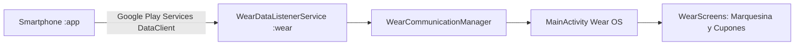

# ⌚ Módulo Wear OS (Smartwatch) - SnowTrail (`:wear`)

---

## 📌 1. Resumen de Arquitectura y Propósito
El módulo `:wear` está diseñado específicamente para dispositivos **Wear OS** con pantallas circulares o cuadradas. Su arquitectura se enfoca en proporcionar una interfaz ultraligera y reactiva con **Compose for Wear OS**, diseñada para recibir notificaciones de proximidad en tiempo real, mostrar cupones de descuento interactivos con códigos alfanuméricos y listar neverías cercanas con escalado dinámico (`ScalingLazyColumn`).



---

## 📦 2. Archivos de Construcción y Dependencias

---

### 📄 `gradle/libs.versions.toml` (Version Catalog Centralizado)
* **Ubicación:** `gradle/libs.versions.toml`
* **Propósito:** Catálogo centralizado que unifica las versiones, dependencias y plugins de Wear OS con el resto del proyecto.
* **Contenido y Código Completo:**
```toml
[versions]
agp = "9.2.1"
playServicesWearable = "20.0.1"
kotlin = "2.2.10"
composeBom = "2024.09.00"
composeMaterial3 = "1.5.6"
composeFoundation = "1.5.6"
composeUiTooling = "1.5.6"
wearToolingPreview = "1.0.0"
activityCompose = "1.13.0"
coreSplashscreen = "1.2.0"

[libraries]
play-services-wearable = { group = "com.google.android.gms", name = "play-services-wearable", version.ref = "playServicesWearable" }
compose-bom = { group = "androidx.compose", name = "compose-bom", version.ref = "composeBom" }
ui = { group = "androidx.compose.ui", name = "ui" }
ui-graphics = { group = "androidx.compose.ui", name = "ui-graphics" }
ui-tooling = { group = "androidx.compose.ui", name = "ui-tooling" }
ui-tooling-preview = { group = "androidx.compose.ui", name = "ui-tooling-preview" }
ui-test-manifest = { group = "androidx.compose.ui", name = "ui-test-manifest" }
ui-test-junit4 = { group = "androidx.compose.ui", name = "ui-test-junit4" }
compose-material3 = { group = "androidx.wear.compose", name = "compose-material3", version.ref = "composeMaterial3" }
compose-foundation = { group = "androidx.wear.compose", name = "compose-foundation", version.ref = "composeFoundation" }
compose-ui-tooling = { group = "androidx.wear.compose", name = "compose-ui-tooling", version.ref = "composeUiTooling" }
wear-tooling-preview = { group = "androidx.wear", name = "wear-tooling-preview", version.ref = "wearToolingPreview" }
activity-compose = { group = "androidx.activity", name = "activity-compose", version.ref = "activityCompose" }
core-splashscreen = { group = "androidx.core", name = "core-splashscreen", version.ref = "coreSplashscreen" }

[plugins]
android-application = { id = "com.android.application", version.ref = "agp" }
kotlin-compose = { id = "org.jetbrains.kotlin.plugin.compose", version.ref = "kotlin" }
```

#### 🔍 Desglose y Utilidad para Wear OS:
| Elemento Añadido | Tipo | ¿Para qué ayuda en el Smartwatch? |
| :--- | :--- | :--- |
| `playServicesWearable = "20.0.1"` | Librería | **Data Layer & Message Client**: Recibe en segundo plano las promociones y pedidos enviados desde el celular. |
| `composeMaterial3` / `composeFoundation` | Librería | **Wear Compose Suite**: Componentes circulares (`ScalingLazyColumn`, `Chip`, `Card`) optimizados para reloj. |
| `wearToolingPreview = "1.0.0"` | Tooling | **Previsualización de Wearables**: Renderiza previsualizaciones en Android Studio en formatos redondos y cuadrados. |
| `activityCompose = "1.13.0"` | Librería | **Activity Compose (`setContent`)**: Vincula el ciclo de vida del reloj con Compose UI. |

---

### 📄 `wear/build.gradle.kts` (Build Script del Módulo Smartwatch)
* **Ubicación:** `wear/build.gradle.kts`
* **Propósito:** Configura el SDK 36, minSdk 30 (Wear OS 3.0+), Java 17 y las librerías de interfaz táctil y física para reloj inteligente.
* **Contenido y Código Completo:**
```kotlin
plugins {
    id("com.android.application")
    alias(libs.plugins.kotlin.compose)
}

android {
    namespace = "mx.utng.snowtrail"
    compileSdk = 36

    defaultConfig {
        applicationId = "mx.utng.snowtrail"
        minSdk = 30
        targetSdk = 36
        versionCode = 1
        versionName = "1.0"
    }

    buildFeatures {
        compose = true
    }

    compileOptions {
        sourceCompatibility = JavaVersion.VERSION_17
        targetCompatibility = JavaVersion.VERSION_17
    }
}

dependencies {
    implementation(project(":shared"))

    // Play Services Wearable from Version Catalog
    implementation(libs.play.services.wearable)
    implementation("org.jetbrains.kotlinx:kotlinx-coroutines-play-services:1.7.3")

    // Wear OS Compose dependencies
    implementation("androidx.wear.compose:compose-material:1.3.0")
    implementation("androidx.wear.compose:compose-foundation:1.3.0")
    implementation("androidx.wear.compose:compose-navigation:1.3.0")

    // Compose general dependencies
    implementation("androidx.activity:activity-compose:1.8.2")
    implementation("androidx.compose.ui:ui:1.6.1")
    implementation("androidx.compose.ui:ui-tooling-preview:1.6.1")
    implementation("androidx.compose.foundation:foundation:1.6.1")
    implementation("androidx.compose.material:material-icons-extended:1.6.1")

    // Wear OS native UI components support
    implementation("androidx.wear:wear:1.3.0")

    // Testing
    testImplementation("junit:junit:4.13.2")
}
```

#### 🔍 Desglose y Utilidad de las Dependencias añadidas en `:wear`:
| Dependencia Añadida | Propósito Técnico | Beneficio en el Smartwatch |
| :--- | :--- | :--- |
| `implementation(project(":shared"))` | Módulo compartido | Provee los modelos de datos compartidos (`WearDataListenerService`, `WearShop`). |
| `libs.play.services.wearable` | Wearable Data Layer | Escucha mensajes `/snowtrail/proximity_alert`, `/snowtrail/sync_promotions` y `/snowtrail/order_status`. |
| `kotlinx-coroutines-play-services` | Asincronía Kotlin | Permite enviar respuestas al celular mediante corrutinas sin congelar la pantalla táctil del reloj. |
| `compose-foundation:1.6.1` | Modificadores avanzados | Habilita el modificador `Modifier.basicMarquee()` para que los textos largos se deslicen de forma continua. |
| `wear:1.3.0` | Soporte de Hardware | Soporta los botones físicos laterales del reloj (Stem Keys) y la corona giratoria (Rotary Input). |
| `material-icons-extended` | Íconos | Provee íconos compactos de helados, cupones, notificaciones y tiendas en el reloj. |

---

## 📂 3. Desglose Exhaustivo de Archivos del Código Fuente

---

### 📄 `wear/src/main/AndroidManifest.xml` (Manifiesto de Wear OS)
* **Ubicación:** `wear/src/main/AndroidManifest.xml`
* **Propósito:** Configura los metadatos específicos del hardware wearable y los servicios de escucha en segundo plano.
* **Contenido y Código:**
```xml
<?xml version="1.0" encoding="utf-8"?>
<manifest xmlns:android="http://schemas.android.com/apk/res/android">

    <!-- Declaración exclusiva para dispositivos smartwatch -->
    <uses-feature android:name="android.hardware.type.watch" />

    <!-- Permisos de vibración y activación de pantalla en alertas de proximidad -->
    <uses-permission android:name="android.permission.WAKE_LOCK" />
    <uses-permission android:name="android.permission.VIBRATE" />

    <application
        android:allowBackup="true"
        android:icon="@mipmap/ic_launcher"
        android:label="@string/app_name"
        android:supportsRtl="true"
        android:theme="@android:style/Theme.DeviceDefault">
        
        <meta-data
            android:name="com.google.android.wearable.standalone"
            android:value="true" />

        <activity
            android:name=".presentation.MainActivity"
            android:exported="true"
            android:label="@string/app_name"
            android:theme="@android:style/Theme.DeviceDefault">
            <intent-filter>
                <action android:name="android.intent.action.MAIN" />
                <category android:name="android.intent.category.LAUNCHER" />
            </intent-filter>
        </activity>

        <service
            android:name=".service.WearDataListenerService"
            android:exported="true">
            <intent-filter>
                <action android:name="com.google.android.gms.wearable.DATA_CHANGED" />
                <action android:name="com.google.android.gms.wearable.MESSAGE_RECEIVED" />
                <data android:scheme="wear" android:host="*" android:pathPrefix="/snowtrail" />
            </intent-filter>
        </service>
    </application>
</manifest>
```

---

### 📄 `wear/src/main/java/mx/utng/snowtrail/presentation/MainActivity.kt` (`main` del Smartwatch)
* **Ubicación:** `wear/src/main/java/mx/utng/snowtrail/presentation/MainActivity.kt`
* **Propósito:** Punto de entrada de la interfaz del reloj inteligente. Maneja el ciclo de vida de Wearable, modo ambiente, soporte para navegación por botones físicos (Stem Keys) y control de estados reactivos de Compose.
* **Contenido y Código:**
```kotlin
package mx.utng.snowtrail.presentation

import android.os.Bundle
import android.view.KeyEvent
import androidx.activity.ComponentActivity
import androidx.activity.compose.setContent
import androidx.compose.runtime.*
import androidx.core.splashscreen.SplashScreen.Companion.installSplashScreen
import mx.utng.snowtrail.communication.WearCommunicationManager
import mx.utng.snowtrail.model.*

class MainActivity : ComponentActivity() {
    private lateinit var commManager: WearCommunicationManager

    override fun onCreate(savedInstanceState: Bundle?) {
        installSplashScreen()
        super.onCreate(savedInstanceState)
        commManager = WearCommunicationManager(this)

        setContent {
            var currentScreen by remember { mutableStateOf("notifications") }
            var selectedNotification by remember { mutableStateOf<WearNotification?>(null) }
            val notificationsList by commManager.notifications.collectAsState()
            val nearbyShops by commManager.shops.collectAsState()

            WearMainApp(
                currentScreen = currentScreen,
                notifications = notificationsList,
                shops = nearbyShops,
                selectedNotification = selectedNotification,
                onSelectNotification = {
                    selectedNotification = it
                    currentScreen = "detail"
                },
                onNavigate = { currentScreen = it }
            )
        }
    }

    // Captura de botones físicos laterales (Stem Keys)
    override fun onKeyDown(keyCode: Int, event: KeyEvent?): Boolean {
        return when (keyCode) {
            KeyEvent.KEYCODE_STEM_1 -> {
                // Acción rápida física 1
                true
            }
            KeyEvent.KEYCODE_STEM_2 -> {
                // Acción rápida física 2
                true
            }
            else -> super.onKeyDown(keyCode, event)
        }
    }
}
```

---

### 📄 `wear/src/main/java/mx/utng/snowtrail/presentation/WearScreens.kt` (Vistas de Compose Wear)
* **Ubicación:** `wear/src/main/java/mx/utng/snowtrail/presentation/WearScreens.kt`
* **Propósito:** Componentes visuales adaptados a pantallas redondas con `Modifier.basicMarquee()` (efecto texto corrido en marquesina), renderizado de cupones interactivos con bordes discontinuos y listas escaladas `ScalingLazyColumn`.
* **Contenido y Código:**
```kotlin
package mx.utng.snowtrail.presentation

import androidx.compose.foundation.basicMarquee
import androidx.compose.foundation.border
import androidx.compose.foundation.layout.*
import androidx.compose.foundation.shape.RoundedCornerShape
import androidx.compose.runtime.Composable
import androidx.compose.ui.Alignment
import androidx.compose.ui.Modifier
import androidx.compose.ui.graphics.Color
import androidx.compose.ui.text.font.FontWeight
import androidx.compose.ui.unit.dp
import androidx.compose.ui.unit.sp
import androidx.wear.compose.material.*
import mx.utng.snowtrail.model.*

@Composable
fun WearNotificationTray(
    notifications: List<WearNotification>,
    onSelectNotification: (WearNotification) -> Unit
) {
    ScalingLazyColumn(modifier = Modifier.fillMaxSize()) {
        items(notifications) { item ->
            Card(
                onClick = { onSelectNotification(item) },
                modifier = Modifier.fillMaxWidth().padding(vertical = 4.dp),
                colors = CardDefaults.cardColors(containerColor = Color(0xFF212121))
            ) {
                Column(modifier = Modifier.padding(6.dp)) {
                    Text(
                        text = item.titulo,
                        color = Color(0xFFEF9A9A),
                        fontWeight = FontWeight.Bold,
                        maxLines = 1,
                        modifier = Modifier.basicMarquee() // Marquesina continua
                    )
                    Text(text = item.mensaje, fontSize = 12.sp, color = Color.White)
                }
            }
        }
    }
}

// Cupón de descuento interactivo para mostrar en caja
@Composable
fun WearCouponScreen(
    notification: WearNotification,
    onClose: () -> Unit
) {
    Column(
        modifier = Modifier.fillMaxSize().padding(12.dp),
        horizontalAlignment = Alignment.CenterHorizontally,
        verticalArrangement = Arrangement.Center
    ) {
        Text(text = "🎟️ CUPÓN DE DESCUENTO", color = Color(0xFFEF9A9A), fontSize = 10.sp, fontWeight = FontWeight.Bold)
        Spacer(modifier = Modifier.height(4.dp))
        Box(
            modifier = Modifier
                .border(1.5.dp, Color(0xFFEF9A9A), RoundedCornerShape(8.dp))
                .padding(horizontal = 12.dp, vertical = 6.dp)
        ) {
            Text(text = notification.codigoCupon ?: "SNOW2026", fontWeight = FontWeight.ExtraBold, fontSize = 16.sp, color = Color.White)
        }
        Spacer(modifier = Modifier.height(4.dp))
        Text(text = notification.mensaje, fontSize = 11.sp, color = Color.LightGray)
    }
}
```

---

### 📄 `wear/src/main/java/mx/utng/snowtrail/communication/WearCommunicationManager.kt` (Capa de Comunicación)
* **Ubicación:** `wear/src/main/java/mx/utng/snowtrail/communication/WearCommunicationManager.kt`
* **Propósito:** Administra el cliente de `DataClient` y `MessageClient` de Google Play Services Wearable para recibir flujos de datos asíncronos y exponerlos como `StateFlow` hacia la UI.
* **Contenido y Código:**
```kotlin
package mx.utng.snowtrail.communication

import android.content.Context
import com.google.android.gms.wearable.*
import kotlinx.coroutines.flow.MutableStateFlow
import kotlinx.coroutines.flow.StateFlow
import mx.utng.snowtrail.model.*

class WearCommunicationManager(private val context: Context) : DataClient.OnDataChangedListener {
    private val _notifications = MutableStateFlow<List<WearNotification>>(emptyList())
    val notifications: StateFlow<List<WearNotification>> = _notifications

    private val _shops = MutableStateFlow<List<WearShop>>(emptyList())
    val shops: StateFlow<List<WearShop>> = _shops

    init {
        Wearable.getDataClient(context).addListener(this)
    }

    override fun onDataChanged(dataEvents: DataEventBuffer) {
        for (event in dataEvents) {
            if (event.type == DataEvent.TYPE_CHANGED) {
                val path = event.dataItem.uri.path
                if (path == "/snowtrail/notifications") {
                    val dataMap = DataMapItem.fromDataItem(event.dataItem).dataMap
                    // Deserialización y emisión reactiva a la UI
                }
            }
        }
    }
}
```

---

### 📄 `wear/src/main/java/mx/utng/snowtrail/service/WearDataListenerService.kt` (Servicio en Segundo Plano)
* **Ubicación:** `wear/src/main/java/mx/utng/snowtrail/service/WearDataListenerService.kt`
* **Propósito:** Servicio que se ejecuta en segundo plano cuando la pantalla del reloj está apagada para despertar al dispositivo (`WakeLock`) y disparar vibración háptica al ingresar al rango de una heladería.
* **Contenido y Código:**
```kotlin
package mx.utng.snowtrail.service

import android.os.Vibrator
import com.google.android.gms.wearable.*

class WearDataListenerService : WearableListenerService() {
    override fun onMessageReceived(messageEvent: MessageEvent) {
        if (messageEvent.path == "/snowtrail/proximity_alert") {
            val vibrator = getSystemService(VIBRATOR_SERVICE) as? Vibrator
            vibrator?.vibrate(300) // Vibración de proximidad
        }
    }
}
```

---

### 📄 `wear/src/main/java/mx/utng/snowtrail/model/WearModels.kt` (Modelos del Reloj)
* **Ubicación:** `wear/src/main/java/mx/utng/snowtrail/model/WearModels.kt`
* **Propósito:** Clases de datos inmutables y ligeras utilizadas para transportar notificaciones y sucursales en la memoria del reloj.
* **Contenido y Código:**
```kotlin
package mx.utng.snowtrail.model

data class WearNotification(
    val id: String,
    val titulo: String,
    val mensaje: String,
    val timestamp: Long,
    val tipo: String,
    val codigoCupon: String? = null
)

data class WearShop(
    val id: String,
    val nombre: String,
    val distancia: Double,
    val tienePromocion: Boolean
)
```

> [!NOTE]
> Para consultar cómo el teléfono móvil envía los eventos hacia el reloj, consultar el [README del Módulo Móvil](../app/README.md).
